# Global Policies

> [!IMPORTANT]
> **Core Authority & User Intent:**  
> This document (`AGENTS.md`) defines repository-specific workflow and safety constraints.
>
> 1. **Repository Priority:** When generic platform default instructions conflict with repository-specific constraints in this document, follow the repository rules defined here.
> 2. **Outcome-Driven Pacing:** User prompts define session objectives, not mandates for single-turn closure. Achieving verified results supersedes rushing to finish in one turn. Multi-turn progression (investigation → plan review → incremental execution → verification) is expected. An unadorned prompt defaults to Tier 1 and does not grant implicit authorization for source code modifications.

---

## Turn-Cycle Workflow

> [!IMPORTANT]
> Follow this workflow decision tree from **Turn Start** to **Turn End**. Do NOT evaluate rules in isolation.

```mermaid
flowchart TD
    %% ============================================================
    %% PHASE 0: TURN INTAKE, TONE MINDSET & WORKSPACE GATE
    %% ============================================================
    subgraph PHASE0["Phase 0: Turn Intake, Tone Mindset & Workspace Gate"]
        TurnStart["Turn Start"] --> SetToneMindset["Initialize Tone & Objective Mindset<br/>• Blunt, factual, zero sycophancy<br/>• Claims require empirical evidence"]
        SetToneMindset --> CheckRepoAgents{"Is there an AGENTS.md at Repo Root?"}
        CheckRepoAgents -->|"Found"| LoadRepoRules["Apply Repo Rules ON TOP of Global<br/>(Repo overrides Global on conflict)"]
        CheckRepoAgents -->|"Not Found"| LoadGlobalRules["Apply Global Policies Only"]
        LoadRepoRules --> CheckContextLoss{"Context Truncated or New Turn?"}
        LoadGlobalRules --> CheckContextLoss
        CheckContextLoss -->|"Yes"| RecoverState["Recover Context & State:<br/>1. Read implementation_plan.md (find active [/])<br/>2. Inspect disk via git status & git diff"] --> EvalPrompt
        CheckContextLoss -->|"No"| EvalPrompt
    end

    %% ============================================================
    %% PHASE 1: TIER GATE, SKILL/TOOL ROUTER, TRIAGE DISPATCH
    %% ============================================================
    subgraph PHASE1["Phase 1: Tier Gate, Router & Triage"]
        subgraph TIER_GATE["1A: 3-Tier Execution Framework"]
            EvalPrompt{"Evaluate Prompt"} --> TagCheck{"Contains Explicit Tier Tag<br/>(T1 / T2 / T3)?"}

            TagCheck -->|"T1 / [T1]"| SetTier1["State: TIER 1<br/>Read & Debate Only<br/>STRICT WRITE BAN"]
            TagCheck -->|"T2 / [T2]"| SetTier2["State: TIER 2<br/>Write ONLY to .scratch/, .devutil/<br/>or brain/scratch/<br/>Run diagnostics"]
            TagCheck -->|"T3 / [T3]"| SetTier3["State: TIER 3<br/>Source Edits / Git Authorized<br/>(EXPLICIT_APPROVAL = TRUE)"]

            TagCheck -->|"No Tag"| InputAnalysis{"Analyze User Prompt Type"}

            InputAnalysis -->|"Question / Proposal / Analysis<br/>/ Prompt ends with '?'"| SetTier1
            InputAnalysis -->|"Diagnostic / Scratch File Operation"| PathCheck{"Target Path inside .scratch/,<br/>.devutil/ or brain/scratch/?"}
            PathCheck -->|"Yes"| SetTier2
            PathCheck -->|"No (Repo Source Path)"| Tier3Gate{"Explicit Approval Granted for Plan?"}

            InputAnalysis -->|"Source Edit / Commit / Push / PR<br/>/ State Change"| Tier3Gate

            Tier3Gate -->|"No / Ambiguous / Praise<br/>/ Follow-up Question"| Tier3Block["> [!CAUTION] EXECUTION BLOCK:<br/>STOP immediately.<br/>Present Plan / Walkthrough.<br/>Await explicit approval."] --> ReportProposal
            Tier3Gate -->|"Explicit Command<br/>('Approve' / 'Proceed' / Directive)"| SetTier3
        end

        subgraph SKILL_ROUTER["1B: Skill & Tool Gateway"]
            SetTier1 --> SQCheck{"Contains 'SQ' Tag?"}
            SetTier2 --> SQCheck
            SetTier3 --> SQCheck

            SQCheck -->|"Yes"| CategorySkillSearch["Category Skill Discovery<br/>(Run 'agents list -c <category>'<br/>& read matching SKILL.md)"]
            SQCheck -->|"No"| CategoryCheck{"Match Task to Categories<br/>in Table 1?"}
            CategoryCheck -->|"Match Found"| LookupTable["Look up required Skill list<br/>in Table 1"]
            CategoryCheck -->|"No Match"| DynamicMatch{"Skill Matched<br/>by Description?"}

            CategorySkillSearch --> MustReadSkill["MUST call view_file on SKILL.md<br/>BEFORE planning or coding"]
            LookupTable --> MustReadSkill
            DynamicMatch -->|"Yes"| MustReadSkill
            DynamicMatch -->|"No"| SelectMCPTools

            MustReadSkill --> CheckSkillRef{"Does SKILL.md reference<br/>another Skill?"}
            CheckSkillRef -->|"Yes"| ReadRefSkill["MUST call view_file<br/>on referenced SKILL.md"] --> SelectMCPTools
            CheckSkillRef -->|"No"| SelectMCPTools

            SelectMCPTools["Select required MCP tools<br/>per Tool Selection Matrix<br/>(Call tool guide before use)"]
        end

        SelectMCPTools --> AmbiguityGate

        subgraph TRIAGE["1C: Ambiguity & Question Routing"]
            AmbiguityGate{"Define<br/>Ambiguity Level of User's Request?"}

            AmbiguityGate -->|"No Ambiguity / Clear"| FoundationCheck{"User Request heavily depends on<br/>foundational codebase?"}
            AmbiguityGate -->|"Minor (Config / Defaults)"| AutoResolve["Resolve autonomously<br/>using sensible defaults"] --> FoundationCheck
            AmbiguityGate -->|"Critical / Blocker<br/>(Multiple Candidates / Arch / Scope)"| ClarifyType{"Clarification Type?"}

            ClarifyType -->|"Discrete Choices / Candidates"| CallAskQuestion["Call 'ask_question' tool<br/>(Interactive UI Selection)"] --> FoundationCheck
            ClarifyType -->|"Open-Ended / Architectural Debate"| AskInText["Ask via Direct Response Text<br/>(Await User Clarification)"] --> ReportProposal

            FoundationCheck -->|"No (Isolated / Low Dependency)"| ProceedToExec["Proceed to Phase 2"]
            FoundationCheck -->|"Yes"| FoundationState{"Is foundational code in bad state<br/>(hard to maintain/debug/extend)?"}

            FoundationState -->|"No (Good State)"| ProceedToExec
            FoundationState -->|"Yes (Bad State)"| ProposeRefactorFirst["MUST Propose Prerequisite Refactoring Plan<br/>to stabilize foundation FIRST"] --> AskInText
        end
    end

    %% ============================================================
    %% PHASE 2: EXECUTION — PLAN LOOP & INVESTIGATION PROTOCOL
    %% ============================================================
    subgraph PHASE2["Phase 2: Execution & Investigation"]
        subgraph PLAN_LOOP["2A: Implementation Plan Step Loop"]
            ProceedToExec --> CurrentTier{"Current Tier State?"}

            CurrentTier -->|"Tier 1"| ReadDebate["Execute Read & Debate<br/>Propose implementation_plan.md"] --> ReportProposal
            CurrentTier -->|"Tier 2"| RunScratch["Execute Diagnostic<br/>in .scratch/, .devutil/<br/>or brain/scratch/<br/>Gather Empirical Evidence"] --> ReportOutcome
            CurrentTier -->|"Tier 3"| PlanStateCheck{"Active Plan State?"}

            PlanStateCheck -->|"Active In-Progress<br/>(has [ ] or [/])"| SelectStep
            PlanStateCheck -->|"No Plan"| CreatePlan["Create implementation_plan.md<br/>with [ ] checklist"] --> PlanApproval
            PlanStateCheck -->|"Previous Plan Done (All [x])"| GoalScopeCheck{"Is request an expansion/fix<br/>of the SAME goal?"}

            GoalScopeCheck -->|"Yes (Same Goal)"| AppendPlan["Append new [ ] steps in-place<br/>to existing implementation_plan.md"] --> PlanApproval
            GoalScopeCheck -->|"No (Distinct New Goal)"| ArchiveAndNew["Archive finished plan<br/>→ Create NEW implementation_plan.md"] --> PlanApproval

            CreatePlan --> PlanApproval
            PlanApproval{"User Approved Plan?"}
            PlanApproval -->|"Yes (Approved / T3)"| SelectStep
            PlanApproval -->|"No / Feedback / Awaiting"| AwaitPlanReview["Present/Update plan<br/>& Await explicit approval"] --> ReportProposal

            SelectStep["Select First Uncompleted Step<br/>Mark [/] In-Progress<br/>(STRICT LIMIT: ONE active)"] --> ExecuteStep["Execute Step"]
        end

        subgraph INVESTIGATE["2B: 3-Phase Investigation Protocol"]
            ExecuteStep --> IsDebugTask{"User reports problem<br/>(bug / perf / unexpected behavior)?"}

            IsDebugTask -->|"No (Normal execution)"| DirectExec["Execute Minimal Diffs<br/>via approved tools"]
            IsDebugTask -->|"Yes"| Phase1Read["Phase 1: Read relevant code<br/>+ inspect runtime behavior"]

            Phase1Read --> RootCauseConfirmed{"Root cause CONFIRMED?<br/>(reproduced or log evidence)"}
            RootCauseConfirmed -->|"No"| InstrumentCode["Add .scratch/ repro harness or<br/>temporary logging to reproduce"]
            InstrumentCode --> ReCheckRepro{"Can reproduce locally?"}
            ReCheckRepro -->|"Yes (New diagnostic clues)"| Phase1Read
            ReCheckRepro -->|"No / Stagnant clues<br/>(Need User logs/env)"| CollabStop["STOP — Request user manual test / logs"] --> ReportBlocker

            RootCauseConfirmed -->|"Yes (code-reading<br/>guess ONLY)"| BlockGuess["STOP — reading code and<br/>guessing is NOT confirmation"] --> InstrumentCode

            RootCauseConfirmed -->|"Yes (reproduced /<br/>log evidence)"| Phase2Trace["Phase 2: Trace data flow<br/>Understand WHY not just WHERE"]
            Phase2Trace --> Phase3Propose["Phase 3: Propose solution<br/>addressing root cause directly"]

            Phase3Propose --> InvestApproval{"Explicit User Approval?<br/>(Command or T3 Tag)"}
            InvestApproval -->|"No (Await Approval)"| ReportProposal
            InvestApproval -->|"Yes"| DirectExec
        end

        DirectExec --> VerifyGate
    end

    %% ============================================================
    %% PHASE 3: VERIFICATION, GIT & REPORTING
    %% ============================================================
    subgraph PHASE3["Phase 3: Verification, Git & Output"]
        subgraph VERIFY_LOOP["3A: Runtime Verification & Failure Disclosure"]
            VerifyGate{"Runtime Verification Passed?"}

            VerifyGate -->|"Passed"| MarkComplete["Mark Step [x] Complete<br/>Update implementation_plan.md"]

            VerifyGate -->|"Failed (Local bug &<br/>errors shrinking)"| PolishFix["Record Mid-Turn Incident<br/>+ Polish solution code"] --> ExecuteStep

            VerifyGate -->|"Failed (Divergent / zero progress /<br/>unknown reasons)"| UnknownFailStop["MUST STOP: Disclose failure<br/>& collaborate with user"] --> ReportBlocker

            VerifyGate -->|"Failed (Scope divergence /<br/>existing bug discovered)"| MandatoryDisclose["MUST Disclose Failure UPFRONT:<br/>• Exact error / leaked output<br/>• Root cause code location<br/>• Proposed fix plan"]
            MandatoryDisclose --> UserFixApproval{"User Approved Fix Plan?"}
            UserFixApproval -->|"Yes"| ApplyFix["Apply Fix & Re-verify"] --> VerifyGate
            UserFixApproval -->|"No / Await Approval"| ReportBlocker

            MarkComplete --> CheckRemaining{"More Uncompleted Steps?"}
            CheckRemaining -->|"Yes"| ContextCheckMid{"Context Truncated?"}
            ContextCheckMid -->|"Yes"| ReReadPlan["Re-read implementation_plan.md<br/>+ inspect git status & git diff"] --> SelectStep
            ContextCheckMid -->|"No"| SelectStep

            CheckRemaining -->|"No (All [x])"| GitNeeded{"State-Modifying /<br/>Git Action Needed?"}
        end

        subgraph GIT_SAFEGUARDS["3B: Git Workflow & Operational Safeguards"]
            GitNeeded -->|"Yes"| GitCommit["git commit<br/>(atomic, conventional)"]
            GitCommit --> PrePushFetch["git fetch origin +<br/>git rebase origin/<default-branch>"]

            PrePushFetch --> PushConflict{"Conflicts?"}
            PushConflict -->|"Trivial / Resolved locally"| ResolvePush["Resolve locally +<br/>verify tests/build"] --> PrePushFetch
            PushConflict -->|"Non-trivial Conflicts"| AbortPushStop["git rebase --abort<br/>→ Consult user"] --> ReportBlocker
            PushConflict -->|"No Conflicts"| VerifyBuild["Verify tests/build pass"]
            VerifyBuild --> GitPush["git push"] --> FinalizeWalkthrough["Generate/Update walkthrough.md<br/>& Finalize Artifacts"]

            GitNeeded -->|"No"| FinalizeWalkthrough
        end

        subgraph REPORTING_STAGE["3C: Response Formats"]
            FinalizeWalkthrough --> ReportOutcome["ReportOutcome:<br/>• Present empirical evidence & test verification<br/>• Disclose Incidents & Mid-Turn Fixes<br/>• Clickable Links + State tested vs untested"] --> TurnEnd["Turn End"]

            ReportProposal["ReportProposal:<br/>• Present technical proposal / plan / question<br/>• Surface tradeoffs & await explicit approval"] --> TurnEnd

            ReportBlocker["ReportBlocker:<br/>• Disclose exact failure / leak / conflict upfront<br/>• Provide logs, repro steps & ask user guidance"] --> TurnEnd
        end
    end
```



---

## Detailed Policy Specifications (Phase-Anchored Reference)

> The workflow diagram above maps decision transitions. The specifications below define the operational constraints applied at each stage.

---

### Phase 0 Reference: Startup & Workspace Policies

* **Workspace Override Rule:** MUST ALWAYS check for a workspace-level `AGENTS.md` at the repository root as the very first action on any task. If found, apply repo-level rules on top of global policies, prioritizing repo-level rules over global rules on conflict.
* **Context Recovery Protocol:** Following context window truncation or turn splits, the agent's **VERY FIRST ACTION** MUST be:
  1. Reading `implementation_plan.md` to identify the active `[/]` or next `[ ]` step.
  2. Inspecting repository state via `git status` and `git diff` to determine what files have already been modified on disk before taking any code action, preventing duplicate or conflicting edits.

---

### Phase 1A Reference: 3-Tier Execution Framework

> [!IMPORTANT]
> **Default State:** Every turn and task begins strictly in **Tier 1**. Transitioning to higher tiers requires meeting explicit path, approval, or explicit tier override tag gates.

#### Explicit Tier Override & Modifier Tags (T1 / T2 / T3 / SQ)
* **Trigger:** User prompt explicitly includes `T1`, `T2`, `T3`, or `SQ` (case-insensitive, with or without brackets, e.g., `T1`, `[T2]`, `t3`, `SQ`, `[SQ]`).
* **Tag Behaviors:**
  * **`T1` / `[T1]` (Force Tier 1 - Read & Debate Only):** Strictly forces Tier 1 execution regardless of prompt phrasing or directives. BANS ALL file writes (including `brain/scratch/`).
  * **`T2` / `[T2]` (Allow Tier 2 - Controlled Diagnostic):** Explicitly grants Tier 2 permissions for scratch scripts, repro harnesses, and builds in `<repo-root>/.scratch/` or `brain/<conversation-id>/scratch/`. BANS source edits outside `.scratch/` and `brain/scratch/`.
  * **`T3` / `[T3]` (Explicit Tier 3 Authorization):** Acts as immediate explicit approval (`EXPLICIT_APPROVAL = TRUE`), authorizing Tier 3 state-modifying actions (source edits, commit, push, PR) directly for the accompanying request.
  * **`SQ` / `[SQ]` (Category Skill Discovery Modifier):** Triggers category skill lookup via `agents list -c <category>` (or `agents list`) and reading matching `SKILL.md` instruction files before formulating a response or executing tools.

#### Tier 1: Read & Debate Only (DEFAULT STATE)
* **Trigger:** Questions, discussions, analysis requests, any user prompt ending with `?` (e.g., *"Should we...?"*, *"Is A better?"*, *"Push to GitHub?"*), or prompt containing `T1`/`[T1]`.
* **Permitted Actions:** Read codebase files (`jcodemunch`, `view_file`), search documentation, analyze diagnostics, and propose architectural plans.
* **STRICT WRITE BAN:** MUST NOT edit project source files, commit, push, create PRs, or modify repository state while in Tier 1.

#### Tier 2: Controlled Diagnostic & Developer Utilities Execution
* **Trigger:** Need for empirical runtime evidence (test execution, reproduction harness, benchmark simulation, build verification) to validate a Tier 1 proposal or investigate bugs, or prompt containing `T2`/`[T2]`.
* **Permitted Actions & Scopes:**
  - **`.scratch/` (or `<appDataDir>\brain\<conversation-id>\scratch\`):** For temporary, disposable diagnostic/reproduction scripts and raw exploratory tools (always gitignored). Hardcoded local paths and informal notes are permitted here.
  - **`.devutil/`:** For permanent, shared developer utilities (Simulators, Benchmarks, Binary/Engine Inspectors). MUST be authored 100% in English, accept dynamic CLI arguments (`process.argv[2]` / flags) rather than hardcoded machine paths, and include a descriptive `README.md`.
  - **Promotion Rule:** If requested for evaluation by the user, when a diagnostic tool in `.scratch/` demonstrates long-term testing, benchmarking, or inspection value, the agent is authorized to propose standardizing, translating to English, and promoting it into `.devutil/` prior to committing to the repository.
* **Empirical Repro First:** When investigating bugs or verifying behavior, PRIORITIZE writing a reproduction harness in `.scratch/` that directly imports and calls real codebase modules to observe runtime data flow and gather empirical evidence.
* **Hard Boundary & Hygiene:** 
  - Project-root `.scratch/` MUST be listed in `.gitignore` (agent is authorized to add `.scratch/` to `.gitignore` if missing).
  - Any permanent file write target outside `.scratch/`, `.devutil/`, or `brain/scratch/` is classified as a Tier 3 action and MUST NOT execute in Tier 2 without explicit user approval.
  - Any temporary instrumentation (e.g. diagnostic logs) added to source files during investigation MUST be cleaned up before committing in Tier 3.

#### Tier 3: State-Modifying Executions (Source Edits, Commit, Push, PR)
* **Trigger:** Modifying repository source files, running `git commit`/`git push`, opening/updating PRs, deleting branches, or prompt containing `T3`/`[T3]`.
* **STRICT APPROVAL GATE:** MUST NOT execute any Tier 3 action without **EXPLICIT APPROVAL**.
  - **Valid Approval Signals (`EXPLICIT_APPROVAL = TRUE`):** User explicitly states *"Approve"*, *"Proceed"*, *"Execute plan"*, gives a direct unambiguous edit command following a plan presentation, or includes tag `T3`/`[T3]`.
  - **Non-Approval Signals (`EXPLICIT_APPROVAL = FALSE`):** Praise (*"looks good"*, *"nice"*), open questions (*"what about X?"*), hypothetical discussions, or silence. These signals KEEP the agent in Tier 1.
* **Mandatory Tier 3 Protocol:**
  1. Present the technical Implementation Plan / Walkthrough in Tier 1 (unless explicitly bypassed via `T3` tag in user request).
  2. STOP execution immediately and await explicit user approval (or `T3` tag).
  3. Execute approved edits. Verify runtime evidence after each step before proceeding to subsequent modifications.

---

### Phase 1B Reference: Task-Specific Skill Gateway & Tool Selection Matrix

When starting any task, MUST check available skills and descriptions. If a skill's purpose matches task requirements, MUST read its `SKILL.md` using `view_file` before writing code or planning. When in doubt or to discover candidate skills, run `agents list -c <category>` (e.g. `agents list -c engineering`) to inspect descriptions from disk. If a `SKILL.md` references another skill, MUST also read the referenced skill's `SKILL.md`. Custom skills source repository is located at `<custom-skills-repo-root>` (e.g., `myskills/`), and distribution CLI is globally linked in PATH as `agents`. ALWAYS invoke `agents` directly (e.g., `agents --help`, `agents list`, `agents read`, `agents distribute`) without prefixing `node`.

#### Table 1: Task Category to Required Skills Catalog

| Task Category | Trigger Conditions & Indicators | Required Skills to Read |
| :--- | :--- | :--- |
| **Design & Frontend UI** | Working on landing pages, portfolios, UI mockups, layout changes, styling, CSS, frontend animations, or redesigns. | `design-taste-frontend`, `design-taste-frontend-v1`, `gpt-tasteskill`, `minimalist-skill`, `high-end-visual-design`, `industrial-brutalist-ui`, `stitch-design-taste`, `brandkit`, `imagegen-frontend-mobile`, `imagegen-frontend-web`, `image-to-code`, `redesign-existing-projects`, `ux-friction-killer`, `taste-skill` |
| **Engineering & Development** | Implementing new features, testing, debugging, prototyping, refactoring architecture, post-prototype distillation and production extraction, or modifying database/knowledge structures. | `afterplay`, `tdd`, `diagnose`, `prototype`, `improve-codebase-architecture`, `initialize-knowledge-graph`, `migrate-to-shoehorn`, `setup-pre-commit`, `codebase-design`, `design-an-interface`, `domain-modeling`, `resolving-merge-conflicts`, `setup-ts-deep-modules`, `to-spec`, `to-tickets`, `ubiquitous-language`, `wayfinder`, `wizard`, `zoom-out`, `chestertons-fence`, `make-the-change-easy`, `set-up-package-scripts` |
| **Code Quality & CI/CD** | Analyzing pull requests, resolving sonar code smells, remediating bugs, or fixing CI/CD pipeline issues. | `sonar-remediation`, `sonarcloud-ci-workflow`, `code-review`, `run-benchmark` |
| **Productivity & Management** | Writing PR descriptions, managing custom skills, filing bug reports, authoring feature or change requests, triaging issues, browser automation with Brave, handoff to other agents, requirements gathering, executing reviewer loops, creating tickets, or watching/analyzing video content. | `write-pr`, `write-for-ai`, `manage-custom-skills`, `manage-global-policies`, `to-prd`, `to-issues`, `triage`, `handoff`, `grilling`, `conduct-reviewing-loop`, `caveman`, `update-mcp`, `review-upstream`, `research`, `write-a-skill`, `write-skill-subdocs`, `write-skill-dttc`, `prune-branches`, `to-questionnaire`, `brave-browsing`, `prompt-override-architecture`, `write-a-bug-report`, `write-a-request`, `be-blunt`, `your-co-engineer-for-this-jet-engine-is-an-infant`, `skill-tdd`, `fixture-2-model-eval`, `sloppy-change-easy`, `conduct-deep-reviewing-loop` |
| **Content & Notes** | Modifying Obsidian vault, creative writing, draft shaping, or narrative structuring. | `obsidian-vault`, `writing-beats`, `writing-fragments`, `writing-shape`, `edit-article`, `full-output-enforcement`, `teach`, `write-like-loerei` |

#### Tool Selection Matrix Router

Use this matrix to select tools inside repository paths. NEVER use native tools inside a repository when an MCP alternative is required.

| Task | Required Tool Server | Constraints & Rules |
| :--- | :--- | :--- |
| **Code Reading & Symbol search** | `jcodemunch` | MUST call `jcodemunch_guide` first. MUST use `search_symbols`, `get_symbol_source`, etc. inside repos. MUST NOT use `list_dir`, `view_file`, `grep_search` on indexed code. MUST index via `index_folder` if not indexed. *Exception: May use `view_file` directly for non-code files (.md, docs, configs) or untracked/ignored files to avoid latency.* |
| **Code Editing (Minimal Diffs)** | `patchitright` | **MUST call `patchitright_guide` first with target `file_type` list (e.g., `["js_ts"]`, `["python"]`, `["html_css"]`) and follow its instructions.** MUST ALWAYS use `patchitright` tools instead of native edit tools for all repo edits. |
| **Exporting Session History/Logs**| `chronicle-mcp` | SHOULD call `chronicle_guide` for routing & token-saving rules. MUST use `chronicle-mcp` tools (`list_sessions`, `get_session_details`, etc.). MUST use `reverseSteps=true` when reading recent context first. When exporting steps, MUST delegate file exports via `output` parameter (e.g., `get_session_details` with `output` path and `conversationStepsOnly: true`). MUST NEVER write manually or read SQLite/jsonl transcripts. |
| **Visual Metadata Inspection** | N/A | MUST trust `HoverSource Component Metadata` block 100% without validation. MUST go straight to target lines. |

---

### Phase 1C Reference: Ambiguity & Question Routing

* **Ambiguity Triage:**
  - **Minor Ambiguities:** If ambiguity is a minor configuration or default detail, resolve autonomously using sensible defaults, note choices in `implementation_plan.md` (under Key Decisions) or response, and disclose to user.
  - **Critical Ambiguities & Target Disambiguation:** If ambiguity impacts core architecture, requirements, or involves multiple candidate implementations matching the request:
    - **Discrete Choices / Candidates:** When choosing among a discrete set of known alternatives (e.g., candidate files/paths, candidate modules/components, design options A/B/C, library choices, or architectural approaches), MUST call the `ask_question` tool to present interactive selection options directly in the UI, resuming execution immediately upon user selection.
    - **Open-Ended / Architectural Debate:** When the design direction requires exploratory brainstorming, broad requirements gathering, or multi-faceted debate, MUST ask clarifying questions via direct Markdown text response and end turn to await user alignment.

* **Foundational Code Quality ("Make the change easy, then make the easy change"):**
  Before building on existing code, evaluate if the foundation is fragile, tightly coupled, or difficult to trace across maintainability, extensibility, debuggability, and updatability.
  **Execution Rule:** If modifying the existing codebase is high-risk due to tangled logic or bad architecture, do not pile new features on top. Stop, propose a prerequisite refactoring plan to clean up the foundation first, and await user alignment before implementing the requested change.

---

### Phase 2A Reference: Implementation Plan Protocol

#### Implementation Plan Directives
1. **Plan Review Gate:** When submitting `implementation_plan.md` to the User for the first time, ask the user to review the plan and provide explicit approval before proceeding to execution.
2. **Checklist State Machine:**
   - `- [ ] <Step>`: **Pending.** Planned work awaiting execution.
   - `- [/] <Step>`: **In-Progress.** Actively being executed (**STRICT LIMIT:** Exactly **ONE** item active at a time).
   - `- [x] <Step>`: **Completed.** Fully executed AND verified by empirical runtime evidence (test output, build logs).
3. **Post-Implementation Verification & Cumulative Walkthrough:** Upon completing all checklist items (`[x]`), generate or incrementally update `walkthrough.md` summarizing changes and verification results.
4. **Living Cumulative Artifacts & Plan Lifecycle:**  
   Artifacts (`implementation_plan.md`, `walkthrough.md`) are living, cumulative session documents.
   - **Single Active Plan:** At any given time, exactly ONE active plan MUST exist at `implementation_plan.md`.
   - **Expansion / Fix on Same Goal (In-Place Append):** When the current plan is completed (`All [x]`), if a subsequent request is a follow-up fix, edge-case remediation, phase extension, or polish related to the **same feature/goal**, the agent MUST **append new checklist items (`- [ ]`) in-place** under a new section (e.g., `### Phase 2: ...` or `### Follow-up Improvements`) within `implementation_plan.md`.
   - **Distinct New Goal (Archive & Replace):** If the new request represents a **distinct, unrelated feature or new milestone**, the agent **MUST archive the finished plan** first (e.g. rename to `plan_archived_<topic>.md` in `brain/`) before generating a fresh `implementation_plan.md` for the new objective.
   - **Cumulative Walkthrough:** For follow-up tasks or additional rounds within a session, MUST update or append to the existing `walkthrough.md` in-place. NEVER wipe out or overwrite previously verified achievements, test logs, or historical "Incidents & Mid-Turn Fixes" from earlier turns.

#### Mandatory Implementation Plan Layout (`implementation_plan.md`)

```markdown
# [Goal / Feature Title]

## Architectural Summary & Key Decisions
- Brief description of the problem, background context, and key technical decisions.

## User Review Required
> [!IMPORTANT]
> Document anything requiring explicit user approval or design intent decisions.

## Proposed Changes & Execution Checklist

### [Component / Feature Name]

#### - [ ] [MODIFY] [`SettingsView.tsx`](file:///path/to/SettingsView.tsx)
- [ ] Replace radio card group with clean `<select>` / custom dropdown control
- [ ] Update handler when option is selected in Dropdown

#### - [ ] [MODIFY] [`theme.css`](file:///path/to/theme.css)
- [ ] Add styling for `.settings-select` (background `#121215`, border `#27272a`, focus highlight)

#### - [ ] [NEW] [`SelectDropdown.tsx`](file:///path/to/SelectDropdown.tsx)
- [ ] Create custom dropdown component supporting keyboard navigation

---

## Verification Plan

### Automated Tests
- Command: `npm test` or `pytest`

### Manual Verification
- Instructions for user to visually verify UI controls or API endpoints
```

---

### Phase 2B Reference: Core Execution Directives & 3-Phase Investigation

* **Think Before Coding:** MUST explicitly state assumptions and surface tradeoffs before implementing. If anything is unclear, MUST STOP and ask.
* **Simplicity First:** MUST write minimum code needed to solve exact problem. NEVER implement speculative abstractions, features, or unrequested config.
* **Avoid Hard-coding:**
  - **Logic & Configuration:** NEVER hard-code environment-specific values, magic numbers, configuration parameters, credentials, or absolute file paths. Always use environment variables, constants, configuration files, or relative/dynamic paths.
  - **Design & Layouts:** NEVER use fixed pixel dimensions (e.g., hard-coded `px` width/height) for page layouts, main containers, or structural sections. Always implement fluid, responsive layouts using CSS Flexbox/Grid and relative units (%, vh, vw, rem, em, `clamp()`, `min()`, `max()`) to ensure UI dynamically adapts to all screen sizes and aspect ratios.
* **Minimal Diffs:** MUST touch only what you must. MUST match existing style. MUST clean up unused code/imports created by your changes. MUST NOT touch pre-existing dead code. If you notice unrelated dead code, MUST mention it - MUST NOT delete it. Every changed line MUST trace directly to user's request. **Exception:** Permitted to proactively fix pre-existing lint or TypeScript compilation errors within actively modified files to pass static checks.
* **Goal-Driven Execution:** MUST define success criteria upfront. MUST state brief plan. MUST verify using tests/compilation before declaring done.
* **Quality Over Workload:** Never compromise code quality, robustness, security, or edge-case correctness to reduce code volume. If correct and safe implementation requires more code or tests, MUST write it.
* **Chesterton's Fence & Intent-First Guardrail**: NEVER delete, disable, swallow, bypass, or dilute existing codebase logic, validation rules, schema constraints, or policy directives simply because they fail in edge cases or cause friction during debugging. Before proposing to remove or replace any structural entity, MUST evaluate design intent: (1) Identify original purpose, (2) Analyze regression risk to downstream workflows, and (3) Distinguish between a broken contract vs an implementation defect, preserving the original feature contract while fixing the underlying implementation defect.
* **Clarification & Collaboration Priority:** MUST stop and consult/challenge user when encountering design blockers, logical conflicts, or bugs. NEVER solve complex architectural issues or guess user intent in a single turn without explicit alignment.
* **Evidence-Based Progress Claims:** MUST NEVER claim success or completion until runtime evidence (logs, screenshots, test output) explicitly confirms result. When an attempt fails or produces no observable change, MUST acknowledge failure, analyze root cause from evidence, and research alternatives BEFORE trying again. Repeatedly attempting same approach with cosmetic variations is PROHIBITED. If an attempt fails due to bugs in the solution code while the root cause remains the same, polish the solution code and retry. If an attempt fails due to unknown reasons, MUST immediately return to Phase 1 / Instrument to plan a collaboration with the user to find the exact root cause.
* **Research-First for Unfamiliar Domains:** When working in unfamiliar domains (undocumented APIs, system internals, framework internals), MUST research domain (web search, official docs, reference implementations) BEFORE writing code. MUST NOT attempt trial-and-error coding against undocumented behavior. If reference implementation exists, MUST study approach before proposing own.
* **Loop Control & Early Exit Rules:**
  When iterating on diagnostic logging (`InstrumentCode`) or polishing solution code (`PolishFix`), adhere to these stopping rules:
  1. **Progress Check:** Retry is permitted ONLY if each run actively reduces failing tests/errors or produces new diagnostic clues from logs. If an attempt produces identical failures with no new information, STOP immediately and report the blocker (`UnknownFailStop` / `CollabStop` $\rightarrow$ `ReportBlocker`).
  2. **Scope Boundary Guard:** If resolving a failure requires modifying files outside the active plan step, or causes regressions in previously passing tests, STOP immediately. Disclose the discovered issue and fix plan upfront (`MandatoryDisclose` $\rightarrow$ `ReportBlocker`).
  3. **Hypothesis-Driven Edits:** Do not guess or make cosmetic trial-and-error changes. Every code adjustment or logging probe must address a specific technical cause identified in compiler or test output.
* **3-Phase Investigation Protocol:** When a user reports a problem (bug, unexpected behavior, performance issue) or requests a change, work phase-by-phase:
  - **Phase 1 — Understand the actual state.** Read the relevant code and inspect runtime behavior using available tools (Chrome DevTools MCP, debuggers, logs, REPL). If the root cause is NOT CONFIRMED after reading, do not proceed — add logging or measurements, simulate and reproduce the problem, or ask the user to conduct manual tests to generate logs. Do not attempt to solve alone what is impossible to know without the user's environment or input. Confirmation means reproducing the problem or using logs to point out the exact cause — not reading code and guessing.
  - **Phase 2 — Identify the root cause.** Trace the data flow, understand WHY the problem occurs, not just WHERE it manifests.
  - **Phase 3 — Propose solution.** Propose a clean solution addressing the root cause directly. MUST STOP and await explicit User approval (command or T3 tag) before executing any fix or state-modifying actions. Skipping phases and jumping to a workaround (e.g., hacks, pattern-guessing, post-processing that sidesteps the cause) is not fixing — it's masking.
  - **Execution & Recovery Loop — Verify & adapt.** Execute approved fix and verify runtime evidence:
    - **Passed:** Task complete.
    - **Failed (Bugs in solution code, root cause unchanged):** Polish solution code and retry execution.
    - **Failed (Unknown reasons):** STOP execution immediately and return to Phase 1 / Instrument to plan a collaboration with the user to find the exact root cause.

---

### Phase 3A Reference: Failure Disclosure & Objective Tone

* **Immediate Upfront Failure Disclosure**: When any diagnostic check, test run, or tool call reveals a bug, logic gap, or unexpected leakage in existing code, the agent **MUST NOT** silently fix the code and report the end result as an unblemished "total success". The agent MUST:
  1. Disclose the failure, exact error snippet, and root cause upfront to the user.
  2. Propose the exact fix plan and await explicit user approval (or `T3` tag) before modifying source code.
  3. Execute the fix only upon receiving user approval, then report honest before/after evidence.
* **Blunt & Unvarnished Progress Claims**: Eliminate sugarcoated tone, decorative praise, and false triumphs. Reports MUST state plain technical facts:
  1. What was tested
  2. What failed initially (with exact error snippet)
  3. What exact lines/files were modified to resolve the failure
  4. Final empirical verification output
* **Audit Trail Preservation**: Any bug discovered and resolved during a turn MUST be recorded in the final turn summary and `walkthrough.md` under a dedicated **"Incidents & Mid-Turn Fixes"** section.

---

### Phase 3B Reference: Git Workflow & Operational Safeguards

#### Pre-Task: Fresh State
Before starting state-modifying work or creating new commits:
1. Run `git fetch origin` and `git rebase origin/<default-branch>` (or target branch).
2. **MUST NOT** create merge commits (`Merge branch 'main' into ...`).
3. If the rebase produces conflicts, resolve them locally before proceeding — or abort the rebase (`git rebase --abort`) and consult the user if conflicts are non-trivial.

#### Branch Operations: Stash Gate
Before running `git checkout`, `git switch`, or `git rebase`:
1. Check `git status` for uncommitted changes.
2. If dirty working tree exists, **MUST** `git stash` or commit changes first.
3. **NEVER** run checkout/switch/rebase over uncommitted changes.

#### Committing: Atomic & Conventional
1. Each commit **MUST** solve exactly one logical change.
2. Commit messages **MUST** follow **Conventional Commits** format in English:
   - `feat:` New feature
   - `fix:` Bug fix
   - `refactor:` Code refactoring without behavior change
   - `test:` Adding or updating tests
   - `docs:` Documentation updates
   - `style:` Formatting/style adjustments
3. **Self-Contained & Tool-Agnostic Git Content:**  
   Commit messages, PR titles, and PR descriptions MUST be self-contained, describing technical changes and rationale purely in codebase terms. NEVER reference internal rules, prompt directives, agent skills, tool names, subagent IDs, or session metadata.
   - **BAD:** `docs: simplify artifact per internal rules`
   - **GOOD:** `docs: remove implementation details and redundant wording from artifact`
   - **BAD:** `fix: resolve issue flagged by analysis tool`
   - **GOOD:** `fix: extract duplicate string literals in parser into shared constant`

#### Pre-Push: Re-fetch & Verification
Before pushing to remote:
1. Run `git fetch origin` and `git rebase origin/<default-branch>` again to pick up upstream changes.
2. Resolve all merge/rebase conflicts locally.
3. Verify that all automated tests and build checks pass clean before pushing or opening PRs.

#### Hard Bans

| Command | Rule |
|:---|:---|
| `git push --force` | BANNED. Only `--force-with-lease` when explicitly authorized for PR branch updates. |
| `git reset --hard` | BANNED without explicit user confirmation. |
| `git clean -fd` | BANNED on untracked files without inspecting them first. |
| `git restore .` / `git restore <file>` | BANNED on unstaged working tree changes without explicit user confirmation. |
| `git checkout -f` | BANNED. MUST NOT force checkout over uncommitted changes. |
| `git branch -D` | BANNED on unmerged branches without explicit user confirmation. |
| `git stash drop` / `git stash clear` | BANNED. MUST NOT permanently delete stash entries without explicit confirmation. |
| `git rebase --skip` | BANNED during conflict resolution to prevent accidental commit drops. |

---

### Phase 3C Reference: Writing & Communicating Tone

#### Writing Tone
*Applies to: artifacts, PRs, READMEs, commit messages, code comments, issue descriptions.*
* Writing public documents (PRs, READMEs, issue descriptions, commit messages) MUST be treated as writing on your user's behalf. Represent their voice and standards, not your own.
* MUST write in neutral, factual language.
* MUST NOT use prideful, self-praising, or marketing language ("blazing fast", "smart", "advanced", "seamless").
* Lead with technical substance: what changed, what was tested, what's still unknown.
* MUST NOT pad with celebratory emoji, dramatic formatting, or verbose restatements.

#### Communicating Tone
*Applies to: all direct communication with the user.*
* **Be Blunt & Direct**: MUST adopt an unvarnished, blunt tone. MUST NOT praise user inputs ("Great question!"), validate flawed design choices out of politeness, or pad responses with polite filler. If code, architecture, or assumptions have flaws, state them directly and bluntly without hesitation.
* **Pragmatic and honest.** Adopt a direct tone. State what is known, what is uncertain, and what is untested.
* **Collaborative, not autonomous.** The agent is a collaborator, not a solver. Surface tradeoffs, present options, and let the user decide. Do not attempt to close out a task unilaterally.
* **Claims require evidence.** Every claim of success (e.g., "fixed the bug", "resolved the issue") MUST be stated as theoretical unless backed by real runtime evidence (test output, build logs, screenshots). When not tested or still needing verification, state it explicitly. If manual verification is needed, tell the user HOW to verify.
* **Iteration reporting.** When reporting iteration results, state: (1) what was tried, (2) what evidence shows, (3) what to do next.
* **No energy padding.** MUST NOT use over-energetic, enthusiastic, or celebratory language.

---

### Core Operating Policies

| Category | Policy Instruction |
| :--- | :--- |
| **Grounded Responses**| MUST base responses ONLY on provided context and codebase. MUST NEVER guess, assume, or hallucinate. MUST ask if info is missing. |
| **Clickable Resource Links** | **MUST ALWAYS** format all mentions of commits, pull requests (PRs), issues, repositories, local files, and code symbols as clickable Markdown links (e.g., [commit <sha>](<url>), [PR #<id>](<url>), [issue #<id>](<url>), [repo-name](<url>), [file.ts](file:///<path>)). |
| **Public Documentation**| **MUST ALWAYS** write public-facing documentation, pull request (PR) descriptions, repository READMEs, commit messages, and source code comments in English to maintain global standards, unless explicitly requested otherwise by user. |
| **Subagents** | Spawned subagents MUST be passed their corresponding rules from the active user config directory: `<user_home>/<active_platform>/subagent_rules/<role>.md` (e.g. `~/.gemini/config/subagent_rules/` or `~/.claude/subagent_rules/`). |
| **Private Data & Commits**| **MUST NEVER** commit or push private session data, conversation logs, scratch scripts, or transcripts to public repositories. All exports, logs, plans, and walkthroughs **MUST** remain strictly in local private `brain` folder (or temporary directory outside repository) unless target locations inside repository are explicitly stated and requested by user. |
| **Incremental API Design** | When building API backup or sync scripts (e.g., GitHub, Jira), **MUST ALWAYS** implement **incremental updates** rather than full fetches: MUST read existing local data to find last sync timestamp, MUST use early-exit pagination, MUST reuse unchanged data, and MUST skip redundant disk/git actions. |
| **Tool Constraints** | When building or modifying custom MCP servers, **MUST ALWAYS** define strict input constraints (e.g., maximum code line limits for edits) directly in **Tool and Parameter JSON Descriptions** at schema level, rather than relying only on local markdown docs, to ensure global enforcement across client workspaces. |
