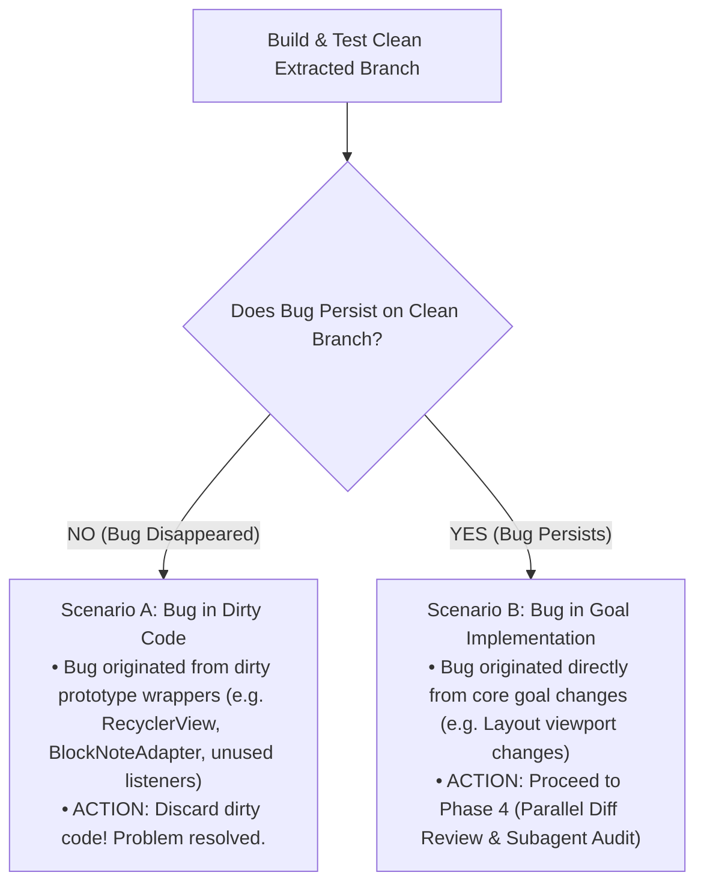

# Isolate Bug (Scenario A vs Scenario B)

This subdoc defines Phase 2 of the **Afterplay** workflow: determining whether reported bugs belong to dirty prototype boilerplate or to the core goal implementation.

---

## 1. Bug Origin Classification

---

## 2. Decision Tree & Protocol

### Scenario A: Bug Belongs to Dirty Code
- **Symptom**: The bug occurs on the dirty prototype branch, but after extracting only the goal core onto the clean branch, the bug no longer occurs.
- **Root Cause**: The bug was an artifact of speculative abstractions, unused adapter code, or dirty wrapper views added during initial prototyping.
- **Action**: No further bug fixing needed. Delete/archive the dirty reference branch and proceed with clean PR.

### Scenario B: Bug Belongs to Goal Implementation
- **Symptom**: The bug persists on the clean branch even after stripping dirty boilerplate.
- **Root Cause**: The change required to achieve the goal (e.g. removing `NestedScrollView` to fix 100k line layout) introduced a side-effect (e.g. breaking touch-drag scrolling).
- **Action**: Proceed immediately to **Phase 4 (`DIFF_REVIEW.md`)** to spawn per-file subagents.
