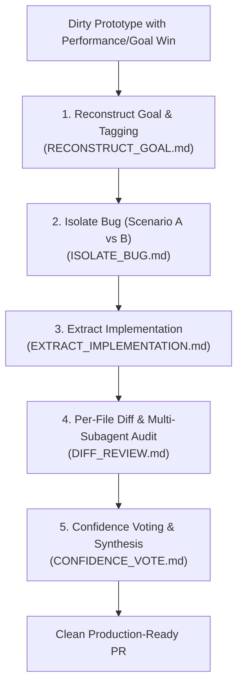

# Afterplay: Post-Prototype Distillation & Diff Audit

Use **Afterplay** when a prototype branch achieves a critical performance win or complex goal (the **Goal**), but the codebase has become dirty, unmaintainable, or contains subtle bugs.

Afterplay provides a disciplined 5-phase pipeline to isolate bugs, extract minimal clean abstractions, run multi-subagent diff audits, and cast confidence votes on every modified file.

---

## Workflows

---

## Execution Phases

### Phase 1: Reconstruct Goal & Tag Baseline
Cleanly reconstruct the environment, preserve dirty work in a reference repository/branch, tag both states, and establish baseline performance metrics.
👉 See [`RECONSTRUCT_GOAL.md`](RECONSTRUCT_GOAL.md) via `view_file` for git tagging conventions and baseline setup.

### Phase 2: Isolate Bug Scenario
Distinguish whether bugs stem from dirty prototype boilerplate (**Scenario A**) or core goal changes (**Scenario B**).
👉 See [`ISOLATE_BUG.md`](ISOLATE_BUG.md) via `view_file` for bug origin isolation rules.

### Phase 3: Extract Minimal Implementation
Extract only the essential abstractions into atomic commits on the clean branch, stripping speculative bloat and separating test bypass code.
👉 See [`EXTRACT_IMPLEMENTATION.md`](EXTRACT_IMPLEMENTATION.md) via `view_file` for surgical extraction protocols.

### Phase 4: Per-File Diff & Multi-Subagent Audit
Generate individual `.diff` files per modified file and spawn parallel subagents (1 subagent per diff file) with complete codebase and goal/bug context.
👉 See [`DIFF_REVIEW.md`](DIFF_REVIEW.md) via `view_file` for `.diff` generation and subagent spawning templates.

### Phase 5: Confidence Voting & Consensus Matrix
Collect subagent assessments across performance criticality, bug taxonomy (Type 0-3), confidence levels (0-100%), and cross-file bug pointing to form a surgical fix plan.
👉 See [`CONFIDENCE_VOTE.md`](CONFIDENCE_VOTE.md) via `view_file` for subagent voting schemas and synthesis templates.
