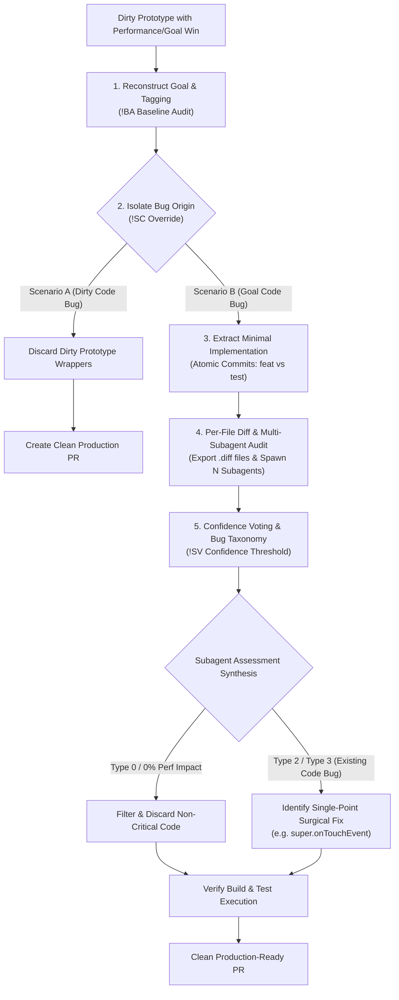

# Afterplay: Post-Prototype Distillation & Diff Audit

Use **Afterplay** when a prototype branch achieves a critical performance win or complex goal (the **Goal**), but the codebase has become dirty, unmaintainable, or contains subtle bugs.

Afterplay provides a disciplined 5-phase pipeline to isolate bugs, extract minimal clean abstractions, run multi-subagent diff audits, and cast confidence votes on every modified file.

---

## Workflows



---

## Execution Phases

### Phase 1: Reconstruct Goal & Tag Baseline
1. Preserve dirty prototype in an independent reference directory or worktree:
   ```bash
   git worktree add ../<repo-name>-architecture <dirty-branch>
   ```
2. Tag dirty reference and clean baseline states:
   ```bash
   git tag -a "dirty-code-<goal>-but-<symptom>" -m "dirty reference baseline"
   git tag -a "clean-code-<goal>-but-<symptom>" -m "clean target baseline"
   ```
3. Record quantitative baseline performance metrics (e.g. latency drop from ~80ms to ~30ms at 100k offset).

### Phase 2: Isolate Bug Scenario
Distinguish whether reported bugs belong to dirty prototype wrappers (**Scenario A**) or core goal changes (**Scenario B**):
- **Scenario A (Bug Disappears on Clean Branch)**: Bug stemmed from dirty prototype wrappers (e.g. unused adapters). Discard dirty code and create clean PR directly.
- **Scenario B (Bug Persists on Clean Branch)**: Bug stems directly from core goal implementation changes. Proceed immediately to Phase 3 and Phase 4.

### Phase 3: Extract Minimal Implementation
Extract essential abstractions into atomic commits on the clean branch, stripping speculative bloat and separating test bypass code:
```bash
git reset HEAD~1
git add path/to/ProductionFile1.java path/to/ProductionFile2.xml
git commit -m "feat: optimize single-edittext performance to 30ms latency"
git add path/to/DevBypassFile.java
git commit -m "test: dev offline mode bypass (skip login)"
```

### Phase 4: Per-File Diff & Multi-Subagent Audit
1. Export individual `.diff` files against base target branch (`origin/trunk` or `origin/main`):
   ```bash
   git diff origin/trunk clean-tag -- path/to/File1.java > "<appDataDir>\brain\<conversation-id>\File1.java.diff"
   ```
2. Spawn $N$ subagents concurrently using `invoke_subagent` (1 subagent per diff file).
3. Supply each subagent with: assigned `.diff` path, full codebase access (`file://`), goal baseline metrics, and bug symptoms.
4. See [REFERENCE.md](REFERENCE.md) via `view_file` for the exact ready-to-use subagent prompt template.

### Phase 5: Confidence Voting & Consensus Matrix
1. Collect subagent assessments across performance criticality, confidence levels (0-100%), and 4-tier bug taxonomy:

| Category Code | Name | Description |
| :---: | :--- | :--- |
| **Type 0** | **Unrelated** | Changes in diff are completely unrelated to the reported bug. |
| **Type 1** | **Missing Code** | Bug occurs because new code for the feature is missing. Existing code is fine. |
| **Type 2** | **Existing Code Bug** | Bug occurs because of a defect in pre-existing code. |
| **Type 3** | **Both** | Bug is caused by a combination of pre-existing code defects AND missing code. |

2. Compile all assessments into `<appDataDir>\brain\<conversation-id>\subagents_diff_and_scrolling_bug_analysis.md`.
3. Filter out diffs with 0% performance impact and pinpoint the minimal surgical fix line edit.
4. See [REFERENCE.md](REFERENCE.md) via `view_file` for subagent markdown/JSON schemas and consensus report templates.

---

## Domain Terms and Tag Commands

The afterplay skill supports specialized modifier tags and domain terminology to control post-prototype distillation and subagent diff review:

- **`Goal Metric`**: Quantifiable baseline performance or functional target achieved during initial prototyping.
- **`Scenario A`**: Bug originating strictly from dirty prototype wrappers or unused boilerplate (discarded on clean branch).
- **`Scenario B`**: Bug originating directly from core goal implementation changes.
- **`!SC<A|B>` (Scenario Choice)**: Force bug classification to Scenario A or B mid-flight in Phase 2 to skip empirical isolation testing.
  - **Syntax/Parameter**: `!SC<A|B>` (Default: Auto-detected via empirical branch test).
  - **Timing**: Start-time.
  - **Agent Action**: Forces bug classification to Scenario A (dirty code bug) or Scenario B (goal code bug).
- **`!BA` (Baseline Audit)**: Require quantitative metric verification in Phase 1 before spawning diff review subagents.
  - **Syntax/Parameter**: `!BA`.
  - **Timing**: Start-time.
  - **Agent Action**: Forces explicit benchmark/profiling run to record baseline metrics before diff review.
- **`!SV<N>` (Subagent Voting Threshold)**: Set minimum confidence threshold in Phase 5 required to accept subagent bug classification.
  - **Syntax/Parameter**: `!SV<N>` (Default: `70`).
  - **Timing**: Start-time.
  - **Agent Action**: Rejects subagent votes with confidence score below $N\%$.


