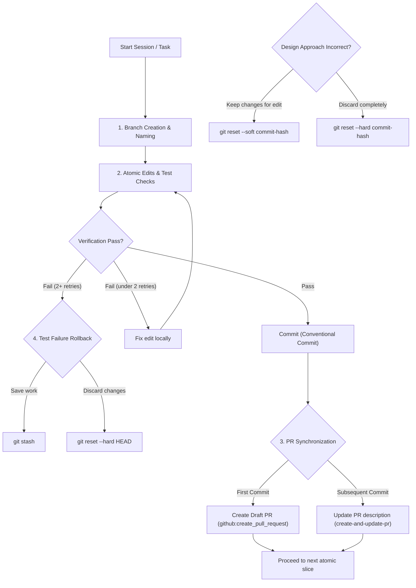

# Git Lifecycle Management

Use this skill to maintain a clean git history with atomic commits, manage pull requests dynamically, and handle safe rollbacks during complex, multi-step coding sessions.

## Quick start

```bash
# 1. Start a feature branch
git checkout -b feature/user-auth

# 2. Make an atomic edit, test it, and commit
# (edit code/tests...)
git add -A && git commit -m "feat(auth): implement basic JWT validation"

# 3. Create Draft PR & keep it updated
# (Refer to create-and-update-pr skill)
```

## Workflows



### 1. Branch Creation & Naming
- Create a branch from the latest base branch (e.g., `main` or `develop`).
- Format branch names clearly: `feature/<short-desc>`, `bugfix/<issue-id>`, or `chore/<task-name>`.

### 2. Atomic Commits
- **Rule**: Each commit must contain exactly one logical change and its corresponding tests/documentation.
- **Size**: Keep edits small. Do not bundle multiple unrelated refactors or features in one commit.
- **Messages**: Follow Conventional Commits: `feat:`, `fix:`, `refactor:`, `test:`, `docs:`, `chore:`.
- **Pre-commit**: Always run tests or compilation checks before committing to ensure the HEAD is never broken.

### 3. Continuous PR Synchronization
- On the first commit, create a Draft Pull Request using `github:create_pull_request`.
- As subsequent atomic commits are added, dynamically update the PR description to list new changes and prevent description drift. Refer to [create-and-update-pr](file:///c:/Users/sayus/.gemini/.agents/skills/create-and-update-pr/SKILL.md).

### 4. Rollback and Revert Strategies
- **Test Failure**: If a change fails verification/tests and is not fixable within 2 iterations:
  - Run `git stash` to save current work, or `git reset --hard HEAD` to discard the failing iteration.
  - Return to the last known stable commit.
- **Incorrect Path**: If a design approach is deemed incorrect:
  - Find the commit hash before the path diverged.
  - Run `git reset --soft <commit-hash>` to keep changes for modification, or `git reset --hard <commit-hash>` to discard them completely.
