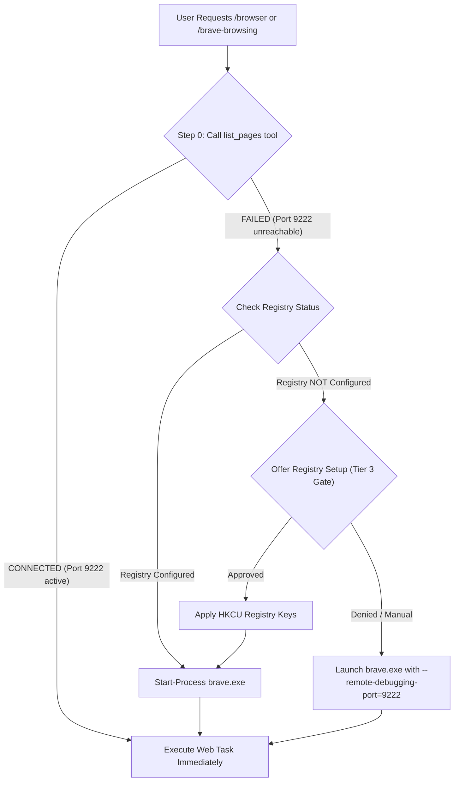

# Brave Browsing with Chrome DevTools MCP

## Step 0: Fast Connection Protocol (Agent Execution Rule)

Whenever invoked via `/browser` or `/brave-browsing`, agents MUST follow this priority sequence BEFORE asking any questions:

1. **Attempt Direct MCP Connection First:** Immediately call `call_mcp_tool` (`chrome-devtools-mcp` -> `list_pages`).
   - **If SUCCESSFUL:** Port 9222 is ALREADY listening (Registry configured or Brave already running). **Proceed directly to the user's web task with zero delay.**
2. **If Connection FAILS (Port 9222 not reachable):**
   - Check if Brave process is running: `Get-Process brave -ErrorAction SilentlyContinue`.
   - Check Registry status: `(Get-ItemProperty "HKCU:\Software\Classes\http\shell\open\command").'(default)'`.
     - **Case A (Registry contains `--remote-debugging-port=9222`):** Launch Brave via `Start-Process brave.exe` or ask user to open Brave normally. Then retry `list_pages`.
     - **Case B (Registry NOT configured):** Present Mode 1 (CLI launch) or ask user if they want to configure Registry (Tier 3 Gate).

## Quick Start

Ensure `mcp_config.json` (at `~/.gemini/config/mcp_config.json`) points to `--browserUrl`:

```json
{
  "mcpServers": {
    "chrome-devtools-mcp": {
      "command": "npx",
      "args": [
        "-y",
        "chrome-devtools-mcp@latest",
        "--browserUrl",
        "http://127.0.0.1:9222"
      ]
    }
  }
}
```

## Workflows



## Setup Modes

### Mode 1: Remote Debugging Port (--browserUrl) - Recommended
- **Command:** `brave.exe --remote-debugging-port=9222 --remote-allow-origins=http://127.0.0.1:9222,http://localhost:9222`
- **MCP Config:** `--browserUrl http://127.0.0.1:9222`

### Mode 2: System-Wide Registry Automation (Persistent)
> [!CAUTION]
> **Tier 3 Execution Gate:** Modifying Registry keys is a system-wide modification. Agents MUST present the exact plan and obtain EXPLICIT USER APPROVAL before executing any Registry commands.

- **Target Registry Keys:**
  1. `HKCU:\Software\Classes\BraveHTML\shell\open\command`
  2. `HKCU:\Software\Classes\http\shell\open\command`
  3. `HKCU:\Software\Classes\https\shell\open\command`
- **Value:** `"C:\Users\<username>\AppData\Local\BraveSoftware\Brave-Browser\Application\brave.exe" --remote-debugging-port=9222 --remote-allow-origins=http://127.0.0.1:9222,http://localhost:9222 -- "%1"`

#### Restore Default:
- **Value:** `"C:\Users\<username>\AppData\Local\BraveSoftware\Brave-Browser\Application\brave.exe" -- "%1"`

## Completion Checklist
- [ ] Direct `list_pages` call attempted first in Step 0.
- [ ] Web task executed without unnecessary user prompt if port 9222 is active.
