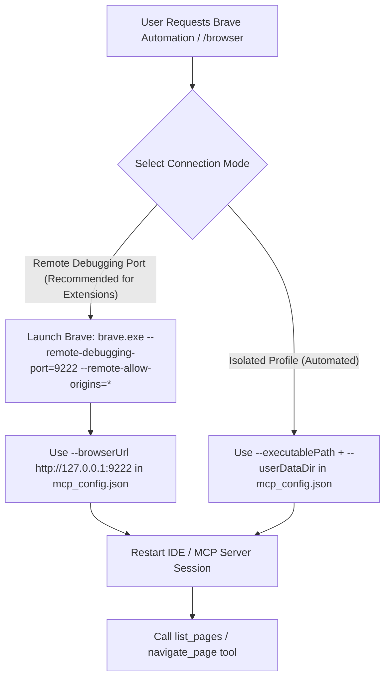

# Brave Browsing with Chrome DevTools MCP

## Quick Start

For Brave with full extension support and active sessions, configure `mcp_config.json` to connect via Remote Debugging Port:

```json
{
  "mcpServers": {
    "chrome-devtools-mcp": {
      "command": "npx",
      "args": [
        "-y",
        "chrome-devtools-mcp@latest",
        "--browserUrl",
        "http://127.0.0.1:9222"
      ]
    }
  }
}
```

Launch Brave with debugging enabled:

```powershell
& "C:\Users\<username>\AppData\Local\BraveSoftware\Brave-Browser\Application\brave.exe" --remote-debugging-port=9222 --remote-allow-origins=*
```

## Workflows



## Setup Modes

### Mode 1: Remote Debugging Port (--browserUrl) - Recommended
- **Use when:** Interacting with authenticated web sessions (Facebook E2EE, Gmail, GitHub) while maintaining full extension support.
- **Command:** `brave.exe --remote-debugging-port=9222 --remote-allow-origins=*`
- **MCP Config:** `--browserUrl http://127.0.0.1:9222`
- **Note:** Brave security policies disable extensions under automated launch flags (`--enable-automation`), making Remote Debugging Port the only mode that preserves all installed extensions.

### Mode 2: Isolated Automated Profile (--executablePath)
- **Use when:** Running headless or isolated browser testing without needing browser extensions.
- **MCP Config:** `--executablePath` + `--userDataDir`

## Completion Checklist
- [ ] Brave launched with `--remote-debugging-port=9222 --remote-allow-origins=*`.
- [ ] `mcp_config.json` configured with `--browserUrl http://127.0.0.1:9222`.
- [ ] `call_mcp_tool` (`chrome-devtools-mcp`/`list_pages`) returns active target pages.
