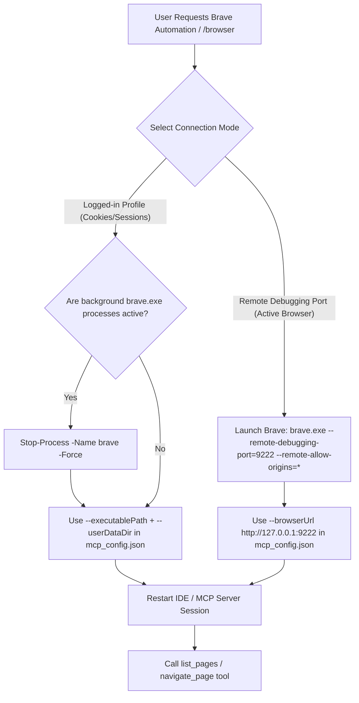

# Brave Browsing with Chrome DevTools MCP

## Quick Start

Update `mcp_config.json` (located at `~/.gemini/config/mcp_config.json` or platform config directory) under the `chrome-devtools-mcp` section:

```json
{
  "mcpServers": {
    "chrome-devtools-mcp": {
      "command": "npx",
      "args": [
        "-y",
        "chrome-devtools-mcp@latest",
        "--executablePath",
        "C:\\Users\\<username>\\AppData\\Local\\BraveSoftware\\Brave-Browser\\Application\\brave.exe",
        "--userDataDir",
        "C:\\Users\\<username>\\AppData\\Local\\BraveSoftware\\Brave-Browser\\User Data",
        "--ignoreDefaultChromeArg",
        "--disable-extensions"
      ]
    }
  }
}
```

## Workflows



## Setup Modes

### Mode 1: Logged-in Profile (--userDataDir)
- **Use when:** Interacting with authenticated web sessions (Facebook E2EE, Gmail, GitHub).
- **Executable Path (Windows):** `C:\Users\<username>\AppData\Local\BraveSoftware\Brave-Browser\Application\brave.exe`
- **User Data Path (Windows):** `C:\Users\<username>\AppData\Local\BraveSoftware\Brave-Browser\User Data`
- **Failure Condition:** If existing Brave instances are running, Chromium locks `User Data` (`The browser is already running...`).
- **Recovery:** Run `Stop-Process -Name brave -Force` before launching or restarting MCP.

### Mode 2: Remote Debugging Port (--browserUrl)
- **Use when:** Attaching directly to an active browser window without restarting Brave.
- **Command:** `brave.exe --remote-debugging-port=9222 --remote-allow-origins=*`
- **MCP Config:** `--browserUrl http://127.0.0.1:9222`
- **Failure Condition:** Enabling `brave://inspect/#remote-debugging` in UI alone causes `404 Not Found` for CDP `/json/version` unless launched with `--remote-allow-origins=*`.

## Completion Checklist
- [ ] `mcp_config.json` configured with verified `brave.exe` path.
- [ ] No locked `User Data` processes remaining if using Mode 1.
- [ ] `call_mcp_tool` (`chrome-devtools-mcp`/`list_pages`) returns active target pages.
