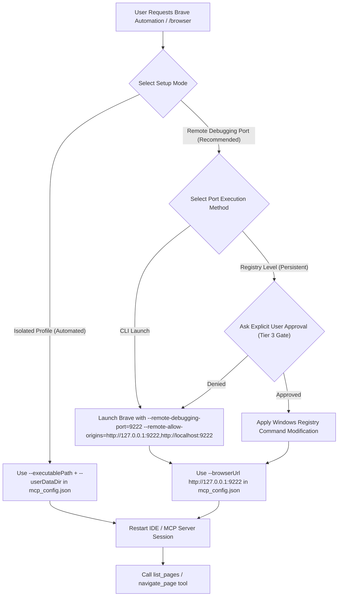

# Brave Browsing with Chrome DevTools MCP

## Quick Start

Configure `mcp_config.json` (located at `~/.gemini/config/mcp_config.json`) to connect via Remote Debugging Port:

```json
{
  "mcpServers": {
    "chrome-devtools-mcp": {
      "command": "npx",
      "args": [
        "-y",
        "chrome-devtools-mcp@latest",
        "--browserUrl",
        "http://127.0.0.1:9222"
      ]
    }
  }
}
```

Launch Brave with secure origin debugging enabled:

```powershell
& "C:\Users\<username>\AppData\Local\BraveSoftware\Brave-Browser\Application\brave.exe" --remote-debugging-port=9222 --remote-allow-origins=http://127.0.0.1:9222,http://localhost:9222
```

## Workflows



## Setup Modes

### Mode 1: Remote Debugging Port (--browserUrl) - Recommended
- **Use when:** Interacting with authenticated web sessions (Facebook E2EE, Gmail, GitHub) while maintaining full extension support.
- **Command:** `brave.exe --remote-debugging-port=9222 --remote-allow-origins=http://127.0.0.1:9222,http://localhost:9222`
- **MCP Config:** `--browserUrl http://127.0.0.1:9222`
- **Security:** Always use explicit origins (`http://127.0.0.1:9222,http://localhost:9222`) instead of wildcard `*`.

### Mode 2: System-Wide Registry Automation (Persistent)
> [!CAUTION]
> **Tier 3 Execution Gate:** Modifying Registry keys is a system-wide modification. Agents MUST present the exact plan and obtain EXPLICIT USER APPROVAL before executing any Registry commands.

- **Target Registry Keys:**
  1. `HKCU:\Software\Classes\BraveHTML\shell\open\command`
  2. `HKCU:\Software\Classes\http\shell\open\command`
  3. `HKCU:\Software\Classes\https\shell\open\command`
- **Value to set:**
  `"C:\Users\<username>\AppData\Local\BraveSoftware\Brave-Browser\Application\brave.exe" --remote-debugging-port=9222 --remote-allow-origins=http://127.0.0.1:9222,http://localhost:9222 -- "%1"`

#### How to restore Registry to Default:
- **Registry default value:**
  `"C:\Users\<username>\AppData\Local\BraveSoftware\Brave-Browser\Application\brave.exe" -- "%1"`

## Completion Checklist
- [ ] Explicit user approval granted if executing Registry setup.
- [ ] Brave running with `--remote-debugging-port=9222` and secure origins.
- [ ] `mcp_config.json` configured with `--browserUrl http://127.0.0.1:9222`.
- [ ] `call_mcp_tool` (`chrome-devtools-mcp`/`list_pages`) connects cleanly.
