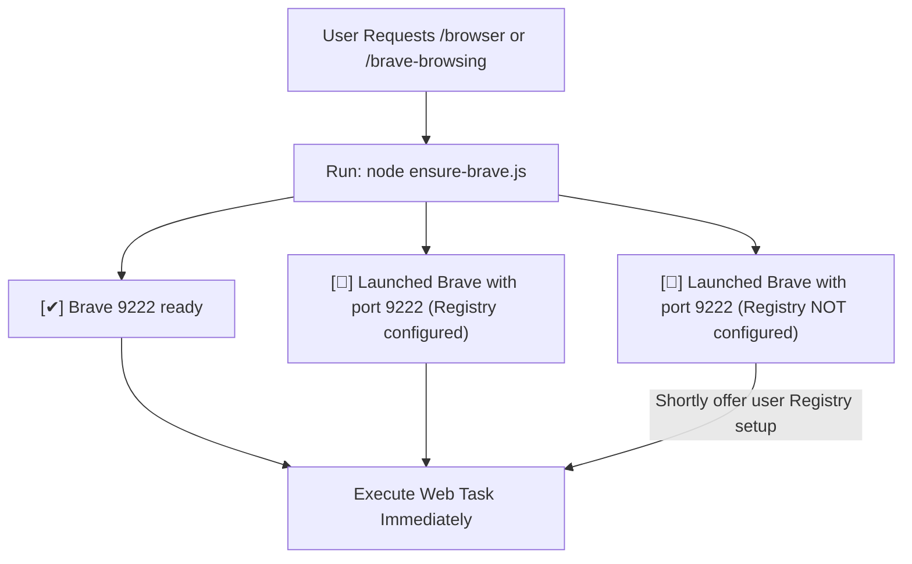

# Brave Browsing with Chrome DevTools MCP

## Fast Connection Protocol (Agent Execution Rule)

Whenever invoked via `/browser` or `/brave-browsing`, agents MUST run the helper script FIRST before taking any other action:

```powershell
node D:\Projects\myskills\productivity\brave-browsing\scripts\ensure-brave.js
```

### Script Output States:

1. **`[✔] Brave 9222 ready`**
   - Port 9222 is active and listening. **Proceed directly to browser automation task with zero delay.**
2. **`[🚀] Launched Brave with port 9222 (Registry configured)`**
   - Brave was launched automatically with remote debugging port 9222. **Proceed to browser automation task.**
3. **`[🚀] Launched Brave with port 9222 (Registry NOT configured). Consider configuring Registry to streamline workflow.`**
   - Brave was launched via CLI flags for now. **Proceed to browser automation task, and shortly offer user Registry setup.**

## Quick Start

Ensure `mcp_config.json` (located at `~/.gemini/config/mcp_config.json`) points to `--browserUrl`:

```json
{
  "mcpServers": {
    "chrome-devtools-mcp": {
      "command": "npx",
      "args": [
        "-y",
        "chrome-devtools-mcp@latest",
        "--browserUrl",
        "http://127.0.0.1:9222"
      ]
    }
  }
}
```

## Workflows



## Setup Modes

### Mode 1: Remote Debugging Port (--browserUrl) - Recommended
- **Command:** `brave.exe --remote-debugging-port=9222 --remote-allow-origins=http://127.0.0.1:9222,http://localhost:9222`
- **MCP Config:** `--browserUrl http://127.0.0.1:9222`

### Mode 2: System-Wide Registry Automation (Persistent)
> [!CAUTION]
> **Tier 3 Execution Gate:** Modifying Registry keys is a system-wide modification. Agents MUST present the exact plan and obtain EXPLICIT USER APPROVAL before executing any Registry commands.

- **Target Registry Keys:**
  1. `HKCU:\Software\Classes\BraveHTML\shell\open\command`
  2. `HKCU:\Software\Classes\http\shell\open\command`
  3. `HKCU:\Software\Classes\https\shell\open\command`
- **Value:** `"C:\Users\<username>\AppData\Local\BraveSoftware\Brave-Browser\Application\brave.exe" --remote-debugging-port=9222 --remote-allow-origins=http://127.0.0.1:9222,http://localhost:9222 -- "%1"`

#### Restore Default:
- **Value:** `"C:\Users\<username>\AppData\Local\BraveSoftware\Brave-Browser\Application\brave.exe" -- "%1"`

## Completion Checklist
- [ ] Ran `ensure-brave.js` helper script.
- [ ] Confirmed Brave connection on port 9222.
- [ ] Executed user's web task without hesitation.
