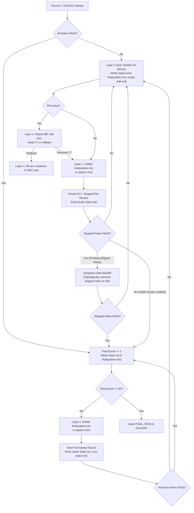

# Conduct Deep Reviewing Loop

Multi-agent review loop using isolated domain reviewers, topological dependency routing, and independent gatekeeping to verify Directive Artifacts (DA).

## Execution Architecture

| Layer | Agent | Primary Responsibility |
| :--- | :--- | :--- |
| **Layer 1** | Main Agent | Spawns Layer 2 Host, handles Host verdict, manages `!PA` pause gate, rollback handling, path-anchored `<da_stem>.bak.md` cleanup, deletes `host/Analyzation.md` prior to Round N+1, terminates Host subagents, presents final output. |
| **Layer 2** | Review Host & Critical Gate | Dynamically selects active reviewers in `Reviewer_Choice_Rationale.md`, summons active reviewers using invariant prompts, purges `reports/` before passes, isolates host artifacts in `host/`, executes Reviewer-level DAG routing (consuming `State.md`), enforces Tier Batch Gate negotiation and in-place fix pre-verification, terminates subagent processes upon tier batch resolution, executes Snapshot Delta Backfill for skipped roles (upstream and untouched), applies verified DA mutations directly (creating `<da_stem>.bak.md` for modified DAs), writes `State.md` and `Analyzation.md`. |
| **Layer 3** | Domain Reviewers | Independent specialist subagents (up to 11 roles across 4 Tiers) executing domain audits per `<Role>-REVIEWER-GUIDE.md`. |

## Workflow

### Step 1: Initialize Workspace

Create or purge `<repo-root>/.scratch/deep-review/host/`, `<repo-root>/.scratch/deep-review/reports/`, and `<repo-root>/.scratch/deep-review/sandbox/`. Delete any pre-existing sibling `<da_stem>.bak.md` files for target DAs listed in `Context.md`. Initialize `.scratch/deep-review/Context.md` with target DA path(s), cross-referenced DAs with dependency lineage (`Upstream` / `Downstream` and `Implemented` / `Unimplemented`), active modifier tags (e.g. `## Active Modifiers: !PA, !SP<N>`), codebase rules (`AGENTS.md`), task domain skills, criteria, and static `SP` threshold.

### Step 2: Spawn Review Host & Critical Gate (Layer 2)

#### 2A. Define Host Subagent Type (Prerequisite)
If `review_host` is not already defined in the active session, call `define_subagent` to register the subagent type:
- `name`: `"review_host"`
- `description`: `"Host and Critical Gate for multi-agent deep reviewing loop"`
- `enable_subagent_tools: true`
- `enable_write_tools: true`
- `enable_mcp_tools: true`
- `system_prompt`: Provide Host operational instructions referencing `REVIEW-HOST-GUIDE.md` and `HOW-TO-GATE.md`.

#### 2B. Summon Review Host
Invoke the registered `review_host` subagent via `invoke_subagent`:
- `TypeName`: `"review_host"`
- `Role`: `"Review Host & Critical Gate"`
- `Prompt`:
  - **Round 1 (Initial)**:
    `You are Review Host & Critical Gate. Target DA(s): <da_path(s)>. System Rules: AGENTS.md. Execution Protocol: REVIEW-HOST-GUIDE.md. Gating Standards: HOW-TO-GATE.md. Context: .scratch/deep-review/Context.md. Execute review round per guides.`
  - **Round N+1 (Targeted or Full Sweep)**:
    `You are Review Host & Critical Gate. Target DA(s): <da_path(s)>. System Rules: AGENTS.md. Execution Protocol: REVIEW-HOST-GUIDE.md. Gating Standards: HOW-TO-GATE.md. Context: .scratch/deep-review/Context.md. State: .scratch/deep-review/host/State.md. Execute review round per guides.`

### Step 3: Handle Host Verdict

Read `.scratch/deep-review/host/Analyzation.md` and `.scratch/deep-review/host/State.md`.

| Verdict in `State.md` | Action |
| :--- | :--- |
| `ROUND_REVISION_NEEDED` | Host applied verified mutations directly to DA(s) and generated `host/State.md` and `host/Analyzation.md`. • **DA Path Verification**: If Host updated `Context.md` for WBS restructuring, Layer 1 re-reads `Context.md` and verifies active paths. • **If `!PA` / `!WA` active**: Host retained `<da_stem>.bak.md` backups. Layer 1 outputs quota pause message, halts turn, and awaits user command (`"C"` or rollback). See **Pause Gate Protocol** below. • **If no pause tag**: Layer 1 deletes `host/Analyzation.md` (preserving `host/State.md`), terminates prior `review_host` via `manage_subagents(Action="kill")`, and immediately re-spawns Layer 2 Host for Round N+1. |
| `ABORTED_MUTATION_FAILURE` | Host experienced a write verification failure or filesystem error during DA mutation and restored DAs from backups. Layer 1 terminates `review_host` via `manage_subagents(Action="kill")`, reports failure details from `Analyzation.md` to user, and halts review loop. |
| `ROUND_PASS` | Layer 1 deletes `host/Analyzation.md` (preserving `host/State.md`), terminates prior `review_host` via `manage_subagents(Action="kill")`, and re-spawns Layer 2 Host for next Full Sweep round on unchanged DA. |
| `FINAL_PASS` | Conclude review loop (`PassCount >= SP`). Layer 1 terminates `review_host` via `manage_subagents(Action="kill")`. Read `.scratch/deep-review/host/Analyzation.md` to confirm verified clearance, present verified DA to user, and execute final directory purge of `<repo-root>/.scratch/deep-review/*`. |

#### Pause Gate Protocol (!PA / !WA)
When `ROUND_REVISION_NEEDED` occurs under `!PA` / `!WA`:
- Output standardized quota pause message:
  `> "Paused per !PA request. Verified mutations were applied directly to target DA(s). Please check your API quota status or inspect diff against <da_stem>.bak.md. Send 'C' to remove backup files and proceed to Round {N+1}, or request rollback to revert mutations and halt."`
- **Upon receiving "C"**: Layer 1 executes ordered cleanup:
  1. If `.scratch/deep-review/Context.bak.md` is present: identify deleted target DAs (present in `Context.bak.md` but absent in active `Context.md`), delete their sibling `<da_stem>.bak.md` files, and delete `Context.bak.md`.
  2. For every active target DA in `Context.md`: delete its sibling `<da_stem>.bak.md` file (if present).
  3. Delete any remaining orphaned sibling `<da_stem>.bak.md` files in target DA directories.
  4. Delete `.scratch/deep-review/host/Analyzation.md` to prevent anti-anchoring in Round N+1 (strictly preserving `host/State.md`).
  5. Terminate prior `review_host` via `manage_subagents(Action="kill")` and re-spawn Host for Round N+1.
- **Upon user rollback command**: Layer 1 executes rollback:
  1. If `.scratch/deep-review/Context.bak.md` is present: identify newly created DAs (present in active `Context.md` but absent in `Context.bak.md`) and delete them; restore `Context.md` from `Context.bak.md` and delete `Context.bak.md`.
  2. For every target DA listed in `Context.md` (restored from `Context.bak.md` if present): restore from its sibling `<da_stem>.bak.md` file (if present) and delete the backup file.
  3. Delete any remaining orphaned sibling `<da_stem>.bak.md` backup files.
  4. Delete `host/State.md` and `host/Analyzation.md`, terminate `review_host` via `manage_subagents(Action="kill")`, and halt the review loop, reporting that mutations were reverted.

## Modifiers

| Command | Action |
| :--- | :--- |
| `!SP<N>` | Set required continuous Full Sweep PASS rounds threshold to N (Default: 1). |
| `!PA` / `!WA` | Pre-review pause gate: On `ROUND_REVISION_NEEDED`, Host retains sibling `<da_stem>.bak.md` copies and applies verified mutations directly to DA. Main Agent halts turn, prompts user to check quota / review diff, and awaits keyword `"C"` to remove backup files, delete `host/Analyzation.md`, and proceed to Round N+1 (or executes rollback if user requests revert). Remains active across the entire review loop until `FINAL_PASS`. |
| `!FPA` | Instantly kill running subagents and pause execution. |
