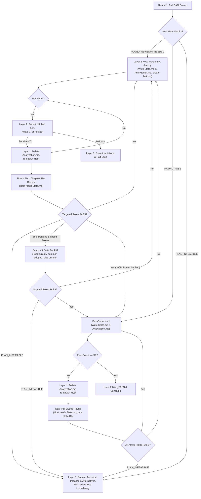

# Conduct Deep Reviewing Loop

Multi-agent review loop using isolated domain reviewers, topological dependency routing, and independent gatekeeping to verify Directive Artifacts (DA).

## Execution Architecture

| Layer | Agent | Primary Responsibility |
| :--- | :--- | :--- |
| **Layer 1** | Main Agent | Resolves `<short_title>` and binds `<review_dir>` (`.scratch/deep-review-<short_title>`), initializes isolated workspace, spawns Layer 2 Host passing `<review_dir>`, handles Host verdict (including user escalation on `PLAN_INFEASIBLE`), manages `!PA` pause gate, rollback handling, path-anchored `<da_stem>.bak.md` cleanup, deletes `<review_dir>/host/Analyzation.md` prior to Round N+1, terminates Host subagents, executes final isolated teardown of `<review_dir>/*`, presents final output. |
| **Layer 2** | Review Host & Critical Gate | Consumes assigned `<review_dir>` from prompt and `Context.md`, dynamically selects active reviewers in `Reviewer_Choice_Rationale.md`, summons active reviewers passing `<review_dir>`, purges `<review_dir>/reports/` before passes, isolates host artifacts in `<review_dir>/host/`, executes Reviewer-level DAG routing (consuming `State.md`), enforces Tier Batch Gate negotiation and in-place fix pre-verification, terminates subagent processes upon tier batch resolution, executes Snapshot Delta Backfill for skipped roles (upstream and untouched), applies verified DA mutations directly (creating `<da_stem>.bak.md` for modified DAs), writes `<review_dir>/host/State.md` and `<review_dir>/host/Analyzation.md` (halting without DA mutation on `PLAN_INFEASIBLE`). |
| **Layer 3** | Domain Reviewers | Independent specialist subagents (up to 11 roles across 4 Tiers) consuming `<review_dir>` from prompt and `Context.md`, executing domain audits per `<Role>-REVIEWER-GUIDE.md`. |

## Workflow

### Step 1: Initialize Workspace

1. **Resolve `<short_title>` and Workspace Directory (`<review_dir>`)**:
   - Determine `<short_title>` according to strict precedence:
     1. **Explicit User Specification**: User-specified title, slug, or tag in prompt (e.g. `/conduct-deep-reviewing-loop <title>`), excluding active role identifiers, modifier tags, and target DA file paths. Extract the candidate string and pass it directly to the 5-stage slugification pipeline as `<Topic>`.
     2. **Single Target DA Topic / Stem**: If auditing a single file whose stem is generic (`implementation_plan`, `plan`, `spec`, `draft`, `index`) or located in an agent brain session folder (`.gemini/antigravity/brain/<id>/`), extract `<short_title>` from the document's top-level H1 header:
        - Extract raw text from top-level H1 header (stripping `#` and whitespace).
        - Strip case-insensitive leading document archetype prefixes matching `^(?:Implementation\s+Plan|Plan|Spec(?:ification)?|Design\s+Doc(?:ument)?|Architecture\s+Spec(?:ification)?)\s*[:–—|-]\s*`.
        - Trim remaining leading/trailing whitespace and punctuation, and pass the resulting string as `<Topic>` to the 5-stage slugification pipeline (e.g. `# Implementation Plan: Dynamic Workspace Isolation` -> `dynamic-workspace-isolati` (truncated to 25 chars)).
        - If no prefix matches, pass the entire trimmed H1 header text to the slugification pipeline.
        - Fall back to the filename stem only if no H1 header exists or extraction yields empty. For non-generic filenames (and filename stem fallbacks), pass the extracted stem to the 5-stage slugification pipeline as `<Topic>` (e.g. `auth_service.md` -> stem `auth_service` passed to pipeline -> `auth-service`).
     3. **Cluster / Epic Topic**: Common parent folder name or 2-3 word topic slug if auditing multiple DAs (e.g. `notifier-tickets`). Pass the candidate string to the 5-stage slugification pipeline as `<Topic>`.
   - **Strict Slugification Pipeline & Bounds**:
     - Multi-stage sanitization:
       1. Convert whitespace, underscores (`_`), and non-alphanumeric characters to hyphens (`-`).
       2. Convert all characters to lowercase.
       3. Collapse consecutive hyphens (`-+` -> `-`).
       4. Truncate to maximum 25 characters (prevents Windows `MAX_PATH` overflow in nested `sandbox/` probe scripts).
       5. Trim leading and trailing hyphens.
     - Deterministic Degenerate Fallback: If sanitized slug evaluates to empty (`""`), fallback to `default` (`.scratch/deep-review-default`).
     - Absolute ban on `#` character (prevents URL fragment parsing errors in Markdown `file:///` URIs).
   - Bind `<review_dir>` = `.scratch/deep-review-<short_title>`. Never fallback to plain `.scratch/deep-review/`.

2. **Directory Initialization**:
   - Create or purge `<repo-root>/<review_dir>/host/`, `<repo-root>/<review_dir>/reports/`, and `<repo-root>/<review_dir>/sandbox/`.
   - Delete any pre-existing sibling `<da_stem>.bak.md` files for target DAs listed in `Context.md`.
   - Initialize `<repo-root>/<review_dir>/Context.md` with:
     - `## Review Workspace: <review_dir>`
     - Target DA path(s).
     - Cross-referenced DAs with dependency lineage (`Upstream` / `Downstream` and `Implemented` / `Unimplemented`).
     - Active modifier tags (e.g. `## Active Modifiers: !PA, !SP<N>`).
     - Codebase rules (`AGENTS.md`), task domain skills, criteria, and static `SP` threshold.

### Step 2: Spawn Review Host & Critical Gate (Layer 2)

#### 2A. Define Host Subagent Type (Prerequisite)
If `review_host` is not already defined in the active session, call `define_subagent` to register the subagent type:
- `name`: `"review_host"`
- `description`: `"Host and Critical Gate for multi-agent deep reviewing loop"`
- `enable_subagent_tools: true`
- `enable_write_tools: true`
- `enable_mcp_tools: true`
- `system_prompt`: Provide Host operational instructions referencing `REVIEW-HOST-GUIDE.md` and `HOW-TO-GATE.md`.

#### 2B. Summon Review Host
Invoke the registered `review_host` subagent via `invoke_subagent`:
- `TypeName`: `"review_host"`
- `Role`: `"Review Host & Critical Gate"`
- `Prompt`:
  - **Round 1 (Initial)**:
    `You are Review Host & Critical Gate. Review Workspace: <review_dir>. Target DA(s): <da_path(s)>. System Rules: AGENTS.md. Execution Protocol: REVIEW-HOST-GUIDE.md. Gating Standards: HOW-TO-GATE.md. Context: <review_dir>/Context.md. FIRST read the listed files, then execute review round per guides.`
  - **Round N+1 (Targeted or Full Sweep)**:
    `You are Review Host & Critical Gate. Review Workspace: <review_dir>. Target DA(s): <da_path(s)>. System Rules: AGENTS.md. Execution Protocol: REVIEW-HOST-GUIDE.md. Gating Standards: HOW-TO-GATE.md. Context: <review_dir>/Context.md. State: <review_dir>/host/State.md. FIRST read the listed files, then execute review round per guides.`

### Step 3: Handle Host Verdict

Read `<review_dir>/host/Analyzation.md` and `<review_dir>/host/State.md`.

| Verdict in `State.md` | Action |
| :--- | :--- |
| `ROUND_REVISION_NEEDED` | Host applied verified mutations directly to DA(s) and generated `<review_dir>/host/State.md` and `<review_dir>/host/Analyzation.md`. • **DA Path Verification**: If Host updated `Context.md` for WBS restructuring, Layer 1 re-reads `<review_dir>/Context.md` and verifies active paths. • **If `!PA` / `!WA` active**: Host retained `<da_stem>.bak.md` backups. Layer 1 outputs quota pause message, halts turn, and awaits user command (`"C"` or rollback). See **Pause Gate Protocol** below. • **If no pause tag**: Layer 1 deletes `<review_dir>/host/Analyzation.md` (preserving `<review_dir>/host/State.md`), terminates prior `review_host` via `manage_subagents(Action="kill")`, and immediately re-spawns Layer 2 Host for Round N+1. |
| `PLAN_INFEASIBLE` | Host verified an insurmountable technical impasse or platform impossibility with zero in-scope fixes. Host preserved target DA(s) without mutation and generated `<review_dir>/host/State.md` and `<review_dir>/host/Analyzation.md`. Layer 1 terminates `review_host` via `manage_subagents(Action="kill")`, extracts the impasse analysis and `Alternative Architectural Paths` from `<review_dir>/host/Analyzation.md`, presents them directly to the user, and immediately halts the review loop. |
| `ABORTED_MUTATION_FAILURE` | Host experienced a write verification failure or filesystem error during DA mutation and restored DAs from backups. Layer 1 terminates `review_host` via `manage_subagents(Action="kill")`, reports failure details from `<review_dir>/host/Analyzation.md` to user, and halts review loop. |
| `ROUND_PASS` | Layer 1 deletes `<review_dir>/host/Analyzation.md` (preserving `<review_dir>/host/State.md`), terminates prior `review_host` via `manage_subagents(Action="kill")`, and re-spawns Layer 2 Host for next Full Sweep round on unchanged DA. |
| `FINAL_PASS` | Conclude review loop (`PassCount >= SP`). Layer 1 terminates `review_host` via `manage_subagents(Action="kill")`. Read `<review_dir>/host/Analyzation.md` to confirm verified clearance, present verified DA to user, and execute final isolated directory purge of `<repo-root>/<review_dir>/*` (preserving other active review workspaces). |

#### Pause Gate Protocol (!PA / !WA)
When `ROUND_REVISION_NEEDED` occurs under `!PA` / `!WA`:
- Output standardized quota pause message:
  `> "Paused per !PA request. Verified mutations were applied directly to target DA(s). Please check your API quota status or inspect diff against <da_stem>.bak.md. Send 'C' to remove backup files and proceed to Round {N+1}, or request rollback to revert mutations and halt."`
- **Upon receiving "C"**: Layer 1 executes ordered cleanup:
  1. If `<review_dir>/Context.bak.md` is present: identify deleted target DAs (present in `Context.bak.md` but absent in active `Context.md`), delete their sibling `<da_stem>.bak.md` files, and delete `<review_dir>/Context.bak.md`.
  2. For every active target DA in `<review_dir>/Context.md`: delete its sibling `<da_stem>.bak.md` file (if present).
  3. Delete any remaining orphaned sibling `<da_stem>.bak.md` files in target DA directories.
  4. Delete `<review_dir>/host/Analyzation.md` to prevent anti-anchoring in Round N+1 (strictly preserving `<review_dir>/host/State.md`).
  5. Terminate prior `review_host` via `manage_subagents(Action="kill")` and re-spawn Host for Round N+1.
- **Upon user rollback command**: Layer 1 executes rollback:
  1. If `<review_dir>/Context.bak.md` is present: identify newly created DAs (present in active `Context.md` but absent in `Context.bak.md`) and delete them; restore `<review_dir>/Context.md` from `<review_dir>/Context.bak.md` and delete `<review_dir>/Context.bak.md`.
  2. For every target DA listed in `<review_dir>/Context.md` (restored from `Context.bak.md` if present): restore from its sibling `<da_stem>.bak.md` file (if present) and delete the backup file.
  3. Delete any remaining orphaned sibling `<da_stem>.bak.md` backup files.
  4. Delete `<review_dir>/host/State.md` and `<review_dir>/host/Analyzation.md`, terminate `review_host` via `manage_subagents(Action="kill")`, and halt the review loop, reporting that mutations were reverted.

## Modifiers

| Command | Action |
| :--- | :--- |
| `!SP<N>` | Set required continuous Full Sweep PASS rounds threshold to N (Default: 1). |
| `!PA` / `!WA` | Pre-review pause gate: On `ROUND_REVISION_NEEDED`, Host retains sibling `<da_stem>.bak.md` copies and applies verified mutations directly to DA. Main Agent halts turn, prompts user to check quota / review diff, and awaits keyword `"C"` to remove backup files, delete `<review_dir>/host/Analyzation.md`, and proceed to Round N+1 (or executes rollback if user requests revert). Remains active across the entire review loop until `FINAL_PASS` or permanent halt (`PLAN_INFEASIBLE` / `ABORTED_MUTATION_FAILURE`). |
| `!FPA` | Instantly kill running subagents and pause execution. |
