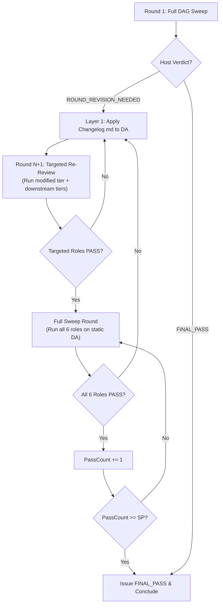

# Conduct Deep Reviewing Loop

Multi-agent review loop using isolated domain reviewers, topological dependency routing, and independent gatekeeping to verify Directive Artifacts (DA).

## Execution Architecture

| Layer | Agent | Primary Responsibility |
| :--- | :--- | :--- |
| **Layer 1** | Main Agent | Spawns Layer 2 Host, applies clean DA mutations from `Changelog.md`, presents final output. |
| **Layer 2** | Review Host & Critical Gate | Writes `Context.md`, routes Layer 3 reviewers via DAG, skips unaffected roles on re-review, runs Full Sweep before Final PASS, writes `Analyzation.md` and `Changelog.md`. |
| **Layer 3** | Domain Reviewers | Independent subagents executing domain audits per `<Role>-REVIEWER-GUIDE.md`. |

## Workflow

### Step 1: Initialize Workspace

Create `scratch/deep_review/`. Save target DA path and criteria.

### Step 2: Spawn Review Host & Critical Gate (Layer 2)

Spawn Layer 2 Subagent with prompt:
`You are Review Host & Critical Gate. Target DA: <da_path>. System Rules: AGENTS.md. Execution Protocol: PROTOCOL.md. Opinion Filtering: HOW-TO-PICK-UP-THE-RIGHT-OPINIONS.md. Execute DAG routing, write Context.md, spawn Layer 3 domain reviewers, filter feedback, and generate Analyzation.md and Changelog.md.`

### Step 3: Handle Host Verdict

Read `scratch/deep_review/Analyzation.md`.

| Verdict in `Analyzation.md` | Action |
| :--- | :--- |
| `ROUND_REVISION_NEEDED` | Read `scratch/deep_review/Changelog.md`. Apply edits to DA using Clean & Neutral Artifact Protocol. Re-spawn Layer 2 Host for Round N+1. |
| `FINAL_PASS` | Conclude review loop. Present fully verified DA to user. |

## Modifiers

| Command | Action |
| :--- | :--- |
| `!SP<N>` | Set required continuous Full Sweep PASS rounds threshold to N (Default: 1). |
| `!PA` | Pause execution after applying Layer 2 `Changelog.md` edits; await user confirmation before starting next round. |
| `!FPA` | Instantly kill running subagents and pause execution. |
