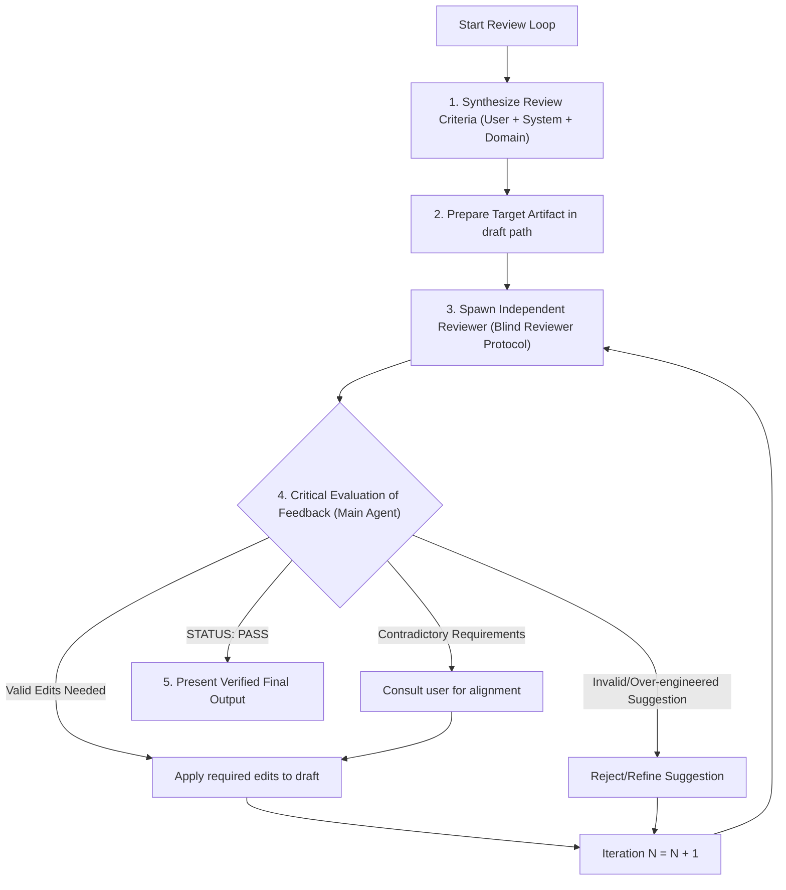

# Conduct Reviewing Loop

Run iterative, independent subagent reviews to stress-test plans, code designs, skills, PRDs, or specs against explicit user and system criteria.

## Workflows

### 1. Artifact & Review Matrix

| Artifact Type | Primary Checklist Sources | Model Selection Strategy | Termination Condition |
| :--- | :--- | :--- | :--- |
| **Skill Draft** | `/write-a-skill`, `/write-for-ai`, `AGENTS.md`, User rules | Most capable reasoning model (e.g. `inherit` / `pro`) | Until clean **STATUS: PASS** |
| **Implementation Plan / RFC** | `AGENTS.md`, `/codebase-design`, `/improve-codebase-architecture`, User rules | Most capable reasoning model (e.g. `inherit` / `pro`) | Until clean **STATUS: PASS** |
| **PRD / Spec** | `/to-prd`, `/to-spec`, User rules | Most capable reasoning model (e.g. `inherit` / `pro`) | Until clean **STATUS: PASS** |
| **Code / Patch Audit** | `/code-review`, `/ponytail-review`, `AGENTS.md` | Most capable reasoning model (e.g. `inherit` / `pro`) | Until clean **STATUS: PASS** |

### 2. Synthesize Review Criteria

Synthesize a custom review checklist from 3 sources:
1. **User Criteria**: Explicit rules, constraints, or preferences specified by the user.
2. **System Guidelines**: Applicable guidelines/skills (e.g. `/write-a-skill`, `/write-for-ai`, `AGENTS.md`).
3. **Domain Completeness**: Edge cases, performance risks, or missing requirements identified by the main agent.

### 3. Prepare Target Artifact

Write or update the target document/artifact in a draft path (e.g. `scratch/draft_<name>/`).

### 4. Reviewer Loop Execution (Blind Protocol & Critical Filter)

> [!IMPORTANT]
> **Blind Reviewer Protocol**: NEVER feed previous reviewer findings, past feedback points, or lists of fixed items to Reviewer #N+1. Passing past feedback creates **Anchoring Bias** (narrowing focus to old items) and **Confirmation Bias** (rubber-stamping approval). Every Reviewer subagent MUST evaluate the latest draft with completely fresh, unbiased eyes.

> [!WARNING]
> **Critical Evaluation Rule (Main Agent Gatekeeper)**: ALWAYS be critical of reviewers' feedback. Do NOT blindly apply every reviewer request. The Main Agent MUST filter and validate reviewer suggestions against:
> 1. **User Requirements & Simplicity (YAGNI)**: Does the suggestion add unnecessary complexity or over-engineering?
> 2. **Empirical Codebase Facts**: Verify directly in codebase whether the reviewer's claimed bug or gap is real.
> 3. **Repository Rules (`AGENTS.md`)**: Ensure reviewer suggestions comply with project architecture principles.
> If a reviewer suggestion is invalid, hallucinated, or over-engineered, REJECT or refine that suggestion.

For each iteration $N$ ($1, 2, 3...$):

1. **Spawn Independent Reviewer**: Call `invoke_subagent` with a DIFFERENT Reviewer Role (`<Domain> Reviewer #N`), using the environment's most capable reasoning model tier (defaulting to `inherit` if unstated).
   - Pass ONLY: latest target artifact path, codebase paths, guidelines, and general checklist.
   - STRICTLY PROHIBIT including previous reviewer comments or lists of fixed points in the prompt.
   - Instruct reviewer to conclude strictly with **STATUS: PASS** or **STATUS: REVISIONS NEEDED** with numbered edits.
2. **Evaluate Feedback Critically**:
   - Filter feedback through the Critical Evaluation Rule.
   - If **STATUS: REVISIONS NEEDED** contains valid, verified edits: Apply edits to draft artifact and proceed to iteration $N+1$ with a fresh subagent reviewer.
   - If **STATUS: PASS**: Terminate loop and proceed to presentation.
3. **Conflict Resolution**: If consecutive reviewers highlight conflicting requirements, synthesize the contradictory points and consult the user for alignment.

### 5. Present Verified Final Output

Submit the final, reviewer-validated artifact to the user, highlighting key iterations and improvements.

---

## Templates & Checklists

See [REFERENCE.md](REFERENCE.md) for Reviewer Prompt Templates and Checklist Builders for Plans, Code, and Skills. (You MUST read [REFERENCE.md](REFERENCE.md) using `view_file` before launching reviewer loops).
