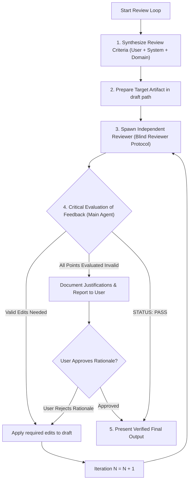

# Conduct Reviewing Loop

Run iterative, independent subagent reviews to stress-test plans, code designs, skills, PRDs, or specs against explicit user and system criteria.

## Workflows

### 1. Artifact & Review Matrix

| Artifact Type | Primary Checklist Sources | Model Selection Strategy | Termination Condition |
| :--- | :--- | :--- | :--- |
| **Skill Draft** | `/write-a-skill`, `/write-for-ai`, `AGENTS.md`, User rules | Most capable reasoning model (e.g. `inherit` / `pro`) | Until `STATUS: PASS` or User-Approved Invalid Rationale |
| **Implementation Plan / RFC** | `AGENTS.md`, `/codebase-design`, `/improve-codebase-architecture`, User rules | Most capable reasoning model (e.g. `inherit` / `pro`) | Until `STATUS: PASS` or User-Approved Invalid Rationale |
| **PRD / Spec** | `/to-prd`, `/to-spec`, User rules | Most capable reasoning model (e.g. `inherit` / `pro`) | Until `STATUS: PASS` or User-Approved Invalid Rationale |
| **Code / Patch Audit** | `/code-review`, `/ponytail-review`, `AGENTS.md` | Most capable reasoning model (e.g. `inherit` / `pro`) | Until `STATUS: PASS` or User-Approved Invalid Rationale |

### 2. Synthesize Review Criteria

Synthesize a custom review checklist from 3 sources:
1. **User Criteria**: Explicit rules, constraints, or preferences specified by the user.
2. **System Guidelines**: Applicable guidelines/skills (e.g. `/write-a-skill`, `/write-for-ai`, `AGENTS.md`).
3. **Domain Completeness**: High-level edge cases, performance risks, or missing requirements identified by the main agent.

### 3. Prepare Target Artifact

Write or update the target document/artifact in a draft path (e.g. `scratch/draft_<name>/`).

### 4. Reviewer Loop Execution (Blind Protocol & Critical Filter)

> [!IMPORTANT]
> **Blind Reviewer Protocol & No-Hint Checklist**:
> NEVER feed previous reviewer findings, past feedback points, or lists of fixed items to Reviewer #N+1.
> Furthermore, the Synthesized Audit Checklist in the prompt MUST remain strictly at the **High-Level Domain Specification Level** (verifying correctness, edge-case safety principles, and system guidelines). The checklist MUST NEVER name specific internal function names (`_commit_transaction_with_delay`), private flags (`old_start=0`), file markers (`.missing`), or code snippets introduced during previous iterations.
> Listing implementation details from previous iterations causes **Prompt Poisoning & Anchoring Bias**, forcing the reviewer to act as a checklist checker instead of an independent auditor.

> [!WARNING]
> **Critical Evaluation Rule (Main Agent Gatekeeper)**: ALWAYS be critical of reviewers' feedback. Do NOT blindly apply every reviewer request. The Main Agent MUST filter and validate reviewer suggestions against:
> 1. **User Requirements & Simplicity (YAGNI)**: Does the suggestion add unnecessary complexity or over-engineering?
> 2. **Empirical Codebase Facts**: Verify directly in codebase whether the reviewer's claimed bug or gap is real.
> 3. **Repository Rules (`AGENTS.md`)**: Ensure reviewer suggestions comply with project architecture principles.

> [!CAUTION]
> **Strict Loop Termination & User Approval Protocol**:
> The Main Agent MUST continue the review loop (spawning iteration $N+1$) UNTIL one of two valid termination conditions is met:
> 
> 1. **Condition A (Explicit PASS)**: A reviewer subagent explicitly concludes with `STATUS: PASS`.
> 2. **Condition B (All Points Evaluated Invalid by Main Agent)**: The latest reviewer returns `STATUS: REVISIONS NEEDED`, but the Main Agent critically evaluates **EVERY** suggested point as invalid, hallucinated, or over-engineered (violating YAGNI or user constraints).
> 
> **User Approval Gate**: In ALL cases, before declaring the plan/artifact ready for execution or state-modifying changes (Tier 3), the Main Agent MUST report the final review loop outcome to the user and await explicit user approval.
> *In Condition B*, the Main Agent MUST explicitly document each rejected reviewer point, provide a technical justification for why it was deemed invalid, and present this rationale to the user for explicit approval.

For each iteration $N$ ($1, 2, 3...$):

1. **Spawn Independent Reviewer**: Call `invoke_subagent` with a DIFFERENT Reviewer Role (`<Domain> Reviewer #N`), using the environment's most capable reasoning model tier (defaulting to `inherit` if unstated).
   - Pass ONLY: latest target artifact path, codebase paths, guidelines, and high-level specification checklist.
   - STRICTLY PROHIBIT including previous reviewer comments, lists of fixed points, or specific internal implementation names in the prompt.
   - Instruct reviewer to conclude strictly with **STATUS: PASS** or **STATUS: REVISIONS NEEDED** with numbered edits.
2. **Evaluate Feedback Critically**:
   - Filter feedback through the Critical Evaluation Rule.
   - If **STATUS: REVISIONS NEEDED** contains valid, verified edits: Apply edits to draft artifact and MUST proceed to iteration $N+1$ with a fresh subagent reviewer.
   - If **STATUS: REVISIONS NEEDED** has ONLY invalid/over-engineered points: Document justifications for rejecting each point, stop loop, and present rationale to user for approval.
   - If **STATUS: PASS**: Terminate loop and proceed to presentation.
3. **Conflict Resolution**: If consecutive reviewers highlight conflicting requirements, synthesize the contradictory points and consult the user for alignment.

### 5. Present Verified Final Output

Submit the final, reviewer-validated artifact to the user, highlighting key iterations, improvements, or invalid point justifications, and await explicit approval for execution.

---

## Templates & Checklists

See [REFERENCE.md](REFERENCE.md) for Reviewer Prompt Templates and Checklist Builders for Plans, Code, and Skills. (You MUST read [REFERENCE.md](REFERENCE.md) using `view_file` before launching reviewer loops).
