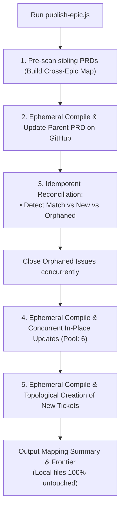

# GitPublish PRD and Tickets

Publish or synchronize a local PRD and its constituent ticket markdown files to GitHub Issues with parallel batch concurrency. Resolves semantic keys (`01.1.1.1`, `02.1`), maps dependencies across both intra-PRD and cross-PRD references, updates parent PRD links, attaches standardized taxonomy labels, and handles in-place updates, splits, and deletions with zero duplicates.

## Core Directives

1. **Source Purity & Zero Disk Mutation (SSOT Preservation)**:
   - Local files under `docs/specs/` (`PRD.md` and `tickets/*.md`) MUST remain **100% pure semantic files** and **NEVER be modified on disk** by the publish script.
   - All transformations (`01.1` $\to$ `#138 (01.1)`, parent references) are compiled ephemerally in memory / OS tempdir exclusively for GitHub API upload.
   - Reviewers in `/conduct-deep-reviewing-loop` continue to work with clean semantic keys without mutable GitHub issue IDs pollution.
2. **High-Performance Parallel Execution**: Runs in-place ticket updates and non-dependent ticket creations concurrently using an internal worker pool (`--concurrency <N>`, default: 6).
3. **Batch Multi-Epic Synchronization**: Supports `--all` flag to discover, pre-scan, and synchronize all Epics under `docs/specs/` in a single command.
4. **Idempotent Reconciliation**:
   - **Matching Key (`01.1` $\to$ `01.1`)**: Executes in-place update (`gh issue edit`) on the existing GitHub issue without creating duplicates.
   - **New Key (Split child `01.1.1` or added `05.2`)**: Creates a new issue (`gh issue create`).
   - **Orphaned Key (Old `01.1` removed or split)**: Automatically closes the stale remote issue with reason not planned and closing comment (`gh issue close --reason "not planned" --comment "..."`).
5. **Topological Publishing**: Publishes tickets in topological order so that prerequisite tickets receive GitHub issue IDs before dependent tickets.
6. **Standardized Taxonomy Auto-Labels**:
   - **Parent PRD**: `epic`, `epic-<num>` (e.g. `epic,epic-02`)
   - **Child Tickets**: `ticket`, `epic-<num>` (e.g. `ticket,epic-02`)

---

## Workflow



---

## CLI Usage

```bash
# Dry run simulation on single Epic
node <skill-dir>/scripts/publish-epic.js docs/specs/02-codebase-readiness-multios/PRD.md --dry-run

# Reconcile & publish single Epic (concurrency pool of 8, zero disk mutation)
node <skill-dir>/scripts/publish-epic.js docs/specs/02-codebase-readiness-multios/PRD.md --concurrency 8

# Batch synchronize ALL 5 Epics across the workspace
node <skill-dir>/scripts/publish-epic.js docs/specs/ --all --concurrency 8

# Target specific repo or parent issue
node <skill-dir>/scripts/publish-epic.js docs/specs/03-virtual-nested-folders-and-workspaces/PRD.md --parent-id 94 --repo loerei/YumeShelf
```

---

## Output

Outputs a JSON mapping of all published tickets (`"01.1.1.1": 138`) and the immediate unblocked implementation frontier ready for `/implement-a-ticket`.
