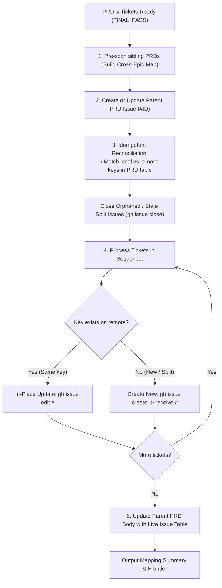

# GitPublish PRD and Tickets

Publish or synchronize a local PRD and its constituent ticket markdown files to GitHub Issues in a single automated, idempotent step. Resolves semantic keys (`01.1.1.1`, `02.1`), maps dependencies across both intra-PRD and cross-PRD references, updates parent PRD links, attaches standardized taxonomy labels, and handles in-place updates, splits, and deletions with zero duplicates.

## Directives

1. **Idempotent Reconciliation**:
   - **Matching Key (`01.1` $\to$ `01.1`)**: Executes in-place update (`gh issue edit`) on the existing GitHub issue without creating duplicates.
   - **New Key (Split child `01.1.1` or added `05.2`)**: Creates a new issue (`gh issue create`).
   - **Orphaned Key (Old `01.1` removed or split)**: Automatically comments and closes the stale remote issue (`gh issue close`).
2. **Topological Publishing**: MUST publish tickets in the sequence specified in the PRD or directory ordering so that prerequisite tickets receive GitHub issue IDs before dependent tickets.
3. **Dynamic Key Resolution**: Automatically maps semantic ticket keys (e.g. `01.1.1.1` $\to$ `#138 (01.1.1.1)`) across all ticket bodies and the parent PRD without requiring manual issue ID updates.
4. **Cross-PRD Pre-scan**: Automatically scans all sibling `docs/specs/*/PRD.md` files to resolve cross-epic references (e.g. `Epic 02: 02.2.2` $\to$ `#151 (Epic 02: 02.2.2)`).
5. **Standardized Taxonomy Auto-Labels**:
   - **Parent PRD**: `prd`, `epic`, `epic-<num>` (e.g. `prd,epic,epic-02`)
   - **Child Tickets**: `ticket`, `ready-for-agent`, `epic-<num>`, `enhancement` (e.g. `ticket,ready-for-agent,epic-02,enhancement`)

---

## Workflow



---

## CLI Usage

```bash
# Dry run simulation (no GitHub modifications)
node <skill-dir>/scripts/publish-epic.js <path-to-prd-or-epic-dir> --dry-run

# Reconcile & publish (auto-updates existing, creates new, closes orphaned)
node <skill-dir>/scripts/publish-epic.js docs/specs/02-codebase-readiness-multios/PRD.md

# Target specific repo or parent issue
node <skill-dir>/scripts/publish-epic.js docs/specs/03-virtual-nested-folders-and-workspaces/PRD.md --parent-id 94 --repo loerei/YumeShelf
```

---

## Output

Outputs a JSON mapping of all published tickets (`"01.1.1.1": 138`) and the immediate unblocked implementation frontier ready for `/implement-a-ticket`.
