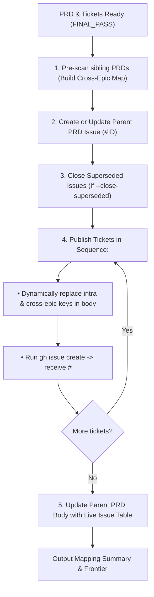

# GitPublish PRD and Tickets

Publish a local PRD and its constituent ticket markdown files to GitHub Issues in a single automated step. Resolves semantic keys (`01.1.1.1`, `02.1`), maps dependencies across both intra-PRD and cross-PRD references, updates parent PRD links, and supersedes stale legacy issues.

## Directives

1. **Topological Publishing**: MUST publish tickets in the sequence specified in the PRD or directory ordering so that prerequisite tickets receive GitHub issue IDs before dependent tickets.
2. **Dynamic Key Resolution**: Automatically maps semantic ticket keys (e.g. `01.1.1.1` $\to$ `#138 (01.1.1.1)`) across all ticket bodies and the parent PRD without requiring manual issue ID updates.
3. **Cross-PRD Pre-scan**: Automatically scans all sibling `docs/specs/*/PRD.md` files to resolve cross-epic references (e.g. `Epic 02: 02.2.2` $\to$ `#151 (Epic 02: 02.2.2)`).
4. **Parent Issue Management**: Creates a new parent PRD issue or updates an existing `--parent-id`, appending the full live `#<id>` child issue table.
5. **Superseded Issue Pruning**: Closes legacy or coarse issues specified via `--close-superseded <ids>` with a superseding explanation note.

---

## Workflow



---

## CLI Usage

```bash
# Dry run simulation (no GitHub modifications)
node <skill-dir>/scripts/publish-epic.js <path-to-prd-or-epic-dir> --dry-run

# Publish new PRD and tickets
node <skill-dir>/scripts/publish-epic.js docs/specs/03-virtual-nested-folders-and-workspaces/PRD.md

# Publish with existing Parent PRD ID and close old coarse tickets
node <skill-dir>/scripts/publish-epic.js docs/specs/02-codebase-readiness-multios/PRD.md --parent-id 88 --close-superseded 89,90,91,92,93

# Target specific repo or labels
node <skill-dir>/scripts/publish-epic.js <path> --repo loerei/YumeShelf --label "enhancement,ready-for-agent"
```

---

## Output

Outputs a JSON mapping of all published tickets (`"01.1.1.1": 138`) and the immediate unblocked implementation frontier ready for `/implement-a-ticket`.
