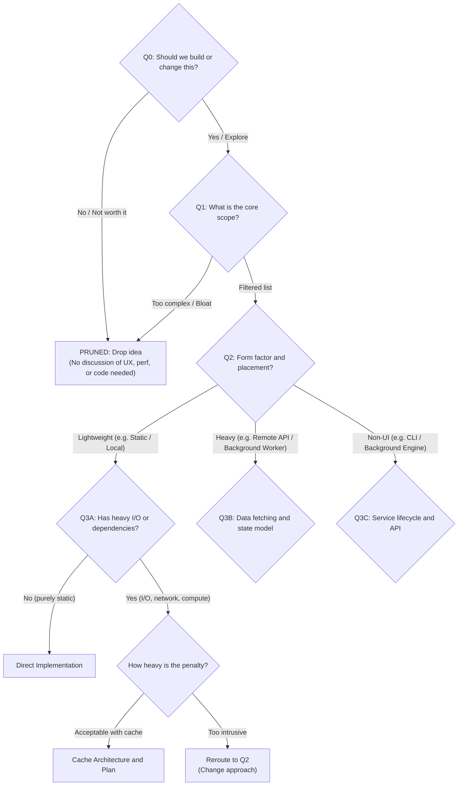

# Let's Just Talk: Branching Decision Dynamics

## 1. The Branching Decision Graph & Pruning Principle

In software engineering discussions, topics form a branching tree with early exits and dead ends, not a flat sequence.

Every technical detail (UI layout, caching strategy, module boundary) is valid only inside its parent branch. If the parent branch is rejected, all downstream work generated for it is wasted, for example:

See? So the best answer to "Should we build or change this" is not a specs dump, a simple answer straight to the question is better, no one urge you to solve the entire question when what they ask is just "Solve or no", so don't do it.

---

## 2. The Failure Mode: Premature Leaf Dumping

When an AI flattens the tree in Turn 1, it assumes a single linear path down to the leaves, ignoring that the human may take an exit or reroute:

- **User Ask at Q0/Q1:** "Should we add user avatars next to comments?"
- **AI 1-Turn Collapse Anti-Pattern:**
  1. Lists all avatar sources: Gravatar, OAuth, custom uploads (Q1)
  2. Proposes 48px circle CSS styling with hover tooltips (Assumes Q2 = Inline Avatar)
  3. Dictates S3 bucket configs and file upload middleware (Assumes Q3B = Custom Uploads)
  4. Proposes Redis TTL caching for Gravatar rate limits (Assumes Q3A/Q3B)
  5. Writes a 5-step implementation plan with file diffs (Assumes leaf node)
- **User Reaction:** "Actually, this is an internal admin tool, nobody cares about avatars. Let's skip it."
- **Result:** 90% of the AI's response was solving backend infrastructure and UI layout for a branch that was pruned immediately.

---

## 3. The 1-Sentence Constraint Rule (Bubble Up Without Solving)

Downstream technical constraints (e.g., API rate limits, heavy I/O, schema migrations) help decide which branch to take.

When surfacing a downstream constraint, state it in one sentence as a decision factor, then stop. Do not design the fix yet.

| Downstream Concern | Bad (Premature Solutioning) | Good (1-Sentence Selection Factor) |
| :--- | :--- | :--- |
| **API Rate Limits** | Writes paragraphs designing a Redis token bucket and exponential backoff worker. | "Gravatar is easy to set up, but fetching avatars on every page load can hit external rate limits without a cache." |
| **Storage & I/O** | Details S3 presigned URLs, image compression pipelines, and multipart upload handlers. | "Supporting custom image uploads requires adding file storage infrastructure and file size validation." |
| **Schema Migration** | Writes raw SQL migration scripts adding nullable foreign keys and indexing tables. | "Adding a new status column requires a database migration across existing user records." |

---

## 4. Case Study: Adding Avatars to Comments

### The Conversation:

- **User:** "Should we show user avatars next to comments? Maybe pull from Gravatar or allow custom uploads?"

### Bad Response (Premature Leaf Dumping):
> "Great idea! We can support both. Here is the CSS for the circular avatar container: [CSS block]. For custom uploads, we should use multer with an AWS S3 bucket and sharp for thumbnail resizing. For Gravatar, we should hash the email with MD5 and cache the avatar URL in Redis for 24 hours. Here is the implementation plan across 4 files..."
> *(Assumes avatars are approved, assumes both sources are needed, designs S3 storage and CSS before the user even evaluates the trade-off).*

### Good Response (`lets-just-talk`):
> "Avatars make comment threads much easier to scan visually. 
>
> Gravatar is zero-setup since we already have user emails, though it relies on third-party availability. Custom uploads give full control, but require file storage infrastructure.
>
> Do you want to start with Gravatar to keep it lightweight, or is custom upload a hard requirement?"
> *(Answers Q1, bubbles up storage/dependency constraints in 1 sentence, asks a focused steering question, passes turn).*
