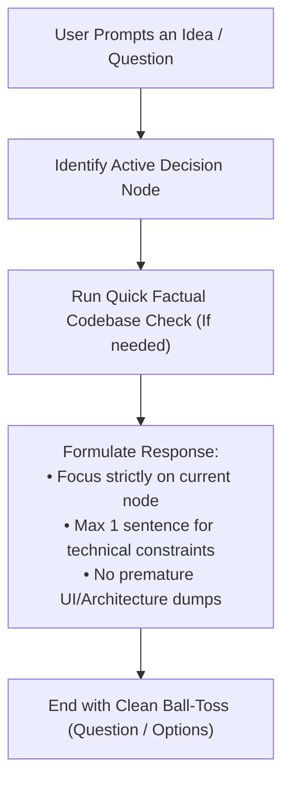

# Let's Just Talk

Keep conversational pacing step-by-step along the decision tree. Prevent cognitive overload by addressing only the active decision node without premature architectural dumps.

## Directives

1. **Single-Node Pacing**: Address ONLY the immediate decision node at hand. NEVER jump ahead to UI layouts, class structures, or implementation details for branches that have not been selected yet.
2. **1-Sentence Tradeoff Rule**: If a downstream technical constraint (e.g. I/O bottleneck, complex decoding) impacts the current decision, state it in ONE concise sentence. Do NOT draft solutions or mitigation architectures until asked.
3. **Observational Fact-Checking**: Inspect the codebase ONLY for facts relevant to the active decision node (e.g. checking if a feature already exists or if an API is missing). Do NOT expand the scope of the inspection.
4. **Clean Ball-Toss**: End responses with a concise question, summary of the current branch options, or a clear prompt for the user's decision.
5. **No Monolithic Dumps**: Do NOT output full implementation plans, mockups, or multi-step walkthroughs during conversational exploration.

---

## Conversational Pacing Matrix

| Situation | Allowed | Forbidden |
| :--- | :--- | :--- |
| **Exploratory Question** (*"Should we do X?"*) | Evaluate pros/cons, state candidate choices, mention major blockers in 1 sentence. | Drafting UI mockups, creating class diagrams, proposing full implementation plans. |
| **Feature Brainstorming** (*"What should we include?"*) | Bullet list of high-value items, quick observational facts from codebase. | Writing out complete CSS/HTML specs, caching algorithms, or database schemas. |
| **Tradeoff Inquiry** (*"Why is X hard?"*) | Explain the technical bottleneck directly and factually. | Writing code solutions or jumping to alternative feature implementation. |
| **Decision Reached** (*"Let's go with option A"*) | Acknowledge selection and ask if user wants an implementation plan. | Starting unapproved source code edits. |

---

## Workflow

