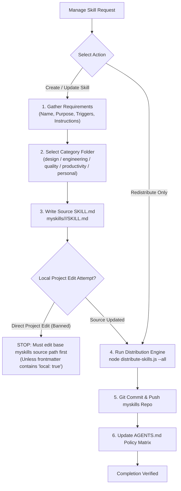

# Manage Custom Skills

Enforce single-source-of-truth skill management by writing skills directly to the central `myskills` source catalog before distributing across local project workspaces and multi-IDE environments.

---

## Workflows



---

## 1. Gather Requirements

Before scaffolding or editing a skill, confirm:
1. **Name**: Skill identifier (e.g. `my-awesome-skill`).
2. **Purpose**: Core capability summary for YAML description.
3. **Triggers**: Explicit conditions and keywords that trigger loading ("Use when...").
4. **Instructions**: Required workflows, decision trees, guidelines, and commands.

---

## 2. Category Selection & Source-First Execution

Always modify or create skills directly in the central source repository:
`Path: <projects-dir>/myskills/<category>/<skill-name>/SKILL.md`

### Standard Categories:
- `design/`: Layout, visual aesthetics, UI taste, styling, mobile/web comps.
- `engineering/`: Architecture, TDD, debugging, domain modeling, refactoring.
- `quality/`: Sonar remediation, code reviews, benchmark testing, git guardrails.
- `productivity/`: Workflow automation, skill management, PR generation, triage, AI writing.
- `personal/`: Obsidian vault management, article editing, draft shaping.

### Frontmatter Format:
```yaml
---
name: <skill-name>
description: <Capability description>. Use when [specific triggers].
---
```

> [!CAUTION]
> **Source-First Guardrail**: Never create or edit a global custom skill directly inside a local project workspace (`.agents/skills/<skill-name>/`). Local project edits will be overwritten during distribution unless the skill explicitly contains `local: true` in its frontmatter.

---

## 3. Distribution & Multi-IDE Sync

Run the distribution engine to sync the central source across all local workspace repositories and global IDE targets (`~/.gemini`, `~/.claude`, `~/.cursor`):

```powershell
node <projects-dir>/distribute-skills.js --all <projects-dir>
```

Or target a specific project workspace:
```powershell
node <projects-dir>/distribute-skills.js --target <projects-dir>/<project-folder>
```

---

## 4. Remote Synchronization

Navigate to `<projects-dir>/myskills/`, commit the updated skill source, and push upstream:
```powershell
git add .
git commit -m "feat(skills): add/update <skill-name> in <category>"
git push
```

---

## 5. Global Policy Matrix Update

When a custom skill is added or re-categorized, update the task-to-skill classification table in the global policy file (`AGENTS.md`):
1. Locate the **Task-Specific Workflows** table.
2. Add the skill name under the **Required Skills to Read** column for its matching category.
