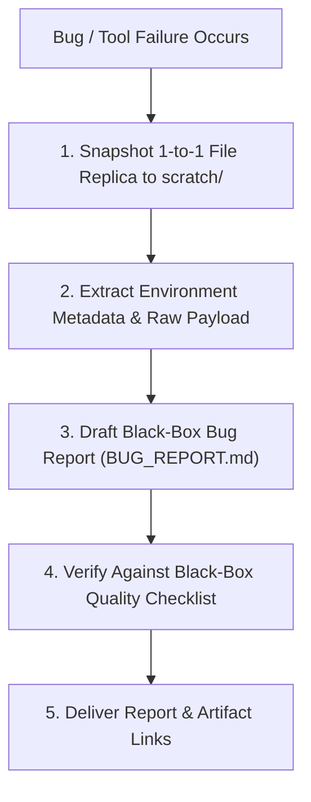

# Write a Bug Report

Author factual, black-box bug reports and reproducible defect packages for external tools, MCP servers, CLIs, or software dependencies.

## Core Rules & Guardrails

1. **Strict Black-Box Boundary**: NEVER speculate on internal root causes or claim code-level defects when inspecting external tools or unindexed engines. Only state observed inputs, outputs, timings, and error traces.
2. **Mandatory 1-to-1 Reproduction Replica**: When a file operation or patch fails, MUST snapshot an exact 1-to-1 byte-for-byte copy of target file(s) into `scratch/replica_<filename>` at the exact moment of failure before mutating state.
3. **Unified Repro Section**: Keep target replica links, trigger commands, and raw input payloads together in a single `## Reproduction` section without fragmented subsections.
4. **Observed vs. Expected**: State clearly what happened versus what should have happened.

## Workflow



---

## Bug Report Document Template (`BUG_REPORT.md` / `issue_*.md`)

When authoring a bug report, use this compact 3-part layout:

```markdown
# Bug Report: [Short, Descriptive Summary of Failure]

**Target**: [e.g. `tool_name:method`, `cli_command`, `package_name`]  
**Environment**: [OS / Runtime / Versions, e.g. Windows 11, Node v20, MCP stdio]  
**Severity**: [Blocker / Major / Minor]  
**Date**: [YYYY-MM-DD]  

---

## 1. Observed vs. Expected

### Observed Behavior (Actual)
- Exact error message, exit code, stack trace, or measured hang duration.
- Raw stderr/stdout log snippet.

### Expected Behavior
- What should have happened instead (expected output, exit code, or clean error).

## 2. Reproduction (Repro)

* **Target Snapshot (1-to-1 Replica)**: `[replica_filename](file:///absolute/path/to/replica)` (if applicable).
* **Trigger (Command / Payload / Script)**:
```bash / json / language
[Exact command, payload, or minimal reproduction script]
```
```

---

## Quality Checklist

- [ ] **Zero Speculation**: Contains NO unverified assertions about internal code/AST mechanics.
- [ ] **Replica Preserved**: 1-to-1 replica of the file at bug occurrence is saved and linked.
- [ ] **Exact Payload**: Raw input payload or terminal command is completely preserved without truncation.
- [ ] **Timings & Environment**: Measured durations, OS, and runtime are explicitly documented.
- [ ] **Self-Contained**: An external developer can copy the payload + replica to reproduce immediately.
