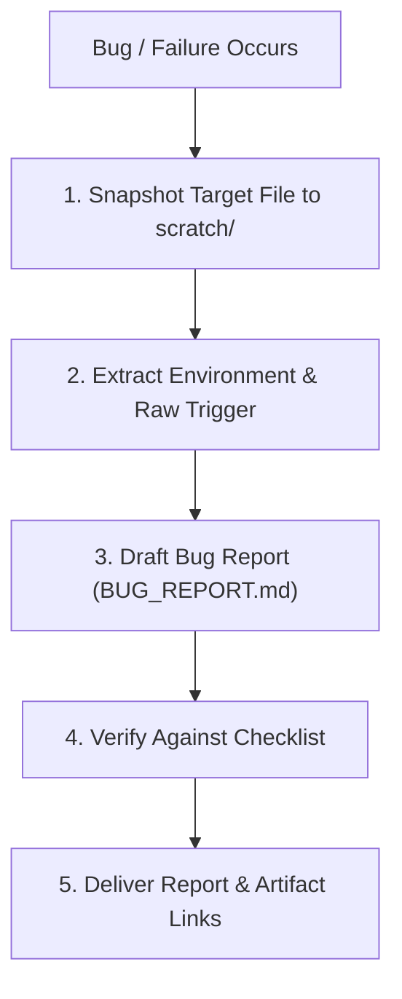

# Write a Bug Report

## Core Rules

1. **Zero speculation**: NEVER speculate on internal root causes or unverified code mechanics. State only observed inputs, outputs, error traces, and measured timings (never guess or fabricate durations).
2. **File snapshot on failure**: When a file operation or patch fails, save an exact copy of target file(s) into `scratch/replica_<filename>` at the moment of failure before making further changes.
3. **Observed vs. expected**: State clearly what happened versus what was supposed to happen.

## Workflow



---

## Bug Report Template (`BUG_REPORT.md` / `issue_*.md`)

```markdown
# Bug Report: [Short, Descriptive Summary of Failure]

**Target**: [e.g. `tool_name:method`, `cli_command`, `package_name`]  
**Environment**: [OS / Runtime / Versions]  
**Severity**: [Blocker / Major / Minor]  
**Date**: [YYYY-MM-DD]  

---

## 1. Observed vs. Expected

### Observed Behavior (Actual)
- Exact error message, exit code, stack trace, or measured hang duration.
- Raw stderr/stdout log snippet.

### Expected Behavior
- What should have happened instead (expected output, exit code, or clean error).

## 2. Reproduction (Repro)

* **Target Snapshot**: `[replica_filename](file:///absolute/path/to/replica)` (if applicable).
* **Trigger (Command / Payload / Script)**:
```bash / json / language
[Exact command, payload, or minimal reproduction script]
```
```

---

## Quality Checklist

- [ ] **Zero Speculation**: Contains no unverified assertions about internal code or root causes.
- [ ] **Replica Preserved**: Exact copy of the file at bug occurrence is saved and linked.
- [ ] **Exact Payload**: Raw input payload or command is preserved without truncation.
- [ ] **Environment & Timings**: OS/runtime documented; durations included only if measured (never guessed).
- [ ] **Self-Contained**: An external developer can copy the payload + replica to reproduce immediately.
