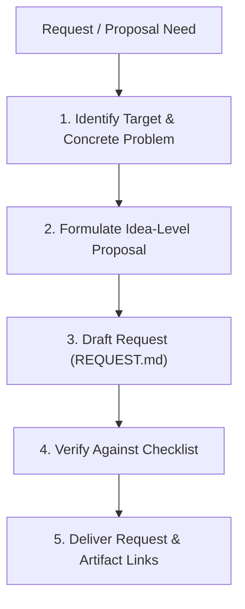

# Write a Request

## Core Rules

1. **Zero speculation**: Propose at the behavioral or interface level. State what capability, option, or behavior is needed; never dictate internal architecture or guess implementation details.
2. **Ground in real context**: State the exact friction point, missing option, or workflow bottleneck with a concrete example.
3. **Clear rationale**: Explain why the change matters without hype.

## Workflow



---

## Request Template (`REQUEST.md` / `request_*.md`)

```markdown
# Request: [Short, Descriptive Summary of Request]

**Target**: [e.g. `tool_name`, `DOCUMENT.md`, `project_name`]  
**Type**: [Feature / Policy Change / Enhancement]  
**Date**: [YYYY-MM-DD]  

---

## 1. Problem (What)
- Describe the friction point, limitation, or missing capability with a concrete example.

## 2. Proposed Idea (Do What)
- Describe the desired behavior, option, or interface change at the concept level.
- Focus on idea-level; do not dictate internal implementation.

## 3. Rationale (Why)
- Explain the concrete value.
```

---

## Quality Checklist

- [ ] **Zero Speculation**: Proposes behavior and interfaces only; does not assert or dictate internal mechanics.
- [ ] **Concrete Problem**: Problem is backed by a real use case or example, not hypothetical generalities.
- [ ] **Distinct Rationale**: Clearly states why the change is beneficial without marketing fluff.
- [ ] **Self-Contained**: Clear and actionable for maintainers or policy reviewers.
