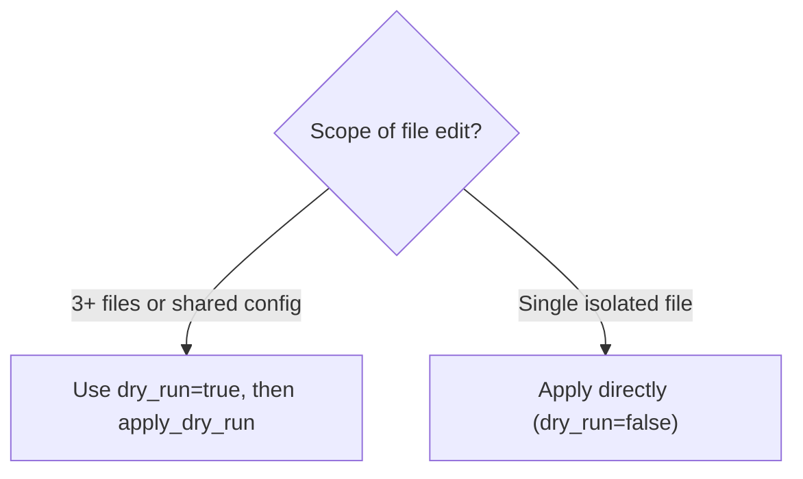

# Reference: Write for AI & Deslop Guide

## 1. Deslop Reference: Fluff vs. Signal

| Category | Bad (Slopped / Jargon / Overexplained) | Good (Deslopped / Plain English / Actionable) |
| :--- | :--- | :--- |
| **Pompous Verbs** | `Utilize the provided mechanism to facilitate user data retrieval from storage` | `Fetch user records from the database` |
| **Implementation Trivia** | `Engineered with state-of-the-art fallback paradigms for enhanced resilience` | `Returns [] if the file does not exist` |
| **Fluff Adverbs & Buzzwords** | `Safely and intelligently orchestrate code modifications without corrupting state` | `Edit source files using exact string replacement` |
| **Internal Mechanism** | `Uses a multi-threaded SHA-256 hashing algorithm to verify file integrity` | `Checks if a file was modified on disk` |
| **Schema Duplication** | `"description": "Optional boolean flag. If true, previews changes. Defaults to false."` | `"description": "Preview changes without writing to disk. Returns run_id."` |
| **Tautology / Circular Naming** | `# Tool: delete_user\nThis tool is used to delete a user from the system.` | `# Tool: delete_user\nPermanently removes user account and invalidates active session tokens.` |
| **Conversational Chaff & Hedging** | `Please make sure to always remember that you should try to run tests before committing` | `MUST run tests before committing` |
| **Motivational Justification** | `Commit patch previewed with dry_run=true. Avoids resending diffs to cut token usage.` | `Apply patch cached by dry_run=true using its run_id.` |
| **Synonym Stacking** | `This rule is a strict, absolute, mandatory, and non-negotiable boundary.` | `MUST NOT modify files outside workspace root.` |
| **Reference Over-Specification** | `For canonical case studies (Multi-Agent, Raft, Game Loop, Storage), see [REFERENCE.md](REFERENCE.md).` | `For canonical case studies, see [REFERENCE.md](REFERENCE.md).` |
| **Opaque Error vs Actionable** | `An unexpected internal exception occurred within the subsystem processing pipeline.` | `Invalid file path: 'src/main.ts'. Check that the file exists and retry.` |

---

## 2. The 6 Universal Forms of Redundancy

| Redundancy Form | Definition & Anti-Pattern | How to Fix |
| :--- | :--- | :--- |
| **1. Schema & Location Duplication** | Repeating types, default values, enums, required status, or repository layout constraints already declared in schemas or configuration files. | State only runtime consequences, non-obvious formatting, or downstream return values. |
| **2. Tautology / Circular Naming** | Rephrasing or defining what the identifier, symbol, or header already makes obvious (e.g., `"The fetch_user tool fetches a user"`). | State unique trigger conditions, differentiators against peer tools, or state mutations. If self-evident, omit prose. |
| **3. Conversational Chaff & Hedging** | Polite conversational filler, introductory padding, and weak modals (`"Please note that you should try to..."`, `"You may want to consider..."`). | Strip polite phrasing. Replace with direct, standard imperatives (`MUST`, `NEVER`, `ALWAYS`). |
| **4. Motivational & Historical Justification** | Explaining why a feature was created, past architecture decisions, or how much time/tokens/bandwidth it saves. | State only the operational contract and requirements. AI models execute instructions; they do not need justification. |
| **5. Synonym Stacking** | Chaining multiple near-identical adjectives, adverbs, or qualifiers to emphasize importance (`"strict, absolute, mandatory, and non-negotiable"`). | Use a single unambiguous RFC 2119 keyword (`MUST`, `MUST NOT`). |
| **6. Reference Over-Specification** | Itemizing, summarizing, or listing internal sub-topics, case study titles, or contents of a referenced document inside the link sentence. | State only the high-level category of the target file without cataloging its contents. |

---

## 3. Artifact Target Matrix

| Artifact Type | Primary Purpose | Must Answer | What to Cut |
| :--- | :--- | :--- | :--- |
| **Tool Description** | Tool selection | When to call this vs. other tools? | Parameter repetition, internal implementation details, marketing adjectives |
| **Parameter Doc** | Value formulation | What value format is expected & what does it trigger? | Type/default repeats, redundant explanations of obvious names |
| **System / Agent Rule** | Behavioral constraint | What MUST / NEVER happen in this condition? | Polite hedging (`try to`), explanatory rationale, background context |
| **SKILL.md Frontmatter** | Dynamic discovery | What exact user keywords/phrases trigger this skill? | Generic summaries (`Helps with code`), implementation details |
| **Tool Error Message** | Agent recovery | What went wrong and what exact command/action fixes it? | Generic failures (`Something went wrong`), internal stack traces without recovery steps |

---

## 4. Before / After Case Studies by Artifact Type

### A. Tool Description (Single & Scoped)

**Before (`edit_file`):**
```
Perform a robust, AST-bounded search-and-replace edit on a target file.
Can be optionally scoped to a line range or a specific AST symbol (function/class)
using symbol index. Includes safety occurrence checks, workspace-scoped path
protection for relative paths, and dry-run preview.
```
**After:**
```
Edit a file by replacing an exact text block (search_content/replace_content)
or applying a unified diff (patch_content). Optionally scope to a line range or symbol name.
```
**What was cut and why:**
- `"robust"` — marketing adjective, zero decision value (Vector 1: Fluff)
- `"AST-bounded"` — implementation detail; `symbol_name` parameter already signals capability
- `"safety occurrence checks"` — restates `allow_multiple` parameter (Vector 2: Schema Duplication)
- `"workspace-scoped path protection"` — global rule, belongs in workspace config (Vector 2: Location Duplication)
- `"dry-run preview"` — restates `dry_run` parameter description (Vector 2: Schema Duplication)

---

### B. Tool Description (Batch & Transactional)

**Before (`batch_edit_files`):**
```
Perform an atomic, transactional refactoring operation across multiple target files.
Applies Git-style Unified Diffs (Fuzz = 0) with a safety lock: if any patch fails,
the entire transaction is rolled back safely, leaving no corrupted files.
Includes crash-resilient ephemeral backup files, optimistic hash-locking to prevent
concurrency conflicts, and dry-run diff preview.
```
**After:**
```
Apply unified diffs to multiple files in one call.
All patches are validated before any file is written; if one fails, none are applied.
```
**What was cut and why:**
- `"atomic, transactional"` — mechanism labels; the behavior (all-or-nothing) is what matters and is kept
- `"Fuzz = 0"` — internal implementation detail
- `"crash-resilient ephemeral backup files"` — internal mechanism the AI cannot act on
- `"optimistic hash-locking"` — internal mechanism

---

### C. Tool Description (Action & Caching Tool)

**Before (`apply_dry_run`):**
```
Commit a patch that was previewed with dry_run=true, using only its run_id.
Avoids resending search_content / replace_content / patch_content,
cutting token usage roughly in half for the apply step.
Fails with a clear error if the run_id is unknown, expired (TTL 300 s),
or if any target file was modified after the dry-run (hash guard).
```
**After:**
```
Apply the patch cached by a previous dry_run=true call.
Requires the run_id from that response.
Fails if the run_id is expired (300 s TTL) or if any target file was modified after the dry-run.
```
**What was cut and why:**
- `"Avoids resending..."` / `"cutting token usage..."` — explains motivation and token metrics, not useful for tool selection (Vector 2: Motivational Justification)
- `"Fails with a clear error"` — all tools should fail clearly; stating it adds noise (Vector 2: Tautology)
- `"hash guard"` — implementation label; the condition (file modified) is kept

---

### D. Parameter Description

**Before:**
```json
"description": "If True, returns a unified diff preview of the changes without modifying the file. Defaults to False."
```
**After:**
```json
"description": "Preview changes as a diff without writing to disk. Returns run_id for apply_dry_run."
```
**What changed:** Added the actionable downstream return key (`run_id`). Removed `"Defaults to False"` because the schema `default: false` field already defines it (Vector 2: Schema Duplication).

---

### E. Tautology & Circular Naming in Tool Definition

**Before (`delete_user`):**
```
# Tool: delete_user
This tool is used to delete a user from the system database when called.
```
**After:**
```
Permanently delete a user account, purge associated session caches, and revoke API keys.
```
**What was cut and why:**
- `"This tool is used to delete a user..."` — pure circular tautology repeating the function name (Vector 2: Tautology)
- Replaced with concrete side-effects and cascading actions the AI must know for decision-making.

---

### F. Synonym Stacking & Hedging in Agent Rules

**Before:**
```
It is strictly, absolutely, and mandatory non-negotiable that you should always make sure to run impact analysis before editing any symbols if possible.
```
**After:**
```
MUST run impact analysis before modifying any function or class symbol.
```
**What was cut and why:**
- `"strictly, absolutely, and mandatory non-negotiable"` — synonym stacking (Vector 2: Synonym Stacking)
- `"you should always make sure to... if possible"` — conversational hedging and weak modals (Vector 2: Conversational Chaff & Hedging)
- Replaced with a single unambiguous imperative `MUST`.

---

### G. System Prompt / Branching Decision Rule

**Before (Prose Rule):**
```
Always use dry_run=true to preview large or risky changes before applying.
```
**After (Mermaid Decision Tree):**


**Why:** Prose rules force the AI to guess what `"large or risky"` means. A Mermaid decision tree defines the exact branching control flow without ambiguity.

---

### H. Tool Error Message

**Bad:**
```json
{"error": "Something went wrong with the file operation."}
```
**Good:**
```json
{"error": "run_id 'abc123' not found or expired. Re-run edit_file with dry_run=true to get a fresh run_id."}
```
**Why:** The error gives the model its exact next recovery action rather than causing an undirected retry loop.
