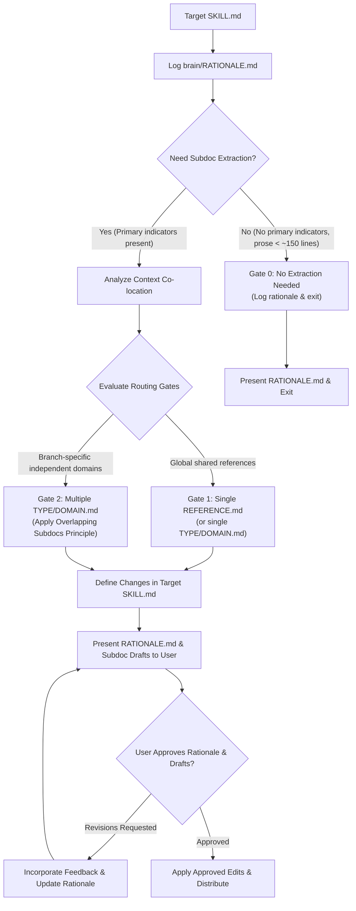

# Write Skill Subdocs

Extract supporting material from a target `SKILL.md` into disclosed sub-documents (`REFERENCE.md` or `TYPE/DOMAIN.md`).

## Subdoc Concept & Definition

A **subdoc (sub-document)** is an auxiliary Markdown file (`REFERENCE.md` or `<TYPE/DOMAIN>.md`) linked from a parent `SKILL.md` via progressive disclosure.
- **Purpose**: Keep `SKILL.md` lean (focusing strictly on primary workflow steps and decision trees) while isolating heavy reference material (lookup tables, schemas, code templates, edge-case matrices).
- **Scope**: Loaded on-demand via `view_file` only when an agent executes the specific branch requiring that reference material.

## Subdoc Extraction & Routing Workflow



## Execution Protocol

### Step 0: Target Skill Audit & Rationale Log Initialization
1. Inventory and inspect target `SKILL.md` and any pre-existing sub-documents (`.md` files) in the target skill directory using `view_file` or `list_dir` to establish a complete baseline.
2. Create and initialize an incremental reasoning log at `<appDataDir>\brain\<conversation-id>\RATIONALE.md` using the human-optimized matrix template:

```md
# Subdoc Extraction Rationale: <skill-name>

## Baseline Audit
- **SKILL.md Size**: X lines | Y bytes
- **Existing Subdocs**: [list or "None"]

## Information Component Analysis

| Information Component | Status | Reasoning | Recommendation |
| :--- | :--- | :--- | :--- |
| <Component Name> | • Needed for every run of SKILL.md (or Not Needed for every run)<br/>• (Not) Worth Extracting to Subdocs<br/>• Reason: [Quoted from HEURISTICS.md] | <Brief rationale> | <Keep Inline / Extract to DOMAIN.md> |

## Routing Decision
- **Applied Gate**: Gate X
- **Overlapping Subdocs Principle**: <Concise routing summary>
```

### Step 1: Information Component Analysis
Categorize all information inside `SKILL.md` and existing subdocs against Primary and Secondary Indicators in [HEURISTICS.md](../writing-great-skills/HEURISTICS.md) and record in the `Information Component Analysis` matrix in `RATIONALE.md`:
- **Status Column Criteria**:
  - `Needed for every run of SKILL.md` OR `Not Needed for every run of SKILL.md`
  - `Worth Extracting to Subdocs` OR `Not Worth Extracting to Subdocs`
  - `Reason(s) quoted from HEURISTICS.md` (e.g., *Primary Signal: Heavy Lookup Tables*, *Primary Signal: Branch-Specific References*, *Secondary Signal: Audit Threshold ~100 lines*).
- **Recommendation**: Specify `Keep Inline in SKILL.md` or `Extract to <DOMAIN>.md`.

### Step 2: Reference Block Formulation
Define each extracted component as a distinct **Reference Block** (Block 1, Block 2, ...) with a title, scope, and estimated line count.

### Step 3: Context Co-location Analysis
Map every execution path (Branch A, Branch B) in the skill to the minimal set of Reference Blocks it requires. Group blocks that are always consulted together.

### Step 4: Subdoc Routing Gates (evaluating indicators per [HEURISTICS.md](../writing-great-skills/HEURISTICS.md))

#### Gate 0: No Extraction Needed
- **Condition**: Target `SKILL.md` triggers NO Primary Indicators per [HEURISTICS.md](../writing-great-skills/HEURISTICS.md) AND total size is under ~150 lines of linear prose (verify against the ~100 line Audit Threshold to ensure no hidden primary signals exist).
- **Action**: Log "No extraction needed" in `RATIONALE.md` and present conclusion to user without modifying files.

#### Gate 1: Single Subdoc (`REFERENCE.md` or `<SINGLE_NAME>.md`)
- **Condition**: Primary Indicators per [HEURISTICS.md](../writing-great-skills/HEURISTICS.md) are triggered, but all extracted reference blocks are globally required across every execution branch of the skill.
- **Action**: Consolidate into a single `REFERENCE.md`.

#### Gate 2: Multiple Subdocs (`TYPE/DOMAIN.md`)
- **Condition**: Primary Indicators per [HEURISTICS.md](../writing-great-skills/HEURISTICS.md) are triggered AND contain branch-specific references required only by independent execution paths.
- **Overlapping Subdocs Principle**: Create the smallest set of subdocs such that every execution path loads only the reference blocks it needs. NEVER force a combined monolithic subdoc if no single execution path requires all blocks simultaneously. See [HEURISTICS.md](../writing-great-skills/HEURISTICS.md).

### Step 5: Target `SKILL.md` Refactoring Spec
1. **Add Context Pointers**: Replace extracted sections with explicit relative Markdown links containing trigger instructions for when to inspect them via `view_file` (e.g., `If executing [Branch A], read [DOMAIN-A.md](DOMAIN-A.md) via view_file`).
2. **Prune Moved Content**: Remove extracted raw templates, long tables, and detailed checklists from `SKILL.md` to keep it lean.
3. **Enforce 1-Level Reference Depth**: Extracted sub-documents MUST be 1-level deep relative to `SKILL.md` and MUST NOT contain markdown links loading further nested sub-documents.

### Step 6: User Reporting & Approval Gate
Present `RATIONALE.md` and draft sub-documents to the user.
- **If User Requests Revisions**: Incorporate feedback, update `RATIONALE.md` and subdoc drafts, and re-present.
- **If Approved**: Proceed to Step 7. Do NOT execute repository modifications or skill distribution without explicit user approval.

### Step 7: Approved Execution & Skill Distribution
Upon receiving explicit user approval:
1. **Sub-document Collision & Cleanup Check**:
   - Inspect target skill directory before writing. If a target subdoc file already exists, merge newly extracted blocks into it or pick non-conflicting domain names under Gate 2 rather than blindly overwriting.
   - Identify and remove/archive any pre-existing sub-documents in the target skill directory that have been replaced or renamed during extraction.
2. Write the created or updated sub-documents into the skill directory.
3. Apply the refactored content to the target `SKILL.md`.
4. Run `node <projects_root>/distribute-skills.js --target <target-repo>` (e.g. `node d:\Projects\distribute-skills.js --target d:\Projects\myskills`) to validate syntax and sync changes across workspace targets.
