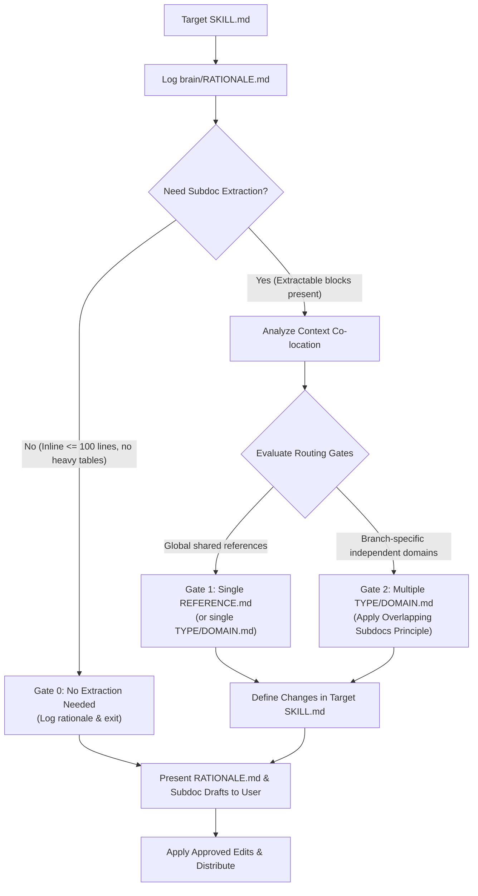

# Write Skill Subdocs

Extract supporting material from a target `SKILL.md` into disclosed sub-documents (`REFERENCE.md` or `TYPE/DOMAIN.md`).

## Subdoc Concept & Definition

A **subdoc (sub-document)** is a auxiliary Markdown file (`REFERENCE.md` or `<TYPE/DOMAIN>.md`) linked from a parent `SKILL.md` via progressive disclosure.
- **Purpose**: Keep `SKILL.md` under 100 lines (focusing strictly on primary workflow steps and decision trees) while isolating heavy reference material (lookup tables, schemas, code templates, edge-case matrices).
- **Scope**: Loaded on-demand via `view_file` only when an agent executes the specific branch requiring that reference material.

## Subdoc Extraction & Routing Workflow

## Execution Protocol

### Step 0: Target Skill Audit & Rationale Log Initialization
1. Read the target `SKILL.md` thoroughly using `view_file` or `jcodemunch`.
2. Create and initialize an incremental reasoning log at `<appDataDir>\brain\<conversation-id>\RATIONALE.md`.

### Step 1: Information Component Analysis
Categorize all information inside `SKILL.md` and log rationale for each in `RATIONALE.md`:
- **Keep Inline**: Core workflow steps, primary decision tree, and mandatory completion criteria.
- **Extract to Subdoc**: Heavy lookup tables, parameter schemas, detailed code templates, rule matrices, troubleshooting lists, and branch-specific guidelines.

### Step 2: Reference Block Formulation
Define each extracted component as a distinct **Reference Block** (Block 1, Block 2, ...) with a title, scope, and estimated line count.

### Step 3: Context Co-location Analysis
Map every execution path (Branch A, Branch B) in the skill to the minimal set of Reference Blocks it requires. Group blocks that are always consulted together.

### Step 4: Subdoc Routing Gates

#### Gate 0: No Extraction Needed
- **Condition**: Target `SKILL.md` is under 100 lines, has no heavy lookup tables/templates, and contains no independent branch-specific references.
- **Action**: Log "No extraction needed" in `RATIONALE.md` and present conclusion to user without modifying files.

#### Gate 1: Single Subdoc (`REFERENCE.md` or `<SINGLE_NAME>.md`)
- **Condition**: All extracted reference blocks are globally required across every execution branch of the skill.
- **Action**: Consolidate into a single `REFERENCE.md`.

#### Gate 2: Multiple Subdocs (`TYPE/DOMAIN.md`)
- **Condition**: The skill contains independent execution branches, and specific branches only require a subset of reference blocks.
- **Overlapping Subdocs Principle**: If Branch A requires blocks [X, Z] and Branch B requires blocks [Y, Z], create two separate files:
  - `DOMAIN-A.md` containing blocks [X, Z]
  - `DOMAIN-B.md` containing blocks [Y, Z]
  - **NEVER** force a combined `ALL.md` containing [X, Y, Z] if no execution path requires both X and Y simultaneously.

### Step 5: Target `SKILL.md` Refactoring Spec
1. **Add Context Pointers**: Replace extracted sections with explicit relative Markdown links containing trigger instructions for when to inspect them via `view_file` (e.g., `If executing [Branch A], read [DOMAIN-A.md](DOMAIN-A.md) via view_file`).
2. **Prune Moved Content**: Remove extracted raw templates, long tables, and detailed checklists from `SKILL.md` to keep it under 100 lines.

### Step 6: User Reporting & Approval Gate
Present `RATIONALE.md` and the draft sub-documents to the user. Await explicit user approval before applying changes to the target repository.

### Step 7: Approved Execution & Skill Distribution
Upon receiving explicit user approval:
1. Write the created sub-documents into the skill directory.
2. Apply the refactored content to the target `SKILL.md`.
3. Run `node <projects_root>/distribute-skills.js --target <target-repo>` to validate syntax and sync changes across workspace targets.
