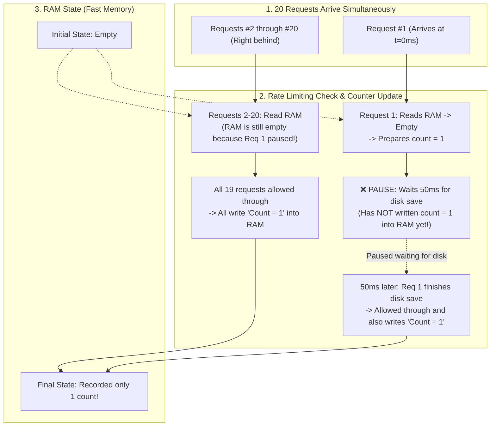

<h1 align="center">Your Co-Engineer for This Jet Engine Is an Infant</h1>

<p align="center">
  <em>Explain the actual physics so we don't blow up the plane. No academic Latin. No pizza delivery analogies.</em>
</p>

<p align="center">
  
  
  
  
</p>

---

## The Premise

You are strapped inside an airplane hangar building a supersonic jet engine. Your co-engineer is a five-year-old child. 

You need them to tighten the high-pressure fuel line before the turbine spins up. You have two ways to fail:

1. **The Professor’s Sin:** You start reciting 12-syllable computer science dogma: *"Pursuant to the non-atomic asynchronous microtask queue interleaving across the heap allocation boundary..."* The kid stares blankly and drops a wrench into the intake fan.
2. **The Kindergarten Teacher’s Sin:** You try to be cute: *"Imagine the turbine is a giant pepperoni pizza, and the fuel line is a happy delivery guy riding a bicycle..."* The kid tries to take a bite out of the titanium casing.

Both of these are fatal. 

**The Jet Engine Principle** is the third way: You explain the **exact, literal physics** of what data moves where, what is read, and what broke—using **plain, unambiguous action verbs**. No Latin. No pizza. Real components.

---

## Before / After

### Scenario: A rate limiter accidentally lets 20 abusive requests bypass a 5-request limit.

#### 1. Standard AI (The Professor)
> *"We observed a non-deterministic race condition stemming from unhandled microtask interleaving during asynchronous I/O yields within the token bucket reconciliation lifecycle, causing heap state divergence across concurrent execution contexts."*
> 
*(Thanks. That sounded very smart and told me literally nothing about which line of code to touch).*

#### 2. The Bad ELI5 (The Kindergarten Teacher)
> *"Imagine your server is a magical bouncer at a club who counts party guests with toy blocks, but when the mailman brings a letter, the bouncer forgets where he put his toys!"*
> 
*(Cute. Now explain how that maps to `this.memory.get()`).*

#### 3. With This Skill (The Jet Engine Infant)
> **Punchline:** The rate limiter allowed all 20 requests because the system paused for 50ms waiting for a slow disk save before recording the first request in RAM, causing all 19 subsequent requests to check an empty RAM counter and independently mark themselves as request #1.
> 

> **Concrete Fix:** Update the counter in RAM immediately before triggering the background disk save.

---

## How It Works: The 4-Step Framework

Whenever an agent explains a bug, architecture plan, or technical tradeoff, it is forced through 4 rigid constraints:

```
1. The Punchline (BLUF)       → State the exact answer and reality gap in the first sentence.
2. Physical Mechanics         → Data flow diagram PLUS numbered step-by-step physical trace.
3. Point of Friction / Gap    → Show the inverted order of operations or broken branch.
4. Concrete Decision          → Literal file/code change with an open alignment question.
```

### The Three Golden Invariants

- **Explain through the idea, not the label:** Never use a technical term to explain another technical term. Describe what data moves, where it pauses, and what it overwrites.
- **Preserve real entities:** RAM is RAM. Disk is disk. Sockets are sockets. Schedulers are schedulers. Do not rename them to magical elves.
- **Diagrams PLUS explicit prose:** Never paste raw code snippets or runtime engine internals (`microtask queue`) into diagram boxes. Label nodes with real components and behavioral action verbs.

---

## Install

### Claude Code

```bash
/plugin marketplace add loerei/jet-engine-infant
```
```bash
/plugin install jet-engine-infant@jet-engine-infant
```
*(Two separate prompts in Claude Code)*

### Gemini / Antigravity / Cursor / Codex

1. Clone or copy this repository into your skills directory:
```bash
git clone https://github.com/loerei/jet-engine-infant.git ~/.gemini/config/skills/your-co-engineer-for-this-jet-engine-is-an-infant
```
2. Or use the central [`myskills`](https://github.com/loerei/myskills) distribution engine:
```bash
agents distribute
```

---

## License

MIT © [loerei](https://github.com/loerei)
