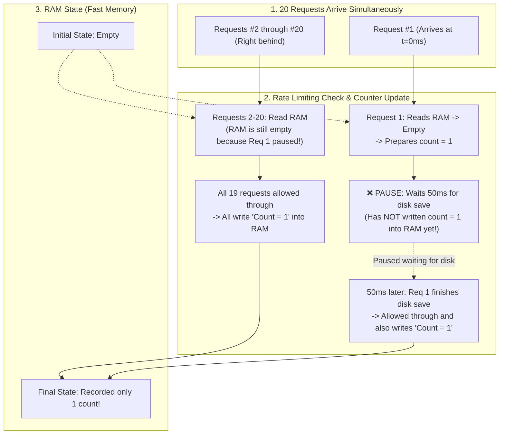

<h1 align="center">Your Co-Engineer for This Jet Engine Is an Infant</h1>

<p align="center">
  <em>He hates pizza, and he doesn't know academic Latin. Explain the actual physics so we don't blow up the plane.</em>
</p>

<p align="center">
  
</p>

<p align="center">
  
  
  
  
</p>

---

## The Premise

You are building a high-stakes, production-grade system with an AI assistant. It is a supersonic jet engine of a codebase.

When you ask your AI *"Why did this break?"* or *"Which architecture should we pick?"*, modern LLMs almost always commit one of two sins:

1. **The Professor’s Sin (Arrogant Jargon & Code Dumps):** The AI barfs out 4 paragraphs of academic CS dogma drenched in function names: *"Upon static AST evaluation of `TokenBucketLimiter.isAllowed()`, we detected a non-deterministic race condition where concurrent `Promise.all` invocations across the microtask queue trigger unhandled yield points in `await this.store.flushToDisk()`, inducing asynchronous state divergence across `this.memory.get()` before the `this.store.set()` critical section commits to the heap allocation boundary..."* You stare at the screen wondering which of the 12 Latin buzzwords corresponds to the actual broken line of code.
2. **The Kindergarten Teacher’s Sin (Condescending Analogies):** The AI assumes you want an "ELI5" and explains your database deadlock using a cute story about a magical pizza delivery guy and friendly farm animals. You now know less about your database than when you started.

Both of these make real co-engineering impossible.

**The Jet Engine Principle** forces the AI to explain the **exact, literal physical mechanics** of the system—what data moves where, what is read in RAM, where execution pauses, and what broke—using **plain, unambiguous action verbs**. 

No Latin. No pizza. Real components, real data flow, zero bullshit.

---

## Before / After

### Scenario: A rate limiter accidentally lets 20 abusive requests bypass a 5-request limit.

#### 1. Standard AI (The Professor)
> *"Upon static AST evaluation of `TokenBucketLimiter.isAllowed()`, we detected a non-deterministic race condition where concurrent `Promise.all` invocations across the microtask queue trigger unhandled yield points in `await this.store.flushToDisk()`, inducing asynchronous state divergence across `this.memory.get()` before the `this.store.set()` critical section commits to the heap allocation boundary."*
> 
*(Thanks. You just read me a stack trace with a thesaurus and I still have no idea what broke).*

#### 2. The Bad ELI5 (The Kindergarten Teacher)
> *"Imagine your server is a magical bouncer at a club who counts party guests with toy blocks, but when the mailman brings a letter, the bouncer forgets where he put his toys!"*
> 
*(Cute. Now explain how that maps to the actual system).*

#### 3. With This Skill (The Jet Engine Infant)
> The rate limiter allowed all 20 requests because the system paused for 50ms waiting for a slow disk save before recording the first request in RAM, causing all 19 subsequent requests to check an empty RAM counter and independently mark themselves as request #1.
> 

> **Concrete Fix:** Update the counter in RAM immediately before triggering the background disk save.

---

## How It Works: Two Modes, Zero Bullshit

Depending on whether you are trying to fix a broken subsystem or just trying to understand what this massive codebase actually does, the AI is locked into one of two operational frameworks:

### 1. When You Need to Fix Something (Planning, Debating, Debugging)
If you're making an architectural call or hunting a bug, the AI is strictly forbidden from writing a 6-paragraph essay. It must follow 4 rigid steps:
```
1. BLUF (Bottom Line Up Front) → What broke or which option wins? (Answered in sentence #1).
2. Physical Mechanics         → Visual contrast diagram + step-by-step trace of bytes in RAM/disk.
3. The Friction Point         → The exact inverted operation, blind window, or missing return.
4. The Concrete Decision      → The exact file to modify and the next immediate command.
```

### 2. When You Just Want It Explained ("Just Explain" / Architecture Overview)
If you drop an AI into an unfamiliar 50,000-line codebase and say *"Explain how this works"*, it usually either barfs AST method names or tells you a bedtime story. Instead, it peels back only the top surface layer:
```
1. The Raw Core Idea          → Why does this machine exist? What physical headache does it solve?
2. The Moving Parts (Layer 1) → High-level data paths across tangible components (The Scanner, The Save Vault, The Ingest Worker).
3. Progressive Check-in       → Stop right there. Ask the human which sub-layer to drill into next before dumping internals.
```

---

### The Four Golden Invariants

- **Explain the idea, not the label:** Never use a fancy CS buzzword to explain another CS buzzword. RAM is RAM. Disk is disk. Sockets are sockets. Describe what moves, where it pauses, and what it overwrites.
- **Moving parts over code-reading:** We don't read `this.state.items.length >= 5` aloud. We say *"The Shopkeeper checks if the Player's Bag is holding 5 items."* Code is the static blueprint; your explanation is the physical machine in motion.
- **The "In Short" anchor:** Every major section ends with an instant 1-line reality check:  
  `**In short:** The Problem (From User's POV) ➔ What This Machine Does About That`
- **Visual contrast on defect:** Don't just tell me it's broken—show **Current Broken Reality** (e.g. sequential fall-through) side-by-side with **Intended Clean Design** so the defect jumps off the screen in 3 seconds.

---

## Install

### Claude Code Plugin (Recommended)

```bash
/plugin marketplace add loerei/your-co-engineer-for-this-jet-engine-is-an-infant
```
```bash
/plugin install your-co-engineer-for-this-jet-engine-is-an-infant@your-co-engineer-for-this-jet-engine-is-an-infant
```
*(Two separate prompts in Claude Code)*

### Direct Git Clone (By Platform)

```bash
# For Gemini / Google Antigravity
git clone https://github.com/loerei/your-co-engineer-for-this-jet-engine-is-an-infant.git ~/.gemini/config/skills/your-co-engineer-for-this-jet-engine-is-an-infant

# For Claude Code (Global)
git clone https://github.com/loerei/your-co-engineer-for-this-jet-engine-is-an-infant.git ~/.claude/skills/your-co-engineer-for-this-jet-engine-is-an-infant

# For Cursor
git clone https://github.com/loerei/your-co-engineer-for-this-jet-engine-is-an-infant.git ~/.cursor/skills/your-co-engineer-for-this-jet-engine-is-an-infant

# For Codex / OpenAI
git clone https://github.com/loerei/your-co-engineer-for-this-jet-engine-is-an-infant.git ~/.codex/skills/your-co-engineer-for-this-jet-engine-is-an-infant

# For Current Project Workspace (Universal Agent Standard)
git clone https://github.com/loerei/your-co-engineer-for-this-jet-engine-is-an-infant.git .agents/skills/your-co-engineer-for-this-jet-engine-is-an-infant
```

Or sync across all workspaces via [`myskills`](https://github.com/loerei/myskills):
```bash
agents distribute
```

---

## License

MIT © [loerei](https://github.com/loerei)
