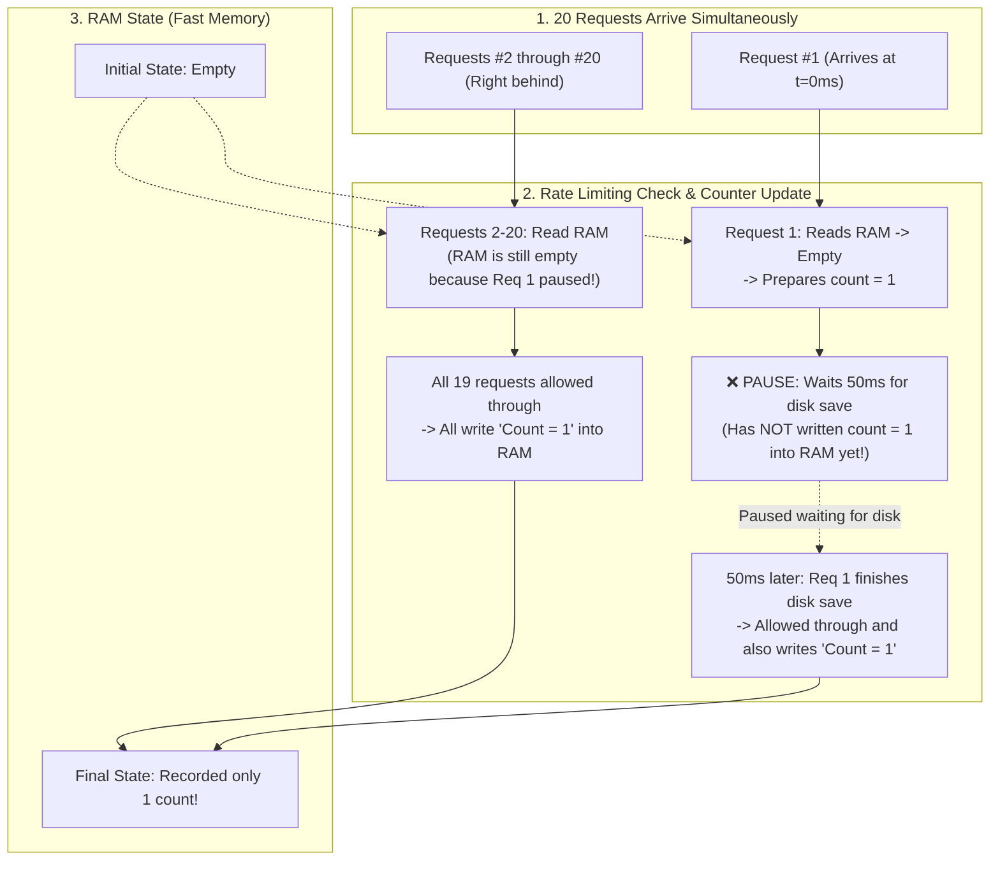

<h1 align="center">Your Co-Engineer for This Jet Engine Is an Infant</h1>

<p align="center">
  <em>Explain the actual physics so we don't blow up the plane. No academic Latin. No pizza delivery analogies.</em>
</p>

<p align="center">
  
  
  
  
</p>

---

## The Premise

You are building a high-stakes, production-grade system with an AI assistant. It is a supersonic jet engine of a codebase.

When you ask your AI *"Why did this break?"* or *"Which architecture should we pick?"*, modern LLMs almost always commit one of two sins:

1. **The Professor’s Sin (Arrogant Jargon & Code Dumps):** The AI barfs out 4 paragraphs of academic CS dogma drenched in function names: *"Upon static AST evaluation of `TokenBucketLimiter.isAllowed()`, we detected a non-deterministic race condition where concurrent `Promise.all` invocations across the microtask queue trigger unhandled yield points in `await this.store.flushToDisk()`, inducing asynchronous state divergence across `this.memory.get()` before the `this.store.set()` critical section commits to the heap allocation boundary..."* You stare at the screen wondering which of the 12 Latin buzzwords corresponds to the actual broken line of code.
2. **The Kindergarten Teacher’s Sin (Condescending Analogies):** The AI assumes you want an "ELI5" and explains your database deadlock using a cute story about a magical pizza delivery guy and friendly farm animals. You now know less about your database than when you started.

Both of these make real co-engineering impossible.

**The Jet Engine Principle** forces the AI to explain the **exact, literal physical mechanics** of the system—what data moves where, what is read in RAM, where execution pauses, and what broke—using **plain, unambiguous action verbs**. 

No Latin. No pizza. Real components, real data flow, zero bullshit.

---

## Before / After

### Scenario: A rate limiter accidentally lets 20 abusive requests bypass a 5-request limit.

#### 1. Standard AI (The Professor)
> *"Upon static AST evaluation of `TokenBucketLimiter.isAllowed()`, we detected a non-deterministic race condition where concurrent `Promise.all` invocations across the microtask queue trigger unhandled yield points in `await this.store.flushToDisk()`, inducing asynchronous state divergence across `this.memory.get()` before the `this.store.set()` critical section commits to the heap allocation boundary."*
> 
*(Thanks. You just read me a stack trace with a thesaurus and I still have no idea what broke).*

#### 2. The Bad ELI5 (The Kindergarten Teacher)
> *"Imagine your server is a magical bouncer at a club who counts party guests with toy blocks, but when the mailman brings a letter, the bouncer forgets where he put his toys!"*
> 
*(Cute. Now explain how that maps to the actual system).*

#### 3. With This Skill (The Jet Engine Infant)
> **Punchline:** The rate limiter allowed all 20 requests because the system paused for 50ms waiting for a slow disk save before recording the first request in RAM, causing all 19 subsequent requests to check an empty RAM counter and independently mark themselves as request #1.
> 

> **Concrete Fix:** Update the counter in RAM immediately before triggering the background disk save.

---

## How It Works: The 4-Step Framework

Whenever an agent explains a bug, architecture plan, or technical tradeoff, it is forced through 4 rigid constraints:

```
1. The Punchline (BLUF)       → State the exact answer and reality gap in the first sentence.
2. Physical Mechanics         → Data flow diagram PLUS numbered step-by-step physical trace.
3. Point of Friction / Gap    → Show the inverted order of operations or broken branch.
4. Concrete Decision          → Literal file/code change with an open alignment question.
```

### The Three Golden Invariants

- **Explain through the idea, not the label:** Never use a technical term to explain another technical term. Describe what data moves, where it pauses, and what it overwrites.
- **Preserve real entities:** RAM is RAM. Disk is disk. Sockets are sockets. Schedulers are schedulers. Do not rename them to magical elves.
- **Diagrams PLUS explicit prose:** Never paste raw code snippets or runtime engine internals (`microtask queue`) into diagram boxes. Label nodes with real components and behavioral action verbs.

---

## Install

### Claude Code

```bash
/plugin marketplace add loerei/jet-engine-infant
```
```bash
/plugin install jet-engine-infant@jet-engine-infant
```
*(Two separate prompts in Claude Code)*

### Gemini / Antigravity / Cursor / Codex

1. Clone or copy this repository into your skills directory:
```bash
git clone https://github.com/loerei/jet-engine-infant.git ~/.gemini/config/skills/your-co-engineer-for-this-jet-engine-is-an-infant
```
2. Or use the central [`myskills`](https://github.com/loerei/myskills) distribution engine:
```bash
agents distribute
```

---

## License

MIT © [loerei](https://github.com/loerei)
