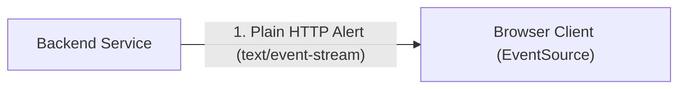
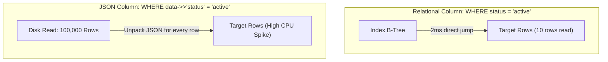
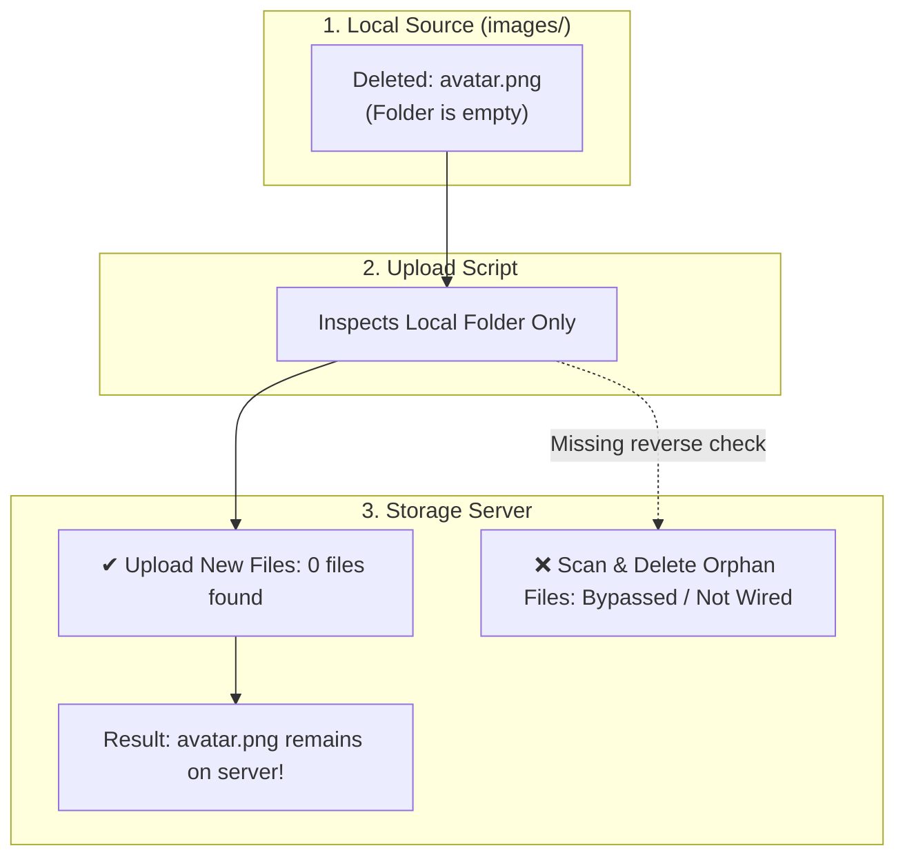

# Reference: Jet Engine Co-Engineer Guide

## 1. The De-Jargoning Dictionary

Replace opaque technical labels with concrete physical and behavioral mechanics:

| Technical Buzzword / Label | What it Actually Means (Physical Mechanics) |
| :--- | :--- |
| **Reconciliation / Pruning / GC** | Reading the destination list and asking the source: *"Do you still have this? If not, delete it."* |
| **Race Condition** | Two operations running at the same time where the final outcome depends on who finishes last. |
| **Deadlock** | Side A is holding Key 1 waiting for Key 2, while Side B is holding Key 2 waiting for Key 1. Neither can move. |
| **Idempotency** | Running the exact same command 10 times produces the exact same result as running it once. |
| **Memory Leak** | Adding items to a list on every request but never writing code to remove old items when done. |
| **Cache Invalidation** | Throwing away the fast local copy because the real data in the main database changed. |
| **AST / Parsing Drift** | Code was modified on disk, but the analyzer is still looking at the old structure cached in memory. |
| **Network Timeout** | Sending a message and waiting until a timer expires because the other side never responded. |
| **Unidirectional Sync** | Copying files from A to B, but never checking if files were deleted in A to remove them from B. |
| **Parameter Dropping / Omission** | The main controller received the order, but forgot to pass the instruction down to the worker function. |
| **Backpressure** | A receiver telling a fast sender to slow down because its incoming queue is full. |
| **Atomic Transaction** | Grouping 5 changes together so that if change #4 fails, changes 1, 2, and 3 are immediately undone. |

---

## 2. The 3 Explanation Styles Compared

| Dimension | Style 1: Abstract Jargon (Opaque) | Style 2: Detached Metaphor (Distorted) | Style 3: Jet Engine Infant (Optimal) |
| :--- | :--- | :--- | :--- |
| **Language** | `"Unidirectional sync without garbage collection."` | `"The pizza delivery guy dropped the box."` | `"The computer copies from A to B, but never checks B to delete old files."` |
| **Target Entities** | Abstract CS concepts | Unrelated real-world objects (pizza, toys) | **The actual files, paths, databases, and code branches** |
| **Understanding** | Only accessible to domain experts | Feels accessible, but distorts how the code actually works | **100% accurate mental model in plain English** |
| **Actionability** | User cannot reason about the fix | User cannot map pizza to their code | **User can immediately collaborate on the exact solution** |

---

## 3. Multi-Mode Case Studies: Applying the 4-Step Framework

### Mode A: Architecture Planning (Live Notification System)

* **Step 1 (The Punchline):**  
  We should use Server-Sent Events (SSE) instead of WebSockets because the server only needs to push one-way alerts to the browser, and SSE runs over plain HTTP without needing a separate connection server.
* **Step 2 (Physical Mechanics & Visualization):**  
  When an alert happens in the backend, the server writes a single line of text over an already open HTTP connection:

* **Step 3 (Point of Friction / Tradeoff):**  
  WebSockets keeps a two-way tunnel open and requires custom ping/pong heartbeats to keep the connection alive. For simple one-way notifications, that extra machinery adds maintenance overhead without providing any two-way benefits.
* **Step 4 (Concrete Decision & Next Action):**  
  We create a single `/api/events` endpoint in `src/server.ts` and connect the frontend with `EventSource`. Do you want to review the endpoint code?

---

### Mode B: Technical Debate / Tradeoff (JSON Column vs SQL Table)

* **Step 1 (The Punchline):**  
  We should put `status` and `user_id` in separate SQL columns and only keep custom user tags in a `metadata` JSON column, because filtering inside JSON across 100,000 rows forces the database to read every single row from disk.
* **Step 2 (Physical Mechanics & Visualization):**  

* **Step 3 (Point of Friction / Tradeoff):**  
  Putting all fields in JSON saves 5 minutes of schema migration today, but causes database CPU to spike to 100% as soon as table size grows past 10,000 records.
* **Step 4 (Concrete Decision & Next Action):**  
  We define explicit SQL columns for `id`, `status`, and `user_id`, and keep `metadata` JSON only for unstructured custom tags. Shall we write the database migration script?

---

### Mode C: System Debugging (File Sync & Orphan Deletion)

* **Step 1 (The Punchline):**  
  The reason deleted images still appear on the storage server is that the upload script only checks for new local files to upload, but never inspects the server to remove deleted files.
* **Step 2 (Physical Mechanics & Visualization):**  

* **Step 3 (Point of Friction / Gap):**  
  The sync script only loops over local files. It has no reverse loop that reads the server directory and compares it against local files.
* **Step 4 (Concrete Decision & Next Action):**  
  We add a reverse check that lists all files on the server and deletes any file that no longer exists locally. Do you want to proceed with this update?
