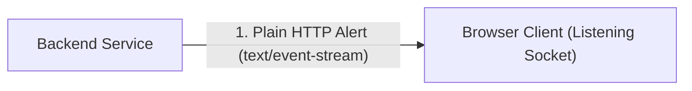
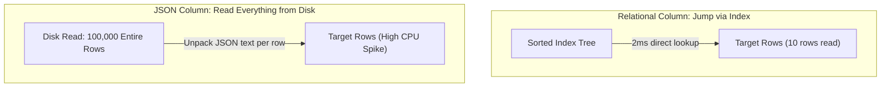
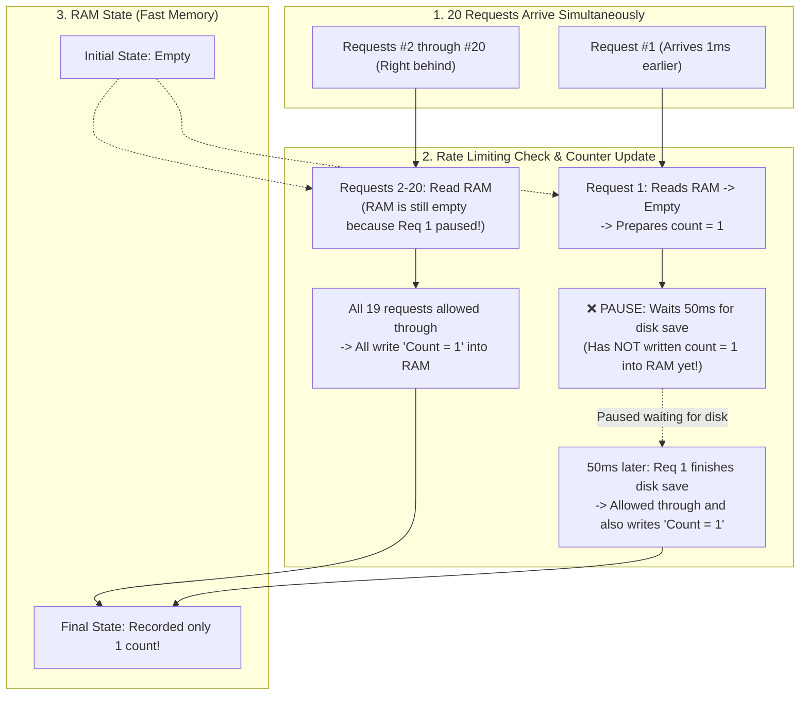

# Reference: Jet Engine Co-Engineer Guide

## 1. The Core Ideology: Explain Through the Idea of Tech Terms

Never explain a technical label by throwing another technical label at the reader. Explain the **underlying physical idea, operational intent, and behavioral mechanics** using real system entities (`RAM`, `disk`, `network`, `requests`, `counters`).

### Translating Software Artifacts into Behavioral Actions

| Technical Concept / Code Artifact | What NOT to Say (Jargon / Code Snippet) | What to Say Instead (The Literal Action) |
| :--- | :--- | :--- |
| **In-Memory Map / Cache** | `Heap Map<string, object>`, `Key-Value Store` | *The fast counter stored in temporary RAM* |
| **Rate Limiter / Guard** | `TokenBucketLimiter.isAllowed()`, `Middleware` | *The check verifying if a user exceeded their allowed requests* |
| **Async Pause / I/O Yield** | `await flushToDisk()`, `Microtask queue yield` | *Waiting 50ms for a slow disk save before updating RAM* |
| **Reconciliation / GC** | `State reconciliation loop`, `Garbage collection` | *Reading the destination list and asking source to delete leftovers* |
| **Race Condition** | `Non-atomic concurrent read-modify-write` | *Two requests reading the same count before either writes back* |
| **Deadlock** | `Circular resource lock acquisition failure` | *Two operations holding each other's keys and both waiting* |
| **Cache Invalidation** | `Cache invalidation / eviction TTL` | *Throwing away the fast RAM copy when the main database changes* |
| **AST / Parsing Drift** | `AST representation out of sync with disk` | *Looking at an old cached copy in memory instead of the actual file on disk* |
| **Backpressure** | `TCP flow control / reactive streams backpressure` | *Telling the sender to pause because incoming requests are piling up* |
| **Atomic Transaction** | `ACID atomic transaction boundary` | *Bundling 5 steps together so if step 4 fails, steps 1-3 undo instantly* |

---

## 2. Diagram Node Labels: Code Dumps vs Behavioral Actions

Diagrams must communicate topography and movement at a glance. Do NOT turn Mermaid boxes into code dumps or fake anthropomorphic metaphors:

| Element | ❌ BAD (Raw Code / Runtime Jargon Dump) | ✔ GOOD (Real Entity & Behavioral Action) |
| :--- | :--- | :--- |
| **Source Node** | `store.get('rate:user_99') -> undefined` | `Check RAM State -> No prior requests recorded` |
| **Action Node** | `await this.store.flushToDisk()` | `❌ PAUSE: Wait 50ms for disk save (RAM not updated yet!)` |
| **Component** | `AsyncStore (this.memory Map in Heap)` | `RAM State (Fast Memory)` |
| **State Mutation** | `this.store.set('key', { count: 1 }) x19` | `19 requests all write 'Count = 1' into RAM` |

---

## 3. The 3 Explanation Styles Compared

| Dimension | Style 1: Abstract Jargon (Opaque) | Style 2: Detached Metaphor (Distorted) | Style 3: Jet Engine Infant (Optimal) |
| :--- | :--- | :--- | :--- |
| **Language** | `"Unidirectional sync without garbage collection."` | `"The pizza delivery guy dropped the box."` | `"The computer copies from A to B, but never checks B to delete old files."` |
| **Target Entities** | Abstract CS concepts | Unrelated real-world objects (pizza, toys) | **The actual files, paths, databases, and code branches** |
| **Understanding** | Only accessible to domain experts | Feels accessible, but distorts how the code actually works | **100% accurate mental model in plain English** |
| **Actionability** | User cannot reason about the fix | User cannot map pizza to their code | **User can immediately collaborate on the exact solution** |

---

## 4. Multi-Mode Case Studies: Applying the 4-Step Framework

### Mode A: Architecture Planning (Live Notification System)

* **Step 1 (The Punchline):**  
  We should use Server-Sent Events (SSE) instead of WebSockets because the server only needs to push one-way alerts to the browser, and SSE runs over plain HTTP without needing a separate connection server.
* **Step 2 (Physical Mechanics & Visualization):**  

  1. The browser initiates a standard HTTP request and leaves the socket open.
  2. Whenever a notification occurs, the backend flushes a UTF-8 text line down that open socket.
  3. The browser immediately receives the line without needing two-way heartbeat tunnels.
* **Step 3 (Point of Friction / Tradeoff):**  
  WebSockets keeps a two-way tunnel open and requires custom ping/pong heartbeats. For simple one-way notifications, that extra machinery adds maintenance overhead without providing any two-way benefits.
* **Step 4 (Concrete Decision & Next Action):**  
  We create a single `/api/events` endpoint in `src/server.ts` and connect the frontend with `EventSource`. Do you want to review the endpoint code?

---

### Mode B: Technical Debate / Tradeoff (JSON Column vs SQL Table)

* **Step 1 (The Punchline):**  
  We should put `status` and `user_id` in separate SQL columns and only keep custom user tags in a `metadata` JSON column, because filtering inside JSON across 100,000 rows forces the database to read every single row from disk.
* **Step 2 (Physical Mechanics & Visualization):**  

  1. **Relational Path:** The database traverses a pre-sorted index tree on disk (reading ~3 index pages), directly locates the 10 matching row pointers, and reads only those 10 rows into RAM. Total time: ~2ms.
  2. **JSON Blob Path:** Because keys inside JSON are unstructured text, the database has no index pointers. It must read all 100,000 table rows from disk into memory, parse the text of every row, and check the string value. Total time: ~450ms with 100% CPU usage.
* **Step 3 (Point of Friction / Tradeoff):**  
  Putting all fields in JSON saves 5 minutes of schema migration today, but causes database CPU to spike to 100% as soon as table size grows past 10,000 records.
* **Step 4 (Concrete Decision & Next Action):**  
  We define explicit SQL columns for `id`, `status`, and `user_id`, and keep `metadata` JSON only for unstructured custom tags. Shall we write the database migration script?

---

### Mode C: System Debugging (Concurrent State Overwrite in Rate Limiting)

* **Step 1 (The Punchline):**  
  The rate limiter allowed all 20 concurrent requests instead of capping at 5 because the system paused to wait for a slow disk save before recording the first request in RAM, causing all 19 subsequent requests to see an empty RAM counter and independently mark themselves as request #1.
* **Step 2 (Physical Mechanics & Visualization):**  

  1. Request 1 arrives and inspects the counter in RAM. It finds no prior requests recorded for this user.
  2. Before writing *"Count = 1"* into RAM, the system pauses to wait 50ms for a background disk save to finish.
  3. While Request 1 is paused waiting for disk, Requests 2 through 20 arrive. They all check RAM, see that it is still completely empty, and conclude they are each the very first request.
  4. All 19 requests allow themselves through and all write "Count = 1" into RAM.
  5. Request 1 finishes its disk wait, wakes up, also assumes it is the first request, and overwrites RAM with "Count = 1" one last time. Result: 20 requests enter, but RAM only recorded 1.
* **Step 3 (Point of Friction / Gap):**  
  The physical sequence of operations was inverted:
  - *Correct:* Update counter in RAM immediately $\rightarrow$ Trigger background disk save without waiting.
  - *Current (Broken):* Wait for disk save $\rightarrow$ Only then write counter to RAM.
  The 50ms pause created a blind window where incoming callers acted on stale RAM state.
* **Step 4 (Concrete Decision & Next Action):**  
  We reverse the order: write the updated counter into RAM synchronously first, and let the disk save run in the background without blocking the request path.
