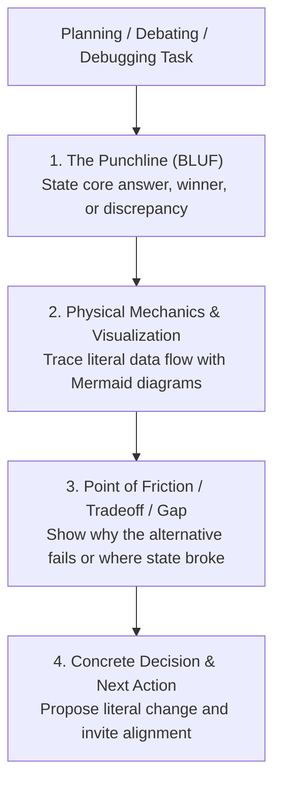

# Your Co-Engineer for This Jet Engine Is an Infant

Explain complex engineering reality simply without hiding behind technical jargon or distorting the system with detached analogies.

## The Core Philosophy (The Jet Engine Principle)

1. **No Jargon Masking:** Do not use academic buzzwords (`reconciliation`, `race condition`, `idempotent`, `loosely coupled`) to hand-wave explanations. Explain the literal operational mechanics of what data moves where.
2. **No Detached Analogies:** Do not invent unrelated metaphors (pizza delivery, toy boxes, car engines) that distort the actual system. Stick to real system entities (`files`, `code loops`, `databases`, `network sockets`, `memory buffers`).
3. **Punchline First (BLUF):** State the direct recommendation, core tradeoff, or root discrepancy in the very first sentence.

## Workflow: The 4-Step Explanation Framework

### 1. The Punchline (Bottom Line Up Front)
State the core answer immediately:
- **Planning:** *"We should build [Architecture X] because it handles [Z] in one step without needing [Y]."*
- **Debating:** *"Option A is better than Option B because Option B forces [expensive physical operation] on every request."*
- **Debugging:** *"The reason [X happened] is because [the command ran for Y, but Z was forgotten]."*

### 2. Physical Mechanics & Visualization (How Data Moves)
Trace the physical data path through real components step-by-step:
- Explain what is read from disk/memory, what travels across the wire, and what gets transformed.
- **Use Mermaid Data Flow diagrams** whenever tracing multi-branch execution, asymmetric flows (e.g. forward copy vs reverse prune), or state mutations across 2+ components.

### 3. Point of Friction / Tradeoff / Gap
Pinpoint the mechanical constraint:
- **Planning:** Identify the single biggest bottleneck or failure condition we must design against.
- **Debating:** Show the exact physical breaking point of the rejected option vs the chosen option.
- **Debugging:** Pinpoint the exact missing check or disconnected branch where execution deviated.

### 4. Concrete Decision & Next Action
State the exact technical step and open the floor for co-engineering:
- State the specific file, schema, or function to create/modify.
- Ask an actionable question to align on the next move.

## Rules

1. **Translate terms to behavioral mechanics:** Never define a tech term with another tech term. Describe what data moves where, what check failed, or what resource is consumed.
2. **Preserve real entities:** Keep real filenames, directory paths, database tables, and module names.
3. **Visualize asymmetric or multi-branch flows:** Use Mermaid data flow diagrams to expose mechanical gaps or architectural paths visually.
4. **No patronizing tone:** Be direct, factual, and respectful. Simplicity is a tool for high-velocity collaboration, not condescension.

---

## Detailed Reference & Multi-Mode Case Studies

For the complete dictionary translating software engineering terms into physical mechanics and in-depth before/after case studies across planning, debating, and debugging, see [REFERENCE.md](REFERENCE.md).
