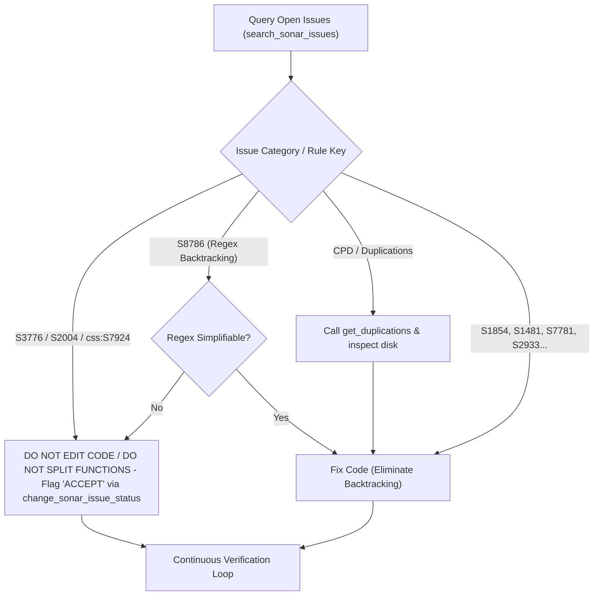
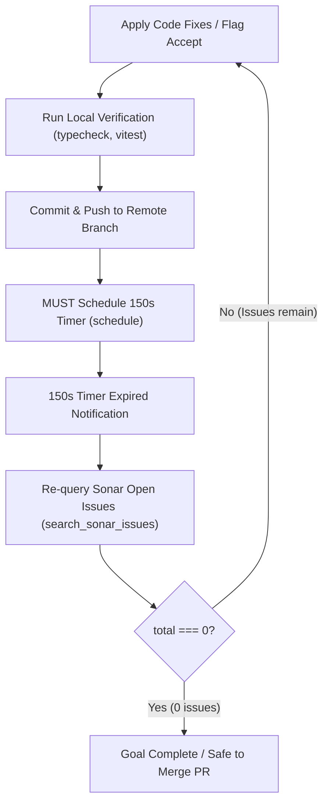

# Sonar Remediation & Quality Gate Workflows

Inspect, remediate, accept, and automate SonarQube/SonarCloud code quality issues across single files, PRs, or entire repositories. (Works with `sonarcloud:` and `sonarqube:` MCP servers).

## Workflows

### 1. Issue Query & Inspection (MCP)

| Task | MCP Tool (`sonarcloud:` / `sonarqube:`) | Required Arguments & Constraints |
| :--- | :--- | :--- |
| **Search Projects** | `search_my_sonarqube_projects` / `search_sonar_projects` | None |
| **Search Open Issues** | `search_sonar_issues_in_projects` / `search_sonar_issues` | `projects: ["<key>"]`, `issueStatuses: ["OPEN"]` PR scope: MUST add `pullRequestId: "<id>"` / `pullRequest: "<id>"`. File scope: `files: ["<key>:<relPath>"]` |
| **Search Duplications** | `search_duplicated_files`, `get_duplications` | `projectKey: "<key>"`, `key: "<fileKey>"`, optional `pullRequest: "<id>"` |
| **Component Measures** | `get_component_measures` | `projectKey: "<key>"` (Note: parameter is `projectKey`, not `component`), `metricKeys: [...]` |
| **Show Rule Details** | `show_rule` / `get_rule_details` | `key: "<ruleKey>"` |
| **Quality Gate Status** | `get_project_quality_gate_status` / `get_quality_gate_status` | `projectKey: "<key>"` |

> [!IMPORTANT]
> When analyzing an active PR, MUST pass `pullRequestId` or `pullRequest`. Omitting PR ID queries the default branch (`main`), leading to unintended refactoring of pre-existing code.

### 2. Issue Triage & Decision Policy

| Domain | Issue Category | Rule Keys | Action | Rationale & Requirements |
| :--- | :--- | :--- | :--- | :--- |
| **General** | **Cognitive Complexity** | `S3776` | **Flag `accept`** via `change_sonar_issue_status` | MUST search issue key first. NEVER split functions solely for S3776. Structural splits require `/improve-codebase-architecture`. |
| **General** | **Function Nesting** | `S2004` | **Flag `accept`** via `change_sonar_issue_status` | Deep nesting in UI/search/event closures is intentional design. |
| **General** | **Backtracking Regex** | `S8786` | **Fix or Flag `accept`** | Simplify regex if possible; flag `accept` if regex is already minimal. |
| **CSS** | **Theme / Contrast** | `css:S7924` | **Flag `accept`** via `change_sonar_issue_status` | Brand theme colors override generic WCAG contrast checks. |
| **JS/TS/CSS** | **Language Smells** | `S1854`, `S1481`, `S6582`, `S6606`, `S7780`, `S7758`, `S6594`, `S4666`, `S1874` | **Fix code** | Follow domain-specific refactoring patterns in [REFERENCE.md](REFERENCE.md). |

> [!IMPORTANT]
> Before calling `change_sonar_issue_status` to flag any issue as `"accept"` or `"falsepositive"`, you MUST search for the exact issue key using `search_sonar_issues` with `issueStatuses: ["OPEN"]`.

### 3. Remediation Safety Boundaries

- **NEVER delete, rename, or move** standalone entrypoints, child processes, worker scripts, or dynamic IPC/service wrappers.
- **NEVER modify** exported module interfaces, public API signatures, or database schemas during Sonar Remediation.
- **Domain Contract Preservation (`S1854`, `S1481`)**: NEVER alter returned object keys or state properties (e.g. `favorite`, `id`, `status`) to consume an unused variable. Safely delete the dead variable calculation instead.

### 4. Code Duplication Resolution (CPD)

- MUST call `get_duplications` to retrieve exact duplicated lines and read actual code on disk.
- For structural duplication, read `/improve-codebase-architecture` to design a unified module.

### 5. Continuous Zero-Issue & Remote CI Verification Loop

Triggered via `/goal` or explicit instruction to fix/accept open issues until **0 open issues remain**:
- Call `schedule({ DurationSeconds: "150", Prompt: "150s timer expired. Re-query open Sonar issues" })` after pushing commits.
- MUST NOT merge PR or declare completion (`<!-- GOAL_COMPLETE -->`) until 150s timer expires and re-query confirms `total === 0`.

### 6. Script-Automated Task Execution

For large backlogs, run companion scripts in `.agents/skills/sonar-remediation/scripts/`:
- `python .agents/skills/sonar-remediation/scripts/count_issues.py "<issues_json>" "<session_dir>\scratch\issues_details.md"`
- `python .agents/skills/sonar-remediation/scripts/generate_plan.py "<issues_json>" "<session_dir>\implementation_plan.md"` (`request_feedback: true`)
- `python .agents/skills/sonar-remediation/scripts/generate_task.py "<issues_json>" "<session_dir>\task.md"` (`user_facing: true`)

**Task Execution Loop**: Fix branch -> For each file in `task.md`: Mark `[/]` -> Patch via `patch_file` -> Mark `[x]` -> Verify via project build/test tools before committing.

---

## Detailed Rules & Code Examples

See [REFERENCE.md](REFERENCE.md) for Preemptive Code Inspection, domain-scoped **Before / After** code examples, and specific rule remediation patterns. (MUST read [REFERENCE.md](REFERENCE.md) before applying code fixes).
