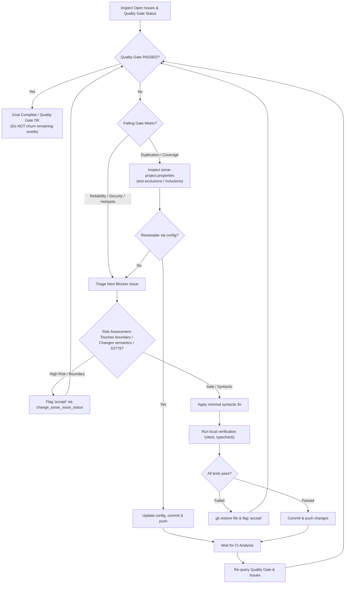

# Sonar Remediation & Quality Gate Workflows

Inspect, remediate, accept, and automate SonarQube/SonarCloud code quality issues across single files, PRs, or entire repositories (supports `sonarcloud:` and `sonarqube:` MCP servers).

## Directives

1. **Quality Gate Priority**: The target exit condition is `Quality Gate === PASSED / OK`. NEVER destabilize working code or churn code smells once the Quality Gate passes.
2. **Test Invariance**: NEVER modify unit or integration tests to accommodate Sonar suggestions. If a code fix causes any test to fail, immediately revert the change via `git restore` and flag the issue as `"accept"` or `"falsepositive"`.
3. **Boundary Invariance**: NEVER refactor, extract functions, or alter serialization/cloning mechanics in sensitive boundaries (Transactions, Migrations, State stores, IPC channels, external configs). Flag `"accept"` on structural or complexity smells in these domains.
4. **Config Before Code**: For Duplication (CPD) or Coverage failures, inspect project configuration (e.g. `sonar.tests`, `sonar.cpd.exclusions` in `sonar-project.properties`) before modifying any source code.
5. **Pure Syntactic Fixes Only**: Only apply fixes that are 100% syntactically safe (delete unused local variable/import, fix typo). If a fix requires behavioral changes or structural refactoring, flag `"accept"`.
6. **Safety Boundaries & Signatures**: NEVER delete, rename, or move standalone entrypoints, child processes, worker scripts, dynamic IPC/service handlers, or public API signatures.
7. **Domain Contract Preservation (`S1854`, `S1481`)**: NEVER alter returned object keys or state properties (e.g. `favorite`, `id`, `status`) to consume an unused variable. Safely delete the dead variable calculation instead.
8. **Issue Verification Before Status Change**: Before calling `change_sonar_issue_status` to flag `"accept"` or `"falsepositive"`, MUST search the issue key using `search_sonar_issues` with `issueStatuses: ["OPEN"]`.
9. **PR Scope Parameter**: When analyzing an active PR, MUST pass `pullRequestId` or `pullRequest`. Omitting PR ID queries the default branch.

---

## Query Scope Decision Matrix

| Scope | MCP Query Call |
| :--- | :--- |
| **File** | `search_sonar_issues({ projectKey, componentKeys: ['<projectKey>:<filePath>'], issueStatuses: ['OPEN'] })` |
| **Commit** | `git show --name-only <hash>` $\rightarrow$ `search_sonar_issues({ projectKey, componentKeys, inNewCodePeriod: true })` |
| **Pull Request (PR)** | `search_sonar_issues({ projectKey, pullRequest: '<pr_id>', issueStatuses: ['OPEN'] })` |
| **Branch** | `search_sonar_issues({ projectKey, branch: '<branch_name>', issueStatuses: ['OPEN'] })` |
| **Repository** | `search_sonar_issues({ projectKey, issueStatuses: ['OPEN'] })` |
| **File + PR** | `search_sonar_issues({ projectKey, pullRequest: '<pr_id>', componentKeys: ['<projectKey>:<filePath>'], issueStatuses: ['OPEN'] })` |

---

## Issue Triage & Risk Matrix

| Triage Category | Risk Level | Action | Requirements & Protocol |
| :--- | :--- | :--- | :--- |
| **Cognitive Complexity (`S3776`)** | High (Architectural) | **Flag `accept`** | NEVER split functions solely for S3776. Structural splits require `/improve-codebase-architecture`. |
| **Deep Nesting (`S2004`)** | High (Architectural) | **Flag `accept`** | Deep nesting in UI/event/search closures is intentional design. |
| **Boundary Logic & Serialization (`S7784`, `S7744`)** | High (Semantic) | **Flag `accept`** | Spreads `{ ...(x \|\| {}) }` protect boundaries; `structuredClone` breaks Proxies. Do NOT alter runtime semantics. |
| **Path/File Regexes (`S8786`)** | High (Semantic) | **Flag `accept`** | Bounded strings (paths, filenames) have zero practical ReDoS risk; flag `accept` directly. |
| **Theme Contrast (`css:S7924`)** | Low (Styling) | **Flag `accept`** | Brand color palettes take precedence over automated WCAG checks. |
| **Duplications (CPD)** | Mixed | **Config first, then fix** | Verify test isolation in `sonar-project.properties` first. Consolidate only real production duplicates if gate fails. |
| **Language Smells (`S1854`, `S1481`, etc.)** | Low (Syntactic) | **Fix code** | Follow domain-specific patterns in [REFERENCE.md](REFERENCE.md). |

---

## Continuous CI Verification Loop

```mermaid
flowchart TD
    InspectIssues["Inspect Open Issues & Quality Gate Status"] --> CheckGate{"Quality Gate PASSED?"}
    CheckGate -->|"Yes"| Done["Goal Complete / Quality Gate OK<br/>(Do NOT churn remaining smells)"]
    CheckGate -->|"No"| CheckMetric{"Failing Gate Metric?"}
    CheckMetric -->|"Duplication / Coverage"| CheckConfig["Inspect sonar-project.properties<br/>(test exclusions / inclusions)"]
    CheckMetric -->|"Reliability / Security / Hotspots"| TriageIssue["Triage Next Blocker Issue"]
    CheckConfig --> ConfigFix{"Resolvable via config?"}
    ConfigFix -->|"Yes"| ApplyConfig["Update config, commit & push"] --> WaitCI["Wait for CI Analysis"]
    ConfigFix -->|"No"| TriageIssue
    TriageIssue --> RiskEval{"Risk Assessment:<br/>Touches boundary / Changes semantics / S3776?"}
    RiskEval -->|"High Risk / Boundary"| FlagAccept["Flag 'accept' via change_sonar_issue_status"] --> CheckGate
    RiskEval -->|"Safe / Syntactic"| ApplyFix["Apply minimal syntactic fix"]
    ApplyFix --> RunTests["Run local verification (vitest, typecheck)"]
    RunTests --> TestResult{"All tests pass?"}
    TestResult -->|"Failed"| Rollback["git restore file & flag 'accept'"] --> CheckGate
    TestResult -->|"Passed"| CommitPush["Commit & push changes"] --> WaitCI
    WaitCI --> ReQuery["Re-query Quality Gate & Issues"] --> CheckGate
```

---

## Automation Scripts (Large Backlogs)

For batch fixes across large repositories, run helper scripts in `.agents/skills/sonar-remediation/scripts/`:
- `count_issues.py`: Aggregate issues by rule and component.
- `generate_plan.py`: Generate structured remediation plan (`request_feedback: true`).
- `generate_task.py`: Generate atomic task files (`user_facing: true`).

---

## Subdoc Reference

- **Rule Cookbook, Code Examples & Argument Schemas**: see [REFERENCE.md](REFERENCE.md).
